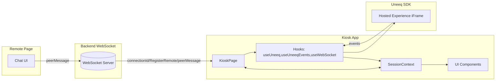
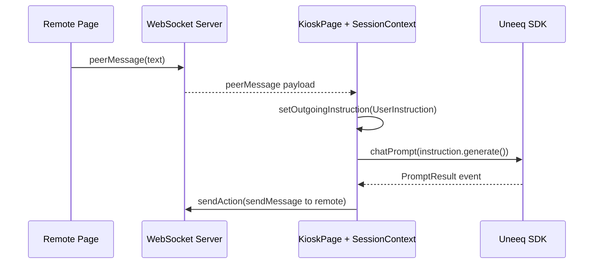

## Architecture

This application is a React + Vite frontend that embeds a Uneeq Digital Human session and coordinates state via a compact, explicit context. A WebSocket connects a “remote” controller to the kiosk.

### System overview

### Key concepts
- **Session store**: `SessionContext` is the single session source of truth (status, Uneeq instance, event queue, media, remote pairing, language, outgoing instruction).
- **Uneeq integration**: `useUneeq` loads the script from config, enforces a singleton (via `window.uneeqSessionKey`), and wires a global `UneeqMessage` handler; `useUneeqEvents` consumes the SDK event stream through an explicit queue with back‑pressure.
- **Remote bridge**: `useWebSocket` handles pairing, connectivity checks, and message passing between remote and kiosk.
- **Instructions**: Incoming and outgoing “instructions” encode domain intent, decoupling UI from SDK speech‑event tags and from prompt text.

### Data flow (prompt lifecycle)

### Why this design
- **Determinism over cleverness**: an explicit queue prevents dropped or re‑ordered Uneeq events and avoids re‑entrancy pitfalls.
- **Controlled external dependency**: the Uneeq SDK is loaded once and owned by the app to avoid HMR/mount churn.
- **Feature isolation**: instructions and hooks isolate integrations from the views; UI can evolve without touching protocol glue.