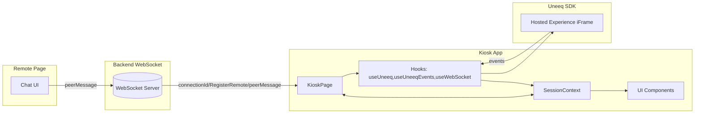
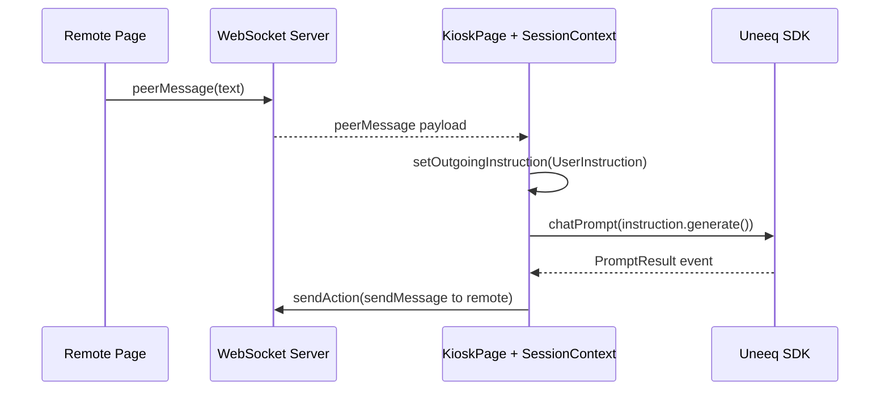

# Architecture

This application is a React + Vite frontend that embeds a Uneeq Digital Human session and coordinates state via a small, explicit context. A WebSocket connects a "remote" controller to the kiosk.

## System overview

## Key concepts
- Session store: `SessionContext` is a minimal and explicit store for session state and event queues.
- Uneeq integration: `useUneeq` loads the external script (from config), guards singletons, and surfaces the API; `useUneeqEvents` consumes the SDK event stream safely via a queue.
- Remote bridge: `useWebSocket` handles pairing, connectivity checks, and message passing between remote and kiosk.
- Instructions: Incoming and outgoing “instructions” represent domain intents; they decouple UI from how Uneeq encodes actions (
  e.g., speech-event tags) and how prompts are generated.

## Data flow (prompt lifecycle)

## Why this design
- Determinism over cleverness: an explicit queue prevents dropped or re‑ordered Uneeq events.
- Controlled external dependency: the Uneeq SDK is loaded once and owned by the app, with a single global instance to avoid HMR/mount churn.
- Feature isolation: instructions and hooks isolate integrations from the views; UI can evolve without touching protocol glue.