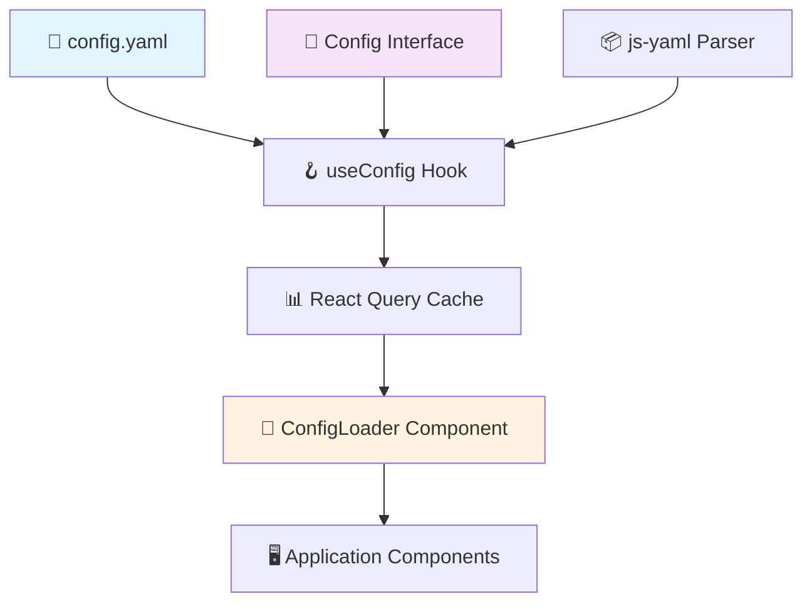
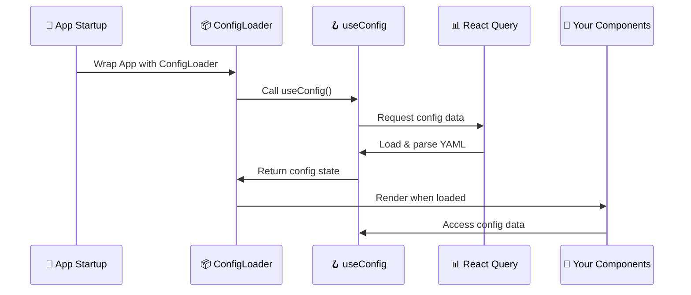
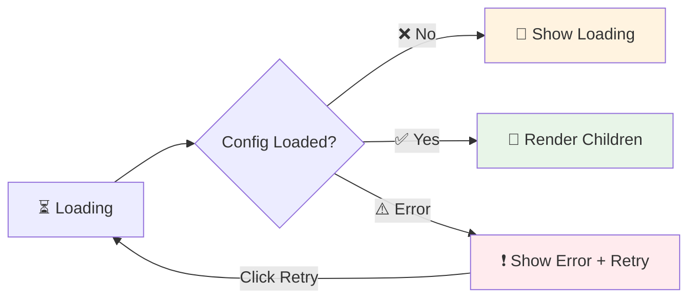

# Application Configuration System

This guide explains how the application configuration system works, how to create and modify configuration files, and how to use configuration in your components.

## 🎯 Quick Overview

**What is the Configuration System?**
The configuration system provides a centralized way to manage application settings, persona configurations, backend connections, and API keys. It uses YAML files for easy editing and TypeScript interfaces for type safety.

**Key Features:**
- 📄 **YAML-based**: Human-readable configuration files
- 🔒 **Type-safe**: Full TypeScript interface support
- ⚡ **Cached**: React Query handles loading and caching
- 🔄 **Hot-reload**: Changes reflect immediately in development
- 🛡️ **Error-safe**: Graceful error handling with retry capability

## 🏗️ Configuration Architecture



### How Configuration Flows Through the App



## 📄 Configuration File Structure

### Location and Naming
- **Main Config**: `Frontend/src/assets/config.yaml`
- **Sample Config**: `Frontend/src/assets/config.sample.yaml`

### Configuration Schema

```yaml
# Application Configuration
app:
  name: "Your App Name"
  environment: "development" # development, staging, production

# Persona configurations for different languages and render types
personas:
  en:  # Language code
    cloud:     # Render type
      CDN: "https://cdn-eu.uneeq.io/hosted-experience/deploy/index.js"
      API: "https://api-eu.uneeq.io"
      key: "your-uneeq-persona-key"
    miniprem:  # Alternative render type
      CDN: "https://cdn-eu.uneeq.io/hosted-experience/deploy/index.js"
      API: "https://api-eu.uneeq.io"
      key: "your-uneeq-persona-key"
  fr:  # Additional languages
    cloud:
      CDN: "https://cdn-eu.uneeq.io/hosted-experience/deploy/index.js"
      API: "https://api-eu.uneeq.io"
      key: "your-french-persona-key"

# API configurations
apis:
  pixabay:
    api_key: "your-pixabay-api-key"
    api_url: "https://pixabay.com/api/"

# Backend connection settings
backend:
  host: "localhost"
  ports:
    http: 3000
    ws: 3001
  key: "your-backend-authentication-key"
```

### Configuration Types

The configuration uses strict TypeScript interfaces:

```typescript
interface Config {
  app: AppConfig;
  personas: Record<string, PersonaConfig>;
  apis: ApiConfig;
  backend?: BackendConfig;
}

interface AppConfig {
  name: string;
  environment: 'development' | 'staging' | 'production';
}

interface PersonaConfig {
  cloud: {
    CDN: string;
    API: string;
    key: string;
  };
  miniprem: {
    CDN: string;
    API: string;
    key: string;
  };
}
```

## 🛠️ Creating and Modifying Configuration

### Step 1: Create Your Configuration File

**Copy from Sample**
```bash
# From Frontend directory
cp src/assets/config.sample.yaml src/assets/config.yaml
```

### Step 2: Add New Configuration Sections

**Adding a New Language:**
```yaml
personas:
  en:
    cloud:
      CDN: "https://cdn-eu.uneeq.io/deploy/index.js"
      API: "https://api-eu.uneeq.io"
      key: "english-persona-key"
  es:  # ← New Spanish language
    cloud:
      CDN: "https://cdn-eu.uneeq.io/deploy/index.js"
      API: "https://api-eu.uneeq.io"
      key: "spanish-persona-key"
```

**Adding Custom API Configuration:**
```yaml
apis:
  pixabay:
    api_key: "existing-key"
    api_url: "https://pixabay.com/api/"
  custom_service:  # ← New custom API
    api_key: "your-custom-key"
    api_url: "https://your-service.com/api/"
    timeout: 5000
```

### Step 3: Update TypeScript Interfaces (If Needed)

If you add new configuration sections, update the interfaces in `src/types/utils/Config.ts`:

```typescript
export interface ApiConfig {
  pixabay: {
    api_key: string;
    api_url: string;
  };
  custom_service?: {  // ← New optional service
    api_key: string;
    api_url: string;
    timeout?: number;
  };
}
```

## 🪝 Using Configuration in Components

### The useConfig Hook

The `useConfig` hook provides access to configuration data with helpful utilities:

```typescript
const {
  config,                    // Raw configuration object
  loading,                   // Loading state
  error,                     // Error state  
  reload,                    // Reload function
  getSupportedLanguages,     // Get available languages
  getDefaultLanguage,        // Get default/fallback language
  getRenderByLanguage        // Get render types for language
} = useConfig();
```

### Basic Usage Examples

#### Accessing App Configuration
```typescript
import { useConfig } from '@/hooks/useConfig';

function MyComponent() {
  const { config } = useConfig();
  
  // Access app settings
  const appName = config?.app?.name || 'Default App';
  const isDevelopment = config?.app?.environment === 'development';
  
  return (
    <div>
      <h1>{appName}</h1>
      {isDevelopment && <div>🚧 Development Mode</div>}
    </div>
  );
}
```

## 📦 ConfigLoader Component

The `ConfigLoader` component ensures configuration is loaded before rendering your application:

### Basic Usage
```typescript
import { ConfigLoader } from '@/components/configLoader/ConfigLoader';

function App() {
  return (
    <ConfigLoader>
      <YourApplication />
    </ConfigLoader>
  );
}
```

### Custom Loading State
```typescript
function App() {
  return (
    <ConfigLoader 
      fallback={<div>🔧 Loading your custom configuration...</div>}
    >
      <YourApplication />
    </ConfigLoader>
  );
}
```

### How ConfigLoader Works



**ConfigLoader States:**

1. **Loading State**: Shows loading fallback while config loads
2. **Error State**: Shows error message with retry button
3. **Success State**: Renders children when config is ready

### Why This Approach?

✅ **Embedded at Build Time**: Config is bundled, no runtime HTTP requests <br/>
✅ **Type-Safe**: Full TypeScript support with interfaces <br/>
✅ **Cached**: React Query prevents unnecessary re-loads <br/>
✅ **Error-Resilient**: Automatic retries with graceful fallbacks <br/>
✅ **Development-Friendly**: Hot-reload support in development <br/>

## 🛡️ Error Handling and Troubleshooting

### Common Issues

#### Issue: "Configuration Error - Failed to load"

**Possible Causes:**
- Missing `config.yaml` file
- Invalid YAML syntax
- Missing required fields

**Solutions:**
1. **Check file exists**: Ensure `Frontend/src/assets/config.yaml` exists
2. **Validate YAML**: Use online YAML validator to check syntax
3. **Copy from sample**: `cp config.sample.yaml config.yaml`
4. **Check console**: Look for specific parsing errors

#### Issue: "Config properties are undefined"

**Example:**
```typescript
const { config } = useConfig();
console.log(config?.app?.name); // undefined
```

**Solutions:**
1. **Wait for loading**: Check `loading` state before accessing config
2. **Use optional chaining**: Always use `?.` for nested properties
3. **Provide fallbacks**: Use `|| 'default'` for missing values

```typescript
function SafeComponent() {
  const { config, loading, error } = useConfig();
  
  // ✅ Handle loading state
  if (loading) return <div>Loading...</div>;
  
  // ✅ Handle error state  
  if (error) return <div>Error: {error.message}</div>;
  
  // ✅ Safe property access
  const appName = config?.app?.name || 'Default App';
  
  return <div>{appName}</div>;
}
```

#### Issue: "TypeScript errors when adding new config fields"

**Solution**: Update the Config interface:

```typescript
// src/types/utils/Config.ts
export interface Config {
  app: AppConfig;
  personas: Record<string, PersonaConfig>;
  apis: ApiConfig;
  backend?: BackendConfig;
  
  // ✅ Add your new section
  myNewSection?: {
    setting1: string;
    setting2: number;
  };
}
```

## 🔒 Security Considerations

### API Keys and Sensitive Data
```yaml
# ⚠️ NEVER put sensitive data in frontend config files
apis:
  service_key: "sk-prod-abc123..."  # ← DANGEROUS! Visible to all users!
```

**❌ What NOT to do in Frontend:**
- Store API keys, secrets, or tokens in config files
- Use environment variables for secrets (they're embedded in bundle)
- Put production credentials in any frontend code

**✅ Secure Approaches for Frontend:**
1. **Ephemeral Tokens**: Fetch short-lived tokens from your backend
2. **Backend Proxy**: Route API calls through your secure backend
3. **Public Keys Only**: Only store non-sensitive, public configuration
4. **Runtime Fetching**: Get sensitive data via authenticated backend calls

### Example: Secure Token Integration
```typescript
// ✅ Configuration stores only non-sensitive backend info
// config.yaml
backend:
  host: "your-secure-backend.com"
  ports:
    http: 443
  key: "public-identifier-not-secret"  # Not a sensitive secret!

// ✅ Component uses config + EphemeralTokenService securely
function SecureApiComponent() {
  const { config } = useConfig();
  
  const tokenService = new EphemeralTokenService({
    apiBaseUrl: `https://${config?.backend?.host}:${config?.backend?.ports?.http}`
  });
  
  const handleApiCall = async () => {
    // Token fetched securely from backend when needed
    const token = await tokenService.ensure('deepgram', 'stt', 60);
    
    // Use token for API call
    const response = await fetch('https://api.deepgram.com/v1/listen', {
      headers: { 'Authorization': `Token ${token}` }
    });
  };
  
  return <button onClick={handleApiCall}>Secure API Call</button>;
}
```

**How This Works:**
1. **Config**: Stores only public backend connection info
2. **EphemeralTokenService**: Fetches short-lived tokens from your secure backend
3. **Backend**: Handles the actual API keys and returns temporary tokens
4. **Frontend**: Never sees or stores the real sensitive credentials

**Best Practices:**
1. **Backend Integration**: Use services like `EphemeralTokenService` for sensitive data
2. **Config per Environment**: Different configs for dev/staging/prod (non-sensitive data only)
3. **Git Ignore**: Add production configs to `.gitignore` 
4. **Validation**: Validate required fields at startup


## 🚀 Summary

The configuration system provides a robust foundation for managing application settings:

### **Creating Configuration:**
1. **Copy sample**: Use `config.sample.yaml` as starting point
2. **Customize settings**: Update personas, APIs, backend settings
3. **Update types**: Modify interfaces if adding new sections
4. **Test loading**: Verify configuration loads without errors

### **Using Configuration:**
1. **Import hook**: Use `useConfig()` in components
2. **Handle states**: Check `loading` and `error` states
3. **Access safely**: Use optional chaining and fallbacks
4. **Wrap app**: Use `ConfigLoader` to ensure config is ready

### **Key Benefits:**
- 🎯 **Centralized**: All settings in one place
- 🔒 **Type-Safe**: Full TypeScript support
- ⚡ **Performant**: Cached and optimized loading
- 🛡️ **Reliable**: Error handling with retry capability
- 🔄 **Developer-Friendly**: Hot-reload and easy debugging

### **Best Practices:**
- Always use `ConfigLoader` to wrap your application
- Handle loading and error states properly
- Use optional chaining for nested properties
- Provide sensible fallback values
- Keep sensitive data in environment variables
- Validate configuration early and often

This configuration system makes it easy to manage complex application settings while maintaining type safety and performance. Whether you're setting up personas, API keys, or backend connections, the unified approach keeps everything organized and accessible throughout your application!
