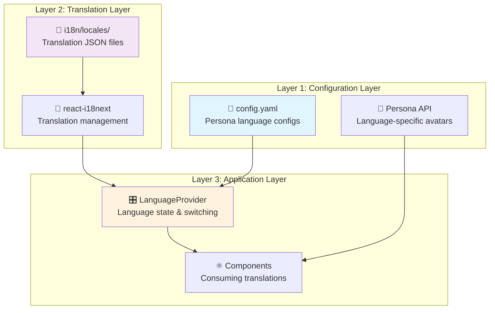

# Language Support System

This guide explains the comprehensive language support system and provides step-by-step instructions for adding new languages to the kiosk application.

## 🎯 Architecture Overview

The language support system operates on **three integrated layers** that work together to provide complete internationalization:



### System Architecture Breakdown

**1. Configuration Layer** [[memory:6251559]]
- Defines available languages through persona configurations
- Maps each language to avatar/persona settings
- Controls which languages appear in UI selectors

**2. Translation Layer**
- Manages UI text translations using react-i18next
- Stores language files in structured JSON format
- Handles language detection and fallbacks

**3. Application Layer**
- Provides language switching context to all components
- Manages RTL/LTR layout switching
- Integrates persona configs with translation system

## 📁 File Structure

```
Frontend/src/
├── assets/
│   └── config.yaml                 # Language-to-persona mapping
├── i18n/
│   ├── index.ts                   # i18next configuration
│   ├── LanguageProvider.tsx       # Language context provider
│   └── locales/                   # Translation files
│       ├── en.json               # English (fallback)
│       ├── es.json               # Spanish
│       ├── fr.json               # French
│       ├── ar.json               # Arabic (RTL)
│       ├── de.json               # German
│       └── pt.json               # Portuguese
├── hooks/
│   └── useTranslation.ts         # Translation helper hook
└── types/utils/
    └── Config.ts                 # Configuration TypeScript interfaces
```

## 🌐 Currently Supported Languages

| Code | Language | Native Name | Flag | RTL | Status |
|------|----------|-------------|------|-----|--------|
| `en` | English | English | 🇺🇸 | No | ✅ Fallback |
| `es` | Spanish | Español | 🇪🇸 | No | ✅ Complete |
| `fr` | French | Français | 🇫🇷 | No | ✅ Complete |
| `ar` | Arabic | العربية | 🇸🇦 | Yes | ✅ RTL Support |
| `de` | German | Deutsch | 🇩🇪 | No | ✅ Complete |
| `pt` | Portuguese | Português | 🇵🇹 | No | ✅ Complete |

## 🚀 How to Add a New Language

Follow these **5 steps** to add complete language support:

### Step 1: Create Translation File

Create a new JSON file in `Frontend/src/i18n/locales/`:

```bash
# Example: Adding Italian (it.json)
touch Frontend/src/i18n/locales/it.json
```

**Translation File Structure:**
```json
{
  "welcome": {
    "title": "Benvenuto a bordo!",
    "description": "La tua esperienza digitale sta per iniziare."
  },
  "actions": {
    "startExperience": "Inizia Esperienza"
  },
  "status": {
    "webSocket": "WebSocket",
    "uneeqScript": "Script Uneeq", 
    "sessionId": "ID Sessione",
    "connected": "Connesso",
    "disconnected": "Disconnesso",
    "ready": "Pronto",
    "notReady": "Non Pronto"
  },
  "renderMode": {
    "label": "Modalità di Rendering",
    "cloud": "Cloud",
    "miniPrem": "MiniPrem"
  },
  ...
```

### Step 2: Register Translation in i18n Configuration

Update `Frontend/src/i18n/index.ts`:

```typescript
import i18n from 'i18next';
import { initReactI18next } from 'react-i18next';
import LanguageDetector from 'i18next-browser-languagedetector';

// Import translation files
import en from './locales/en.json';
import es from './locales/es.json';
import ar from './locales/ar.json';
import pt from './locales/pt.json';
import de from './locales/de.json';
import fr from './locales/fr.json';
import it from './locales/it.json'; // ← Add new import

const resources = {
  en: { translation: en },
  es: { translation: es },
  ar: { translation: ar },
  pt: { translation: pt },
  de: { translation: de },
  fr: { translation: fr },
  it: { translation: it }, // ← Add new resource
};

// ... rest of configuration
```

### Step 3: Add Language Metadata

Update `Frontend/src/i18n/LanguageProvider.tsx` in the `LANGUAGE_METADATA` object:

```typescript
// Centralized language metadata
const LANGUAGE_METADATA = {
  en: { nativeName: 'English', flag: '🇺🇸', isRTL: false },
  fr: { nativeName: 'Français', flag: '🇫🇷', isRTL: false },
  es: { nativeName: 'Español', flag: '🇪🇸', isRTL: false },
  ar: { nativeName: 'العربية', flag: '🇸🇦', isRTL: true },
  pt: { nativeName: 'Português', flag: '🇵🇹', isRTL: false },
  de: { nativeName: 'Deutsch', flag: '🇩🇪', isRTL: false },
  it: { nativeName: 'Italiano', flag: '🇮🇹', isRTL: false }, // ← Add new language
} as const;
```

**Language Metadata Fields:**
- `nativeName`: How the language appears in its own script
- `flag`: Emoji flag representing the primary country/region
- `isRTL`: Whether the language is right-to-left (Arabic, Hebrew, etc.)

### Step 4: Configure Persona for New Language

Update your `Frontend/src/assets/config.yaml` to include persona configuration:

```yaml
# Application Configuration
app:
  name: "Uneeq Generic Kiosk"
  environment: "development"

# Personas Configuration
personas:
  en:
    cloud: 
      CDN: "https://cdn-eu.uneeq.io/hosted-experience/deploy/index.js"  
      API: "https://api-eu.uneeq.io"
      key: "your-english-persona-key"
    miniprem: 
      CDN: "https://cdn-eu.uneeq.io/hosted-experience/deploy/index.js"
      API: "https://api-eu.uneeq.io"
      key: "your-english-persona-key"
  # ... existing languages ...
  it:  # ← Add Italian persona configuration
    cloud: 
      CDN: "https://cdn-eu.uneeq.io/hosted-experience/deploy/index.js"  
      API: "https://api-eu.uneeq.io"
      key: "your-italian-persona-key"  # ← Use Italian-specific persona
    miniprem: 
      CDN: "https://cdn-eu.uneeq.io/hosted-experience/deploy/index.js"
      API: "https://api-eu.uneeq.io"
      key: "your-italian-persona-key"
```

**Why Persona Configuration Matters:**
- Each language typically uses a different Uneeq persona/avatar
- Personas may have different voices, appearances, or capabilities
- The system only shows languages that have persona configurations

### Step 5: Test the New Language

1. **Verify Loading**: Start the development server and check browser console for errors
2. **Test Language Selector**: Confirm the new language appears in language selection UI
3. **Verify Translations**: Switch to the new language and verify all text displays correctly
4. **Test RTL (if applicable)**: For RTL languages, verify layout switches properly

```bash
# Start development server
npm run dev

# Check browser console for any translation errors
# Test language switching in the UI
```

## 🔄 Language Detection & Switching

### Automatic Language Detection

The system detects user language preference in this order:

1. **localStorage** - Previously selected language
2. **navigator** - Browser language settings  
3. **htmlTag** - HTML document language
4. **fallback** - English (en) as ultimate fallback

### Language Switching Logic

```typescript
// Available in components through useLanguage hook
const { switchLanguage, currentLanguage, isRTL } = useLanguage();

// Switch language programmatically
const success = switchLanguage('it'); // Returns true if successful

// Language switching automatically:
// 1. Updates i18n language
// 2. Changes document language and direction
// 3. Stores preference in localStorage
// 4. Updates all UI text immediately
```

### RTL (Right-to-Left) Support

For languages like Arabic or Hebrew:

```typescript
// RTL languages automatically trigger:
// 1. document.documentElement.dir = 'rtl'
// 2. CSS styles can use [dir="rtl"] selectors
// 3. isRTL context value becomes true

// Example CSS for RTL support:
// [dir="rtl"] .my-component {
//   text-align: right;
//   margin-left: auto;
//   margin-right: 0;
// }
```

## 🧩 Integration Points

### useLanguage Hook

Access language functionality in any component:

```typescript
import { useLanguage } from '@/i18n/LanguageProvider';

function LanguageSelector() {
  const {
    currentLanguage,        // Current active language code
    availableLanguages,     // Languages from persona config
    languageOptions,        // Full metadata for each language
    isRTL,                 // Whether current language is RTL
    switchLanguage,         // Function to change language
    getActiveLanguage,      // Get current language metadata
  } = useLanguage();

  return (
    <select onChange={(e) => switchLanguage(e.target.value)}>
      {languageOptions.map(lang => (
        <option key={lang.code} value={lang.code}>
          {lang.flag} {lang.nativeName}
        </option>
      ))}
    </select>
  );
}
```

### useTranslation Hook

Access translations in components:

```typescript
import { useTranslation } from '@/hooks/useTranslation';

function WelcomeMessage() {
  const { t } = useTranslation();

  return (
    <div>
      <h1>{t('welcome.title')}</h1>
      <p>{t('welcome.description')}</p>
      <button>{t('actions.startExperience')}</button>
    </div>
  );
}
```

### Configuration Integration

Languages automatically integrate with persona configuration:

```typescript
import { useConfig } from '@/hooks/useConfig';

function PersonaSelector() {
  const { getSupportedLanguages, getRenderByLanguage } = useConfig();
  const supportedLangs = getSupportedLanguages(); // ['en', 'fr', 'es', ...]
  const renderModes = getRenderByLanguage('fr'); // ['cloud', 'miniprem']
}
```
## 🎯 Best Practices

### Translation Guidelines

**DO:**
- Keep translations contextually appropriate
- Use native speakers for translation review
- Test translations in actual UI layouts
- Include cultural context in loading phrases
- Maintain consistent terminology across the app

**DON'T:**
- Use machine translation without human review
- Directly translate technical terms (WebSocket, API, etc.)
- Ignore text expansion in different languages
- Skip testing with actual native speakers

### Performance Considerations

- **Lazy Loading**: Translation files are imported at build time, not runtime
- **Tree Shaking**: Unused translations are eliminated in production builds
- **Caching**: Browser caches translation files indefinitely
- **Bundle Size**: Each language adds ~2-3KB to bundle size

## 🔧 Troubleshooting

### Common Issues

#### "Language not appearing in selector"

**Cause**: Language not configured in persona configuration
**Solution**: Add language to `config.yaml` personas section

```yaml
personas:
  your_new_lang:  # ← Must exist here
    cloud:
      CDN: "..."
      API: "..."  
      key: "..."
```

#### "Translations not updating"

**Cause**: i18n cache not cleared or missing import
**Solution**: 
1. Refresh browser to clear i18n cache
2. Verify language imported in `i18n/index.ts`
3. Check browser console for import errors

#### "RTL layout not working"

**Cause**: CSS not prepared for RTL languages
**Solution**: Add RTL-specific styles and use logical CSS properties

```css
/* Add RTL support */
[dir="rtl"] .my-component {
  text-align: right;
  direction: rtl;
}
```

## 🌟 Summary

The language support system provides:

### **Key Features:**
- 🌐 **Multi-layer Architecture**: Configuration, translation, and application layers work together
- 🔄 **Dynamic Switching**: Instant language changes without page reload  
- 🎯 **Persona Integration**: Languages automatically map to appropriate avatars
- 📱 **RTL Support**: Full right-to-left language support with automatic layout switching
- 💾 **Persistence**: Language preferences stored across sessions
- 🎨 **Accessibility**: Complete ARIA labels and screen reader support

### **Adding New Languages:**
1. **Create translation file** in `locales/` directory
2. **Register in i18n** configuration
3. **Add metadata** with native name, flag, and RTL info
4. **Configure persona** for the new language
5. **Test thoroughly** with native speakers

This system ensures that adding new languages is straightforward while maintaining the quality and consistency of the user experience across all supported languages. The integration with the persona system means users get not just translated text, but language-appropriate avatar experiences as well.
