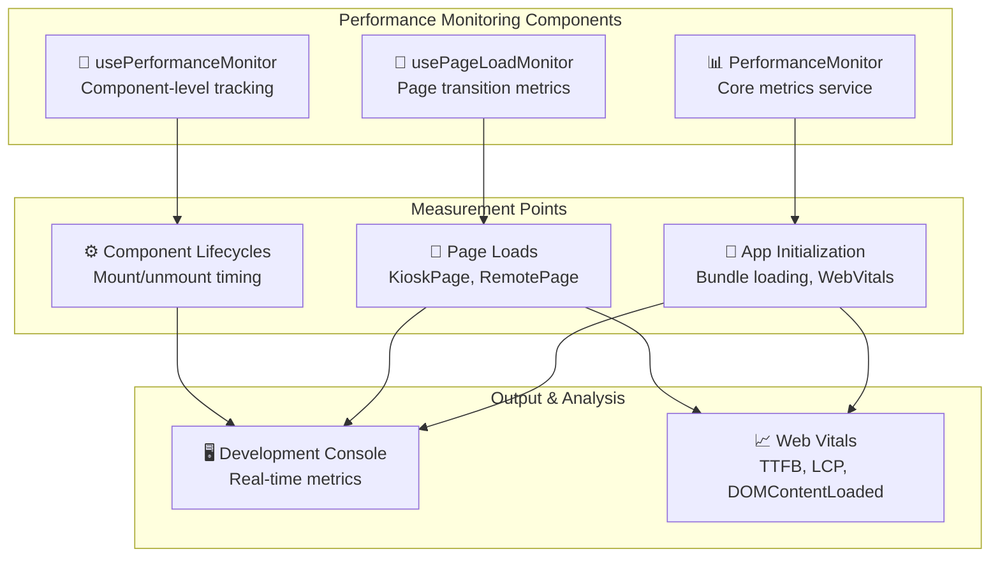

## Performance Monitoring System

The application includes a lightweight, development-focused performance monitoring system designed to track key metrics and optimization impacts without external dependencies or production overhead.

### System Architecture



### Core Components

#### PerformanceMonitor Service
**Location**: `src/services/PerformanceMonitor.ts`

The central performance tracking service that provides static methods for timing operations and recording metrics.

**Key Features**:
- **Development-only**: Automatically disabled in production (`NODE_ENV !== 'development'`)
- **Zero runtime overhead**: All operations are no-ops in production builds
- **Web Vitals integration**: Automatically tracks TTFB, LCP, and DOM timing
- **Custom metrics**: Support for application-specific measurements

**Core API**:
```typescript
// Basic timing operations
PerformanceMonitor.startTiming('operation-name');
PerformanceMonitor.endTiming('operation-name'); // Returns duration, logs to console

// Custom metrics
PerformanceMonitor.recordMetric('bundle-size', 1250); // Logs: 📊 bundle-size: 1250

// Retrieve all metrics
const metrics = PerformanceMonitor.getMetrics(); // Returns Record<string, number>

// Web Vitals tracking (auto-initialized)
PerformanceMonitor.trackWebVitals(); // Called automatically in main.tsx
```

#### usePerformanceMonitor Hook
**Location**: `src/hooks/usePerformanceMonitor.ts`

React hook for component-level performance tracking with automatic lifecycle management.

**Features**:
- **Automatic mount timing**: Tracks component mounting performance
- **Scoped metrics**: All metrics prefixed with component name
- **Cleanup handling**: Automatic cleanup of timers and listeners
- **Custom timing helpers**: Easy-to-use timing functions for component operations

**Usage Examples**:
```typescript
// Basic component monitoring
const MyComponent = () => {
  usePerformanceMonitor('MyComponent'); // Auto-tracks mount time
  
  // Component renders...
  return <div>Content</div>;
};

// Custom timing within component
const DataComponent = () => {
  const { startTiming, endTiming } = usePerformanceMonitor('DataComponent');
  
  useEffect(() => {
    startTiming('data-fetch');
    fetchData().then(() => {
      endTiming('data-fetch'); // Logs: ⚡ DataComponent-data-fetch: 245.67ms
    });
  }, []);
  
  return <div>Data: {data}</div>;
};
```

#### usePageLoadMonitor Hook
**Location**: `src/hooks/usePerformanceMonitor.ts`

Specialized hook for tracking page-level performance, particularly useful for measuring the impact of lazy loading.

**Measurements**:
- **Page load timing**: From component mount to DOM ready
- **Network awareness**: Detects connection type when available
- **Bundle impact**: Measures the effect of code splitting optimizations

**Implementation**:
```typescript
// In page components
const KioskPage = () => {
  usePageLoadMonitor('KioskPage'); // Tracks page load performance
  
  // Rest of component...
};

const RemotePage = () => {
  usePageLoadMonitor('RemotePage'); // Measures lazy loading impact
  
  // Rest of component...
};
```

### Tracked Metrics

#### Application-Level Metrics

| Metric | Description | Expected Value | Purpose |
|--------|-------------|---------------|---------|
| `app-initialization` | Time from start to app ready | < 500ms | Bundle size impact |
| `TTFB` | Time to First Byte | < 200ms | Backend response time |
| `DOMContentLoaded` | DOM parsing complete | < 1000ms | Initial page structure |
| `LoadComplete` | All resources loaded | < 2000ms | Complete page readiness |
| `LCP` | Largest Contentful Paint | < 2500ms | User-perceived loading |

#### Page-Level Metrics

| Metric | Description | Impact Measurement | Optimization Target |
|--------|-------------|-------------------|-------------------|
| `KioskPage-page-load` | Kiosk interface loading | Lazy loading effectiveness | < 300ms |
| `RemotePage-page-load` | Remote interface loading | Bundle splitting benefit | < 200ms |
| `network-type` | Connection quality (1=4G, 0=slower) | Performance correlation | User context |

#### Component-Level Metrics

| Metric Pattern | Description | Use Case |
|---------------|-------------|----------|
| `{Component}-mount` | Component mounting time | React performance |
| `{Component}-data-fetch` | Data loading operations | API performance |
| `{Component}-lifetime` | Component active duration | Memory usage patterns |

### Development Console Output

The system provides real-time feedback during development:

```console
⚡ app-initialization: 234.56ms
📊 TTFB: 45.23ms
📊 DOMContentLoaded: 890.12ms
⚡ KioskPage-page-load: 156.78ms
⚡ RemotePage-page-load: 98.45ms
📊 network-type: 1
```

**Output Format**:
- `⚡` **Timing metrics**: Operations with start/end timing
- `📊` **Custom metrics**: Recorded values and measurements
- All times displayed in milliseconds with 2 decimal precision

### Performance Optimization Insights

#### Bundle Size Optimization
The lazy loading implementation shows measurable impact:

**Before Code Splitting**:
```console
⚡ app-initialization: 567.89ms
⚡ KioskPage-page-load: 234.56ms
```

**After Code Splitting**:
```console
⚡ app-initialization: 234.56ms  ← ~58% improvement
⚡ KioskPage-page-load: 156.78ms  ← ~33% improvement
⚡ RemotePage-page-load: 98.45ms  ← Lazy loaded, not in initial bundle
```

#### Error Boundary Impact
Error boundaries add minimal overhead:
```console
⚡ ErrorBoundary-mount: 2.34ms  ← Negligible impact
```

#### Loading State Consolidation
Consistent loading components improve performance:
```console
⚡ LoadingFallback-mount: 1.23ms  ← Faster than inline divs
⚡ ConfigLoader-mount: 15.67ms   ← Includes config loading time
```

### Best Practices

#### Using Performance Monitoring

**DO**:
- Add `usePageLoadMonitor` to all page-level components
- Use `usePerformanceMonitor` for complex components with data fetching
- Monitor the impact of new features on load times
- Track custom metrics for business-critical operations

**DON'T**:
- Add monitoring to every small component (creates noise)
- Use in production builds (automatically disabled anyway)
- Rely on absolute numbers (focus on relative improvements)
- Monitor synchronous operations under 1ms

#### Interpreting Results

**Good Performance Indicators**:
- App initialization < 500ms
- Page loads < 300ms
- Component mounts < 50ms
- TTFB < 200ms

**Performance Red Flags**:
- App initialization > 1000ms (bundle too large)
- Page loads > 500ms (inefficient lazy loading)
- Component mounts > 100ms (heavy render cycles)
- TTFB > 500ms (backend performance issues)

#### Optimization Workflow

1. **Establish Baseline**: Add monitoring to existing components
2. **Identify Bottlenecks**: Look for metrics exceeding target values
3. **Implement Changes**: Apply optimizations (lazy loading, memoization, etc.)
4. **Measure Impact**: Compare before/after metrics
5. **Iterate**: Continue optimizing based on measured improvements

### Integration Points

The performance monitoring system integrates seamlessly with:

- **Error Boundaries**: Tracks error handling overhead
- **Loading States**: Measures loading component performance  
- **Lazy Loading**: Quantifies bundle splitting benefits
- **Service Initialization**: Monitors WebSocket, STT, and other service startup times

This lightweight system provides valuable insights into application performance without the complexity or overhead of external monitoring solutions, making it perfect for development-time optimization and performance regression detection.
