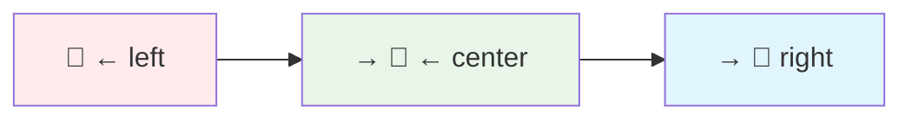
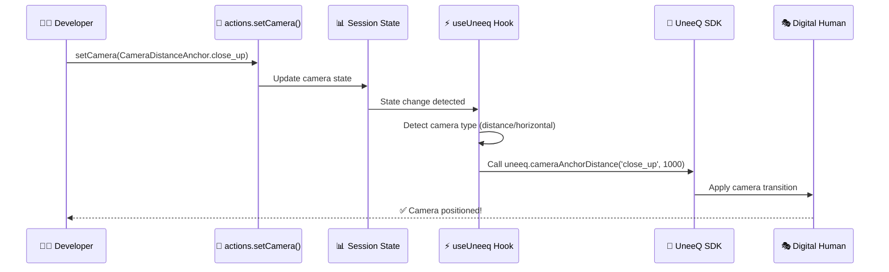

# How-to Guide: Digital Human Camera Control

This guide explains how to control your digital human's camera positioning using the simple, action-based camera control system. With just a single function call, you can dynamically change camera angles, distances, and positioning to create cinematic and engaging experiences.

## 🎯 Quick Overview

**What is Camera Control?**
Camera control allows you to programmatically adjust the digital human's camera positioning during conversations. You can switch between different angles, distances, and horizontal positions to create dynamic, professional-looking interactions.

**Example:** `actions.setCamera(CameraDistanceAnchor.close_up)` → Camera instantly transitions to a close-up view of the digital human's face.

## 🚀 Why This System is Simple

### **1. Single Action Call**
```typescript
// That's it! No complex configurations needed
actions.setCamera(CameraDistanceAnchor.close_up);
```

### **2. Predefined, Human-Readable Options**
No need to remember numbers, coordinates, or technical parameters. Just use descriptive enum values:
```typescript
CameraDistanceAnchor.close_up           // "close up of the face"
CameraHorizontalAnchor.left             // "move camera to the left"
```

### **3. Automatic SDK Integration**
The system automatically:
- Detects the camera type (distance vs horizontal)
- Calls the correct UneeQ SDK method
- Handles the transition smoothly
- No manual SDK calls required

### **4. Type-Safe & Predictable**
- Full TypeScript support with autocompletion
- Impossible to pass invalid values
- Clear documentation for each option

## 📱 Available Camera Controls

### **Distance & Framing Controls**

Control how close or far the camera appears from the digital human:

```typescript
import { CameraDistanceAnchor } from '@/types';

// Ultra close - just the face
actions.setCamera(CameraDistanceAnchor.close_up);

// Face with some shoulders showing
actions.setCamera(CameraDistanceAnchor.loose_close_up);

// Upper body visible
actions.setCamera(CameraDistanceAnchor.tight_medium_shot);
actions.setCamera(CameraDistanceAnchor.medium_shot);

// More of the body visible  
actions.setCamera(CameraDistanceAnchor.medium_full_shot);

// Full body in frame
actions.setCamera(CameraDistanceAnchor.full_shot);
```

### **Horizontal Positioning Controls**

Control the camera's left-right positioning relative to the digital human:

```typescript
import { CameraHorizontalAnchor } from '@/types';

// Move camera to the left side
actions.setCamera(CameraHorizontalAnchor.left);

// Center the camera (default)
actions.setCamera(CameraHorizontalAnchor.center);

// Move camera to the right side  
actions.setCamera(CameraHorizontalAnchor.right);
```

**Visual Reference:**


## 🛠️ How to Use Camera Control

### Step 1: Import the Required Types

```typescript
import { CameraDistanceAnchor, CameraHorizontalAnchor } from '@/types';
import { useSession } from '@/contexts/SessionContext';
```

### Step 2: Get Session Actions

```typescript
const { actions } = useSession();
```

### Step 3: Set Camera Position

```typescript
// For distance/framing control
actions.setCamera(CameraDistanceAnchor.close_up);

// For horizontal positioning
actions.setCamera(CameraHorizontalAnchor.left);
```

## 🎬 Practical Examples

### Example 1: Dynamic Storytelling

Create cinematic storytelling by changing camera angles during the narrative:

```typescript
import { CameraDistanceAnchor, MessageSender, type Message } from '@/types';
import type { SessionContextType } from '@/contexts/SessionContext';

export class CinematicStoryTrigger implements Trigger {
    icon: string = "MdMovie";
    
    generate({actions}: SessionContextType): Message {
        // Start with a dramatic close-up
        actions.setCamera(CameraDistanceAnchor.close_up);
        
        return {
            id: crypto.randomUUID(),
            content: `Let me tell you an incredible story. 
                     *Camera moves to close-up*
                     
                     It was a dark and stormy night when suddenly...
                     *gestures dramatically*
                     
                     The whole world changed forever.`,
            timestamp: new Date(),
            sender: MessageSender.System,
            prompt: true
        };
    }
}
```

### Example 2: Product Presentations

Switch between different angles during product demonstrations:

```typescript
export class ProductDemoTrigger implements Trigger {
    icon: string = "MdShoppingCart";
    
    generate({actions}: SessionContextType): Message {
        // Start with full shot to show the product context
        actions.setCamera(CameraDistanceAnchor.full_shot);
        
        // After a delay, move to medium shot for details
        setTimeout(() => {
            actions.setCamera(CameraDistanceAnchor.medium_shot);
        }, 5000);
        
        return {
            id: crypto.randomUUID(),
            content: `Welcome to our product showcase! 
                     Let me show you our latest innovation.
                     
                     <uneeq custom event name="product" data="new-laptop" />
                     
                     As you can see, this device offers incredible performance...`,
            timestamp: new Date(),
            sender: MessageSender.System,
            prompt: true
        };
    }
}
```

### Example 3: Interactive Conversations

Use horizontal positioning for more natural conversation flow:

```typescript
export class ConversationListener implements CustomEventListener {
    type = "conversation";
    
    async execute(data: any, actions: SessionActions): Promise<void> {
        const mood = data.mood || 'neutral';
        
        switch (mood) {
            case 'intimate':
                // Close-up for personal conversations
                actions.setCamera(CameraDistanceAnchor.close_up);
                break;
                
            case 'professional':
                // Medium shot for business discussions
                actions.setCamera(CameraDistanceAnchor.medium_shot);
                break;
                
            case 'playful':
                // Slightly offset angle for casual chat
                actions.setCamera(CameraHorizontalAnchor.left);
                setTimeout(() => {
                    actions.setCamera(CameraHorizontalAnchor.center);
                }, 3000);
                break;
                
            default:
                actions.setCamera(CameraHorizontalAnchor.center);
        }
    }
}
```

### Example 4: Event Listener Integration

Automatically adjust camera based on speech events:

```typescript
import { EventType } from '@/types';
import type { UneeqEventListener } from '@/listeners/types/UneeqEventListener';
import type { SessionContextType } from '@/contexts/SessionContext';

export class AvatarStartedSpeakingListener implements UneeqEventListener {
    eventType = EventType.AvatarStartedSpeaking;
    
    execute(data: any, session: SessionContextType): void {
        // When avatar starts speaking, ensure proper framing
        session.actions.setCamera(CameraDistanceAnchor.medium_shot);
        session.actions.setAwaitingPromptResponse(true);
    }
}
```

## 🔄 Behind the Scenes: How It Works

The camera control system works through a simple but powerful chain:



### **Automatic Type Detection**

The system automatically determines which UneeQ SDK method to call:

```typescript
// In useUneeq.ts - This happens automatically
useEffect(() => {
    if (state.camera && window.uneeq) {
        // Detect if it's horizontal or distance positioning
        const isHorizontal = Object.values(CameraHorizontalAnchor)
            .includes(state.camera as CameraHorizontalAnchor);
        
        const cameraEnum = isHorizontal ? CameraHorizontalAnchor : CameraDistanceAnchor;
        const cameraKey = Object.keys(cameraEnum)
            .find(key => cameraEnum[key as keyof typeof cameraEnum] === state.camera);
        
        // Call the appropriate SDK method
        window.uneeq[isHorizontal ? 'cameraAnchorHorizontal' : 'cameraAnchorDistance']
            (cameraKey as string, 1000);
    }
}, [state.camera]);
```

### **Default State**

The system initializes with a centered camera:

```typescript
// In SessionContext.tsx
const initialState: State = {
    // ... other state
    camera: CameraHorizontalAnchor.center,
};
```

## 📚 Complete API Reference

### **CameraDistanceAnchor Options**

| Enum Value | Description | Use Case |
|------------|-------------|----------|
| `close_up` | "close up of the face" | Intimate conversations, emotion focus |
| `loose_close_up` | "loose close up of the face" | Personal discussions with context |
| `tight_medium_shot` | "tight medium shot of the body" | Professional conversations |
| `medium_shot` | "medium shot of the body" | Standard presentations |
| `medium_full_shot` | "medium full shot of the body" | Product demonstrations |
| `full_shot` | "full shot of the body" | Welcome interactions, full context |

### **CameraHorizontalAnchor Options**

| Enum Value | Description | Use Case |
|------------|-------------|----------|
| `left` | "move camera to the left of the digital human" | Dynamic conversations, visual variety |
| `center` | "move camera to the center of the digital human" | Standard positioning, formal presentations |
| `right` | "move camera to the right of the digital human" | Alternative angles, storytelling |

### **SessionActions.setCamera Method**

```typescript
setCamera: (camera: CameraHorizontalAnchor | CameraDistanceAnchor) => void;
```

**Parameters:**
- `camera`: Either a `CameraHorizontalAnchor` or `CameraDistanceAnchor` enum value

**Returns:** `void`

**Example:**
```typescript
const { actions } = useSession();
actions.setCamera(CameraDistanceAnchor.close_up);
```

## 🔧 Troubleshooting

### **Common Issues & Solutions**

**Issue: "Camera doesn't change when I call setCamera"**

✅ **Solutions:**
1. Verify UneeQ session is active: `console.log(state.uneeq)`
2. Check that you're using the correct enum values
3. Ensure camera changes aren't happening too rapidly (< 1 second apart)
4. Check browser console for UneeQ SDK errors

**Issue: "Camera changes but looks the same"**

✅ **Solutions:**
1. Some camera positions may look similar depending on the digital human model
2. Try more extreme differences like `full_shot` vs `close_up`
3. Check that the digital human model supports all camera positions
4. Verify the persona configuration allows camera control

**Issue: "TypeScript errors with camera enums"**

✅ **Solutions:**
1. Import the enums properly: `import { CameraDistanceAnchor, CameraHorizontalAnchor } from '@/types'`
2. Ensure you're passing enum values, not strings
3. Check that types are properly exported in `@/types/index.ts`

### **Debugging Checklist**

- [ ] UneeQ session is initialized and active
- [ ] Correct enum imports are used
- [ ] Camera changes have appropriate timing (3+ seconds between changes)
- [ ] Browser console shows no UneeQ SDK errors
- [ ] Digital human model supports camera positioning
- [ ] TypeScript compilation succeeds without errors

### **Debugging Code**

Add this to see camera changes in action:

```typescript
import { useSession } from '@/contexts/SessionContext';

// Add to your component for debugging
const { state } = useSession();

useEffect(() => {
    console.log('Camera state changed:', state.camera);
}, [state.camera]);
```

## 🚀 Summary

The camera control system provides powerful, cinematic control with incredible simplicity:

### **Key Benefits:**
- 🎯 **One-Line Control**: `actions.setCamera(CameraDistanceAnchor.close_up)`
- 🔒 **Type-Safe**: Full TypeScript support with enum validation
- ⚡ **Automatic**: No manual SDK calls or complex configurations
- 🎨 **Creative**: Perfect for storytelling, presentations, and dynamic interactions
- 📐 **Predictable**: Human-readable options with clear descriptions

### **Two Control Types:**
- **🎬 Distance/Framing**: `CameraDistanceAnchor` for close-ups, medium shots, full shots
- **↔️ Horizontal Positioning**: `CameraHorizontalAnchor` for left, center, right angles

### **Usage Pattern:**
1. **Import** the camera enums
2. **Get** session actions with `useSession()`
3. **Set** camera with `actions.setCamera(enum.value)`
4. **Enjoy** smooth, automatic transitions

### **Perfect for:**
- **Storytelling**: Dynamic camera movement during narratives
- **Presentations**: Professional framing for business content  
- **Education**: Guide focus from overview to details
- **Entertainment**: Cinematic experiences and engaging interactions
- **Customer Service**: Appropriate positioning for different conversation types

The camera control system transforms static digital human interactions into dynamic, cinematic experiences with just a single function call. It's designed to be so simple that you can focus on creating great content rather than managing technical details!
