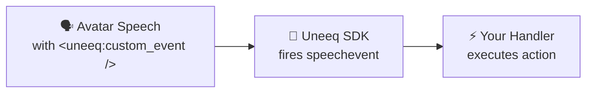
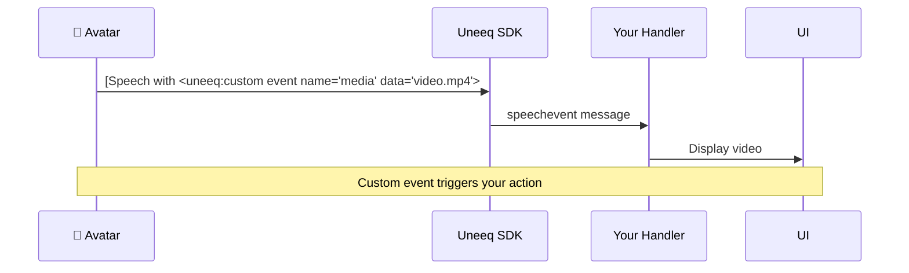
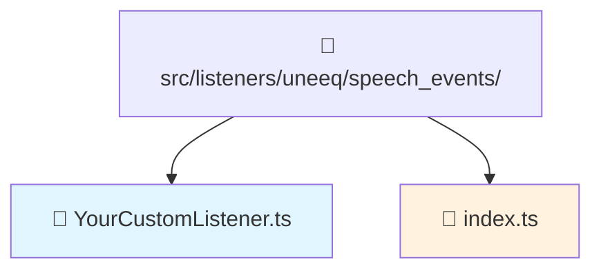
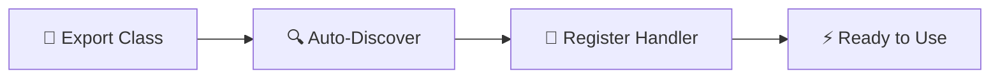

## How-to Guide: Creating Custom Uneeq Events

This guide explains how to create custom event handlers for the Uneeq Digital Human integration. Custom events allow you to extend the avatar's capabilities by responding to special speech tags and instructions.

### Quick Example

Avatar says: *"Here's a beautiful sunset for you! **&lt;uneeq custom event name="image" data="sunset.jpg" /&gt;**"*

Your handler automatically shows the image. That's it! 🎯

### Overview: What are Custom Uneeq Events?

Custom events are triggered when the Uneeq Digital Human detects specific tags or instructions in speech. When the avatar encounters these special markers, it fires `SpeechEvent` messages that your custom handlers can intercept and process to create interactive experiences.

**Simple 3-Step Process:**



### The Complete Flow

Here's how it works when the avatar speaks with a custom event:



### Step-by-Step Implementation

#### Step 1: Create Your Custom Event Class

**File Structure:**


Create a new file in `src/listeners/uneeq/speech_events/`. Let's create a simple example:

**File: `src/listeners/uneeq/speech_events/ImageCustomListener.ts`**

```typescript
import { type SessionActions } from "@/contexts/SessionContext";
import { type CustomEventListener } from "@/listeners/types/CustomEventListener";

export class ImageCustomListener implements CustomEventListener {
    // This matches the tag name in speech
    type = "image";
    
    async execute(data: any, actions: SessionActions): Promise<void> {
        console.log("Image Custom Listener received:", data);
        
        // Extract the image URL from the speech data
        const imageUrl = data.url || data.src || data.image;
        
        if (imageUrl) {
            // Update the session state to show the image
            actions.setImageUrl(imageUrl);
            console.log(`Displaying image: ${imageUrl}`);
        } else {
            console.warn("No image URL found in instruction data:", data);
        }
    }
}
```

#### Step 2: Register Your Event (Auto-Discovery)

Add your new class to the exports in `src/listeners/uneeq/speech_events/index.ts`:

```typescript
export { MediaCustomListener } from './MediaCustomListener';
export { ImageCustomListener } from './ImageCustomListener';  // Add this line
```

That's it! The system automatically discovers and registers your event.

#### Step 3: Configure Speech Events in Uneeq

In your Uneeq persona configuration, you can now use the custom event in speech:

```html
"Here's a beautiful sunset image for you to enjoy. <uneeq custom event name="image" data="https://example.com/sunset.jpg" />"
```

**UneeQ Custom Event Format:**
- `name` attribute: matches your handler's `type` property
- `data` attribute: contains the data your handler will receive
- Events trigger precisely when the digital human speaks that part of the text

### How UneeQ Speech Events Work

When the digital human encounters a `<uneeq custom event />` tag in its speech, it fires a `speechevent` message to your browser. The system automatically routes this to your custom handler:

```typescript
// This is handled automatically by the SpeechEventListener
window.addEventListener('uneeqmessage', (event) => {
  const msg = event.detail;
  if (msg.uneeqMessageType === 'speechevent') {
    const eventName = msg.speechEvent.param.name;   // Your handler's type
    const eventData = msg.speechEvent.param.data;   // Data from the tag
    
    // Auto-discovery finds and executes your handler
    const handler = this.customEvents.get(eventName);
    if (handler) {
      await handler.execute({ ...eventData }, actions);
    }
  }
});
```

### Understanding the CustomEventListener Interface

All custom events must implement this simple interface:

```typescript
interface CustomEventListener {
    type: string;                                           // Tag name to match
    execute(data: any, actions: SessionActions): Promise<void>; // Handler function
}
```

**Key Properties:**

- **`type`**: The string that matches the name in `<uneeq custom event name="..." />`
- **`execute`**: Async function that processes the event data and updates the application state

### Handling Complex Data

For simple data, the `data` attribute contains a string:
```html
<uneeq custom event name="media" data="video.mp4" />
```

For complex data, use JSON strings:
```html
<uneeq custom event name="product" data='{"id":"laptop-pro","color":"silver","price":1299}' />
```

Your handler receives the data as passed from UneeQ:
```typescript
async execute(data: any, actions: SessionActions): Promise<void> {
    // data could be a simple string or complex object
    console.log('Received data:', data);
    
    // For JSON data, parse if it's a string
    const productInfo = typeof data === 'string' ? JSON.parse(data) : data;
    
    // Use the parsed data
    console.log(`Product ${productInfo.id} costs $${productInfo.price}`);
}
```


### Auto-Discovery System

The system automatically finds and registers your custom events:



**The SpeechEventListener automatically:**

1. **Discovers** all exported classes from `speech_events/index.ts`
2. **Instantiates** each class that looks like a CustomEventListener
3. **Registers** them in a Map by their `type` property
4. **Routes** incoming speech events to the correct handler


### Debugging and Troubleshooting

#### Common Issues and Solutions

**Issue: "My custom event isn't being triggered"**

✅ **Solution:**
1. Check that your class is exported in `speech_events/index.ts`
2. Verify the `type` property matches the name attribute exactly
3. Ensure the speech event format is correct: `<uneeq custom event name="..." data="..." />`
4. Check browser console for auto-discovery logs

**Issue: "Event triggers but nothing happens"**

✅ **Solution:**
1. Add console logs in your `execute` method
2. Verify the `data` parameter contains expected values
3. Check that you're calling the correct action methods
4. Ensure session state is updating (use React DevTools)

**Issue: "Actions don't seem to work"**

✅ **Solution:**
1. Verify you're using the correct action method names
2. Check that the UI components are listening to the correct state properties
3. Ensure state updates are properly triggering re-renders

#### Debugging Checklist

- [ ] Event class exported in `speech_events/index.ts`
- [ ] `type` property matches `name` attribute in UneeQ event
- [ ] Speech event format is correct: `<uneeq custom event name="..." data="..." />`
- [ ] Console shows event being processed
- [ ] Data parameter has expected structure
- [ ] Actions are called with valid parameters
- [ ] UI components respond to state changes

### Real-World Use Cases

#### Use Case 1: Interactive Presentations

```typescript
export class SlideCustomListener implements CustomEventListener {
    type = "slide";
    
    async execute(data: any, actions: SessionActions): Promise<void> {
        const slideNumber = data.number || data.slide;
        const slideUrl = `https://example.com/slides/slide-${slideNumber}.jpg`;
        
        actions.setImageUrl(slideUrl);
        actions.addMessageToHistory({
            id: crypto.randomUUID(),
            content: `Now showing slide ${slideNumber}`,
            sender: MessageSender.System,
            timestamp: new Date()
        });
    }
}
```

**Speech:** *"Let me show you **&lt;uneeq custom event name="slide" data="3" /&gt;** slide number three."*

#### Use Case 2: Product Demonstrations

```typescript
export class ProductCustomListener implements CustomEventListener {
    type = "product";
    
    async execute(data: any, actions: SessionActions): Promise<void> {
        const productId = data.id || data.product;
        const productData = await this.fetchProductData(productId);
        
        if (productData.image) {
            actions.setImageUrl(productData.image);
        }
        
        actions.addMessageToHistory({
            id: crypto.randomUUID(),
            content: `${productData.name}: ${productData.description}`,
            sender: MessageSender.Assistant,
            timestamp: new Date()
        });
    }
    
    private async fetchProductData(id: string): Promise<any> {
        // Fetch product data from your API
        const response = await fetch(`/api/products/${id}`);
        return response.json();
    }
}
```

**Speech:** *"Here's our featured **&lt;uneeq custom event name="product" data="laptop-pro-2024" /&gt;** product."*

### Summary

Creating custom Uneeq events is straightforward:

1. **Create** a class like `YourCustomListener` implementing `CustomEventListener`
2. **Export** it from `speech_events/index.ts`
3. **Use** the UneeQ speech event in your persona
4. **Test** and debug as needed

The `CustomEventListener` naming convention makes it clear these are event handlers. The system handles all the complexity of event routing and discovery automatically. You just focus on implementing your business logic in the `execute` method.

### Key Benefits

- 🚀 **Zero Configuration**: Auto-discovery means no manual registration
- 🔧 **Type Safe**: Full TypeScript support with proper interfaces
- 🎯 **Focused**: Each event handler has a single, clear responsibility
- 🛡️ **Error Isolated**: Failed handlers don't break other events
- 📈 **Extensible**: Easy to add new capabilities without touching core code

This pattern makes it incredibly simple to extend your digital human's capabilities and create rich, interactive experiences!
