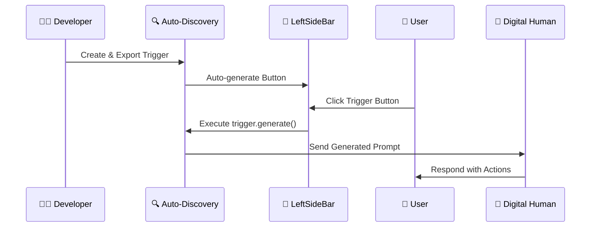
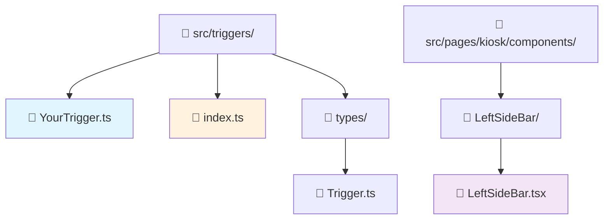

# How-to Guide: Creating Interactive Triggers

This guide explains how to create interactive triggers that automatically appear as buttons in the sidebar and generate dynamic prompts for your digital human conversations.

## 🎯 Quick Overview

**What are Triggers?**
Triggers are smart prompt generators that create dynamic, contextual instructions for your digital human. They automatically appear as clickable buttons in the sidebar and can generate everything from simple prompts to complex interactive scenarios.

**Example:** Click a "Random Story" button → Generates: *"Using the tags related to 'Show media content' you need to generate story naturally with 1 sentence, includes the tag `<uneeq:action_media />` at the exact moment where the action happens..."*

## 🚀 Why Use Triggers?

### **1. Dynamic Content Generation**
- Generate contextual prompts based on current state
- Include random elements for varied experiences  
- Create complex instruction sets programmatically

### **2. Automatic UI Integration**
- Zero configuration - triggers appear automatically in sidebar
- Consistent visual design with icons
- No manual button creation needed

### **3. Scalable Interaction Design**
- Easy to add new interaction patterns
- Self-contained, reusable components
- Type-safe implementation with TypeScript

### **4. Enhanced User Experience**
- Quick access to common actions
- Visual feedback and loading states
- Seamless integration with digital human workflow

## 🔄 The Complete Flow

Here's how triggers work from creation to execution:



## 📁 File Structure



## 🛠️ Step-by-Step Implementation

### Step 1: Understand the Trigger Interface

All triggers must implement this simple interface:

```typescript
interface Trigger {
    /** Optional icon name for UI representation */
    icon?: string;
    
    /**
     * Generate an instruction string (prompt)
     * @param args - Optional generation parameters
     */
    generate: (args: any) => string;
}
```

### Step 2: Create Your Trigger Class

**File: `src/triggers/ProductDemoTrigger.ts`**

```typescript
import type { Trigger } from "./types/Trigger";

export class ProductDemoTrigger implements Trigger {
    icon: string = "MdShoppingCart";
    
    /**
     * Generate a product demonstration prompt
     */
    generate(args: any): string {
        const products = ['laptop', 'smartphone', 'tablet', 'smartwatch'];
        const randomProduct = products[Math.floor(Math.random() * products.length)];
        
        return `Please demonstrate the features of our ${randomProduct} in an engaging way. 
                Include specific details about performance, design, and key benefits. 
                When you mention showing the product image, use 
                <uneeq custom event name="product" data="${randomProduct}" /> 
                to display it visually.`;
    }
}
```

### Step 3: Export Your Trigger (Auto-Discovery)

Add your trigger to `src/triggers/index.ts`:

```typescript
// Export all trigger classes for auto-discovery
export * from './RandomStoryTrigger';
export * from './ProductDemoTrigger';  // ← Add this line

// Export types for usage in components
export type { Trigger } from './types/Trigger';
```

### Step 4: Test Your Trigger

That's it! Your trigger will automatically appear in the sidebar:

1. **Build/Restart** your development server
2. **Look for your icon** in the left sidebar  
3. **Click the button** to test prompt generation
4. **Check console** for generated prompt output

## 🔍 How Auto-Discovery Works

The system automatically finds and integrates your triggers:

```mermaid
graph LR
    A[📂 Export Trigger] --> B[🔍 getAllTriggers()]
    B --> C[📝 Create TriggerItem]
    C --> D[🎨 Generate Button]
    D --> E[⚡ Ready to Use]
    
    style A fill:#e8f5e8
    style E fill:#fff3e0
```

**Behind the Scenes (LeftSideBar.tsx):**

```typescript
const LeftSideBar: React.FC = () => {
  // Auto-discovery finds all exported triggers
  const triggerInstances = useMemo(() => getAllTriggers(), []);
  
  // Load icons dynamically
  const iconNames = triggerInstances.map(trigger => trigger.instance.icon).filter(Boolean);
  const { getIconComponent } = useIconFactory(iconNames);

  const handleTriggerClick = async (trigger: TriggerItem) => {
    // Execute your trigger's generate method
    const prompt = trigger.instance.generate({});
    
    // Add to conversation history
    actions.addMessageToHistory({
      id: crypto.randomUUID(),
      content: prompt,
      timestamp: new Date(),
      sender: MessageSender.System,
    });
  };

  return (
    <div className="left-side-bar-buttons-container">
      {/* Your triggers automatically appear here as buttons */}
      {triggerInstances.map(trigger => (
        <CircleButton 
          key={trigger.key}
          icon={getIconComponent(trigger.instance.icon)}
          onClick={() => handleTriggerClick(trigger)}
          title={`Execute ${trigger.key} trigger`}
        />
      ))}
    </div>
  );
};
```

## 🎨 Advanced Trigger Examples

### Example 1: Contextual Conversation Starter

```typescript
export class ConversationStarterTrigger implements Trigger {
    icon: string = "MdChat";
    
    generate(args: any): string {
        const topics = [
            'the latest technology trends',
            'sustainable living practices', 
            'creative problem-solving techniques',
            'future of work and automation'
        ];
        
        const randomTopic = topics[Math.floor(Math.random() * topics.length)];
        const timeOfDay = new Date().getHours() < 12 ? 'morning' : 
                         new Date().getHours() < 18 ? 'afternoon' : 'evening';
        
        return `Good ${timeOfDay}! Let's have an engaging conversation about ${randomTopic}. 
                Start with an interesting question or fun fact that will spark curiosity 
                and encourage the user to share their thoughts.`;
    }
}
```

### Example 2: Interactive Quiz Generator

```typescript
export class QuizTrigger implements Trigger {
    icon: string = "MdQuiz";
    
    generate(args: any): string {
        const subjects = ['science', 'history', 'technology', 'geography'];
        const difficulties = ['easy', 'medium', 'challenging'];
        
        const subject = subjects[Math.floor(Math.random() * subjects.length)];
        const difficulty = difficulties[Math.floor(Math.random() * difficulties.length)];
        
        return `Create a ${difficulty} ${subject} quiz question with 4 multiple choice answers. 
                Present the question in an engaging way, then wait for the user's answer. 
                After they respond, provide the correct answer with a brief, interesting explanation.`;
    }
}
```

### Example 3: Media Showcase Trigger

```typescript
export class MediaShowcaseTrigger implements Trigger {
    icon: string = "MdPlayCircle";
    
    generate(args: any): string {
        const mediaTypes = ['video', 'image', 'presentation'];
        const mediaType = mediaTypes[Math.floor(Math.random() * mediaTypes.length)];
        
        const mediaUrls = {
            video: ['demo.mp4', 'tutorial.mp4', 'showcase.mp4'],
            image: ['product1.jpg', 'infographic.png', 'chart.svg'],
            presentation: ['slides1.pdf', 'overview.pptx', 'demo.slides']
        };
        
        const randomMedia = mediaUrls[mediaType][
            Math.floor(Math.random() * mediaUrls[mediaType].length)
        ];
        
        return `I'm going to show you something interesting! 
                <uneeq custom event name="${mediaType}" data="${randomMedia}" />
                This ${mediaType} demonstrates key concepts we've been discussing. 
                What questions do you have about what you're seeing?`;
    }
}
```

### Example 4: State-Aware Trigger

```typescript
export class PersonalizedGreetingTrigger implements Trigger {
    icon: string = "MdWavingHand";
    
    generate(args: any): string {
        // Access session state or user preferences
        const userName = args.userName || 'friend';
        const visitCount = args.visitCount || 1;
        const lastTopic = args.lastTopic || 'general topics';
        
        if (visitCount === 1) {
            return `Welcome ${userName}! I'm excited to meet you. 
                    What brings you here today? I'm ready to help with any questions 
                    or just have a great conversation!`;
        } else {
            return `Great to see you again, ${userName}! 
                    Last time we discussed ${lastTopic}. 
                    Would you like to continue that conversation or explore something new?`;
        }
    }
}
```

## 🎯 Trigger Integration with Custom Events

Triggers work beautifully with custom events. Here's how to combine them:

```typescript
export class InteractiveDemoTrigger implements Trigger {
    icon: string = "MdInteractive";
    
    generate(args: any): string {
        return `Let me show you our interactive features! 
                
                First, here's a welcome image: 
                <uneeq custom event name="image" data="welcome-banner.jpg" />
                
                Now let me play a demo video: 
                <uneeq custom event name="media" data="interactive-demo.mp4" />
                
                As you can see, I can display images and videos seamlessly 
                during our conversation. What would you like to explore next?`;
    }
}
```

## 🛡️ Best Practices

### **1. Clear Purpose & Naming**
```typescript
// ✅ Good - Clear purpose
export class ProductDemoTrigger implements Trigger { }
export class ConversationStarterTrigger implements Trigger { }

// ❌ Avoid - Vague naming
export class HelperTrigger implements Trigger { }
export class MainTrigger implements Trigger { }
```

### **2. Meaningful Icons**
```typescript
// ✅ Good - Icons match functionality
icon: string = "MdShoppingCart";  // For product demos
icon: string = "MdChat";          // For conversation starters
icon: string = "MdQuiz";          // For quizzes

// ❌ Avoid - Generic or confusing icons
icon: string = "MdHelp";          // Too generic
```

### **3. Dynamic & Contextual Content**
```typescript
// ✅ Good - Dynamic content
generate(args: any): string {
    const randomElement = this.getRandomOption();
    const contextualInfo = this.getContextualData(args);
    return `Generated prompt with ${randomElement} and ${contextualInfo}`;
}

// ❌ Avoid - Static content
generate(args: any): string {
    return "Always the same prompt";
}
```

### **4. Error Handling**
```typescript
generate(args: any): string {
    try {
        // Your generation logic
        return this.generatePrompt(args);
    } catch (error) {
        console.error('Trigger generation failed:', error);
        return 'Sorry, I had trouble generating that prompt. Please try again.';
    }
}
```

## 🔧 Debugging Triggers

### Common Issues & Solutions

**Issue: "My trigger doesn't appear in the sidebar"**

✅ **Solutions:**
1. Check that your class is exported in `triggers/index.ts`
2. Verify the class implements the `Trigger` interface
3. Ensure you've restarted the development server
4. Check browser console for auto-discovery errors

**Issue: "Button appears but doesn't work when clicked"**

✅ **Solutions:**
1. Add console.log in your `generate` method to verify it's called
2. Check that `generate` returns a string (not undefined)
3. Look for JavaScript errors in browser console
4. Verify your prompt is being added to message history

**Issue: "Icon doesn't show up"**

✅ **Solutions:**
1. Verify the icon name exists in your icon library (React Icons)
2. Check that `useIconFactory` can load the icon
3. Use a common icon like `"MdHelp"` for testing
4. Check browser console for icon loading errors

### Debugging Checklist

- [ ] Trigger class exported in `triggers/index.ts`
- [ ] Class implements `Trigger` interface properly
- [ ] `generate` method returns a string
- [ ] Icon name is valid React Icons name
- [ ] Development server restarted after changes
- [ ] Browser console shows no errors
- [ ] Message history updates when button clicked

## 🎉 Real-World Use Cases

### **Customer Service Kiosk**
```typescript
export class CustomerServiceTrigger implements Trigger {
    icon: string = "MdSupportAgent";
    
    generate(): string {
        return `I'm here to help! I can assist with:
                • Product information and recommendations
                • Order status and tracking
                • Technical support questions
                • Store policies and procedures
                
                What can I help you with today?`;
    }
}
```

### **Educational Content**
```typescript
export class LearningPathTrigger implements Trigger {
    icon: string = "MdSchool";
    
    generate(): string {
        const subjects = ['programming', 'design', 'business', 'science'];
        const subject = subjects[Math.floor(Math.random() * subjects.length)];
        
        return `Let's explore ${subject}! I can create a personalized learning path
                based on your current knowledge and goals. 
                What specific areas of ${subject} interest you most?`;
    }
}
```

### **Entertainment & Engagement**
```typescript
export class StorytellingTrigger implements Trigger {
    icon: string = "MdAutoStories";
    
    generate(): string {
        const genres = ['sci-fi', 'mystery', 'adventure', 'comedy'];
        const settings = ['futuristic city', 'ancient castle', 'space station', 'magical forest'];
        
        const genre = genres[Math.floor(Math.random() * genres.length)];
        const setting = settings[Math.floor(Math.random() * settings.length)];
        
        return `Let me tell you a ${genre} story set in a ${setting}! 
                This will be interactive - you can influence the plot by making
                choices as we go along. Ready to begin the adventure?`;
    }
}
```

## 📈 Performance Considerations

### **Efficient Trigger Loading**
The auto-discovery system is optimized:
- Triggers are instantiated once using `useMemo`
- Icons are loaded dynamically only for registered triggers
- Button rendering is optimized with React keys

### **Memory Management**  
- Triggers are lightweight - just class instances
- No persistent state stored in triggers themselves
- Generated prompts are handled by session state

## 🚀 Summary

Creating triggers is a powerful way to enhance your digital human interactions:

1. **Create** a class implementing `Trigger` interface
2. **Export** it from `triggers/index.ts` 
3. **Use** auto-discovery for instant sidebar integration
4. **Test** and iterate on your trigger logic

### Key Benefits:
- 🔄 **Zero Configuration** - Automatic UI integration
- 🎯 **Dynamic Content** - Contextual prompt generation  
- 🛡️ **Type Safety** - Full TypeScript support
- 🎨 **Consistent UI** - Automatic icon and button styling
- 📈 **Scalable** - Easy to add new interaction patterns

The trigger system makes it incredibly simple to add new interactive capabilities to your digital human experience. Every trigger you create automatically becomes a one-click interaction in your sidebar, creating a seamless and engaging user experience!
