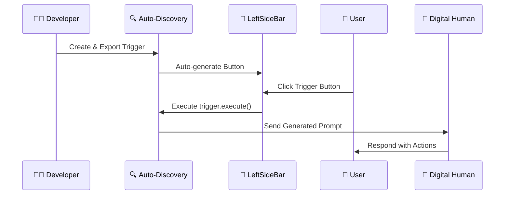
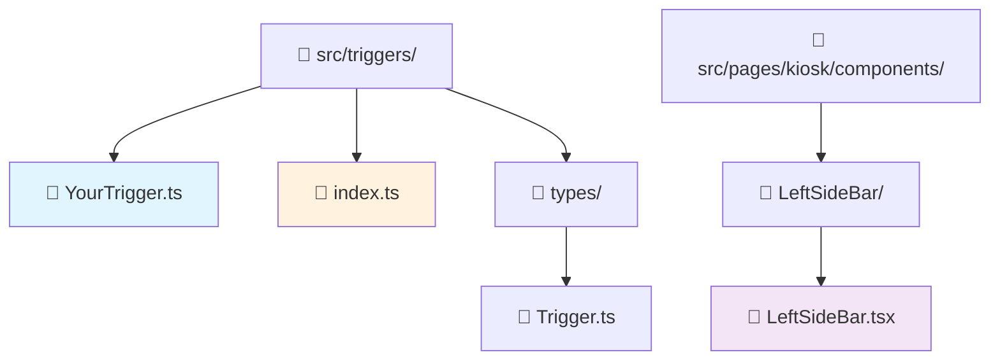
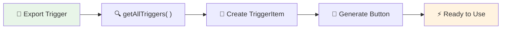

# How-to Guide: Creating Interactive Triggers

This guide explains how to create interactive triggers that automatically appear as buttons in the sidebar and generate dynamic prompts for your digital human conversations.

## 🎯 Quick Overview

**What are Triggers?**
Triggers are smart prompt generators that create dynamic, contextual instructions for your digital human. They automatically appear as clickable buttons in the sidebar and can generate everything from simple prompts to complex interactive scenarios.

**Example:** Click a "Random Story" button → Generates: *"Using the tags related to 'Show media content' you need to generate story naturally with 1 sentence, includes the tag `<uneeq:action_media />` at the exact moment where the action happens..."*

## 🚀 Why Use Triggers?

### **1. Dynamic Content Generation**
- Generate contextual prompts based on current state
- Include random elements for varied experiences  
- Create complex instruction sets programmatically

### **2. Automatic UI Integration**
- Zero configuration - triggers appear automatically in sidebar
- Consistent visual design with icons
- No manual button creation needed

### **3. Scalable Interaction Design**
- Easy to add new interaction patterns
- Self-contained, reusable components
- Type-safe implementation with TypeScript

### **4. Enhanced User Experience**
- Quick access to common actions
- Visual feedback and loading states
- Seamless integration with digital human workflow

## 🔄 The Complete Flow

Here's how triggers work from creation to execution:



## 📁 File Structure



## 🛠️ Step-by-Step Implementation

### Step 1: Understand the Trigger Interface

All triggers must implement this simple interface:

```typescript
import type { Message } from '@/types/transport/Message';
import type { SessionContextType } from '@/contexts/SessionContext';

interface Trigger {
    /** Unique identifier for the trigger */
    id: number;
    
    /** Optional icon name for UI representation */
    icon?: string;
    
    /**
     * Execute the trigger logic and generate a Message object or perform actions
     * @param args - Session context with state and actions
     */
    execute: (args: SessionContextType) => Message | void;
}
```

### Step 2: Create Your Trigger Class

The system supports **two types of triggers**:
- **🎨 UI Triggers**: With icons - appear as buttons in the sidebar
- **⚙️ Programmatic Triggers**: Without icons - available for code use only

#### UI Trigger Example (Appears in Sidebar)

**File: `src/triggers/ActionTrigger.ts`**

```typescript
import type { Message } from "@/types/transport/Message";
import { MessageSender } from "@/types/transport/MessageSender";
import type { Trigger } from "./types/Trigger";
import type { SessionContextType } from "@/contexts/SessionContext";
import { Actions, CameraDistanceAnchor } from "../types";

export class ActionTrigger implements Trigger {
    id: number = 4;
    icon: string = "MdEmojiPeople";  // ← Has icon = Shows in sidebar
    
    /**
     * Execute action trigger with camera positioning and random action generation
     */
    execute({actions}: SessionContextType): Message {
        const actionsKeys = Object.keys(Actions);
        const randomAction = actionsKeys[Math.floor(Math.random() * actionsKeys.length)];   
        const description = Actions[randomAction as keyof typeof Actions];

        // Set camera to full shot for action demonstration
        actions.setCamera(CameraDistanceAnchor.full_shot);

        const prompt = `Using the tags related to "${description}" you need to generate story naturally with 1 sentence, includes the tag <uneeq:action_${randomAction} /> 
        at the exact moment where the action happens. The story should be engaging and lightly amusing, using a subtle, relatable tone—something clever and entertaining 
        without overdoing the humor or sounding like a joke.`;

        return {
            id: crypto.randomUUID(),
            content: prompt,
            timestamp: new Date(),
            sender: MessageSender.System,
            prompt: true
        };
    }
}
```

#### Programmatic Trigger Example (Code-Only Use)

**File: `src/triggers/ApiRequestTrigger.ts`**

```typescript
import type { Message } from "@/types/transport/Message";
import { MessageSender } from "@/types/transport/MessageSender";
import type { Trigger } from "./types/Trigger";

export class ZoomInTrigger implements Trigger {
    id: number = 1;
    // No icon = Available via factory but not in sidebar UI
    
    /**
     * Execute zoom in camera action - moves camera closer step by step
     */
    execute({state, actions}: SessionContextType): void {
        const currentCamera = state.camera;
        const cameraProgression = Object.values(CameraDistanceAnchor);
        
        // Find current position in the progression
        const currentIndex = cameraProgression.findIndex(anchor => anchor === currentCamera);
        
        // If current camera is not a distance anchor or not found, start from full_shot
        if (currentIndex === -1) {
            actions.setCamera(CameraDistanceAnchor.full_shot);
            return;
        }
        
        // If already at the closest position (close_up), do nothing
        if (currentIndex === 0) {
            console.log("Already at closest camera position, cannot zoom in further");
            return;
        }
        
        // Move one step toward the closest position
        const nextIndex = currentIndex - 1;
        const nextCamera = cameraProgression[nextIndex];
        actions.setCamera(nextCamera);
    }
}
```

### Step 3: Export Your Trigger (Auto-Discovery)

Add your trigger to `src/triggers/index.ts`:

```typescript
// Export all trigger classes for auto-discovery
export * from './EmotionTrigger';
export * from './ActionTrigger';         // ← UI trigger (has icon)
export * from './ZoomIn';               // ← Programmatic trigger (no icon)
export * from './ZoomOut';              // ← Programmatic trigger (no icon)

// Export types for usage in components
export type { Trigger } from './types/Trigger';
```

### Step 4: Using Your Triggers

#### UI Triggers (With Icons)
Your UI triggers automatically appear in the sidebar:

1. **Build/Restart** your development server
2. **Look for your icon** in the left sidebar  
3. **Click the button** to test prompt generation
4. **Check console** for generated prompt output

#### Programmatic Triggers (Without Icons)
Use programmatic triggers anywhere in your code:

```typescript
import { getTrigger, getAllTriggers } from '@/factories/TriggerFactory';

// Get a specific trigger by key
const zoomTrigger = getTrigger('zoomIn');
if (zoomTrigger) {
    // Note: ZoomIn returns void, so we call execute with session context
    zoomTrigger.execute(sessionContext);
}

// Or get all triggers (including both UI and programmatic)
const allTriggers = getAllTriggers();
const programmaticTriggers = allTriggers.filter(t => !t.instance.icon);
```

## 🔍 How Auto-Discovery Works

The system automatically finds and integrates your triggers:



**Behind the Scenes:**

#### 1. TriggerFactory Auto-Discovery
```typescript
// TriggerFactory.ts - Registers ALL triggers (with and without icons)
Object.entries(triggers).forEach(([className, TriggerClass]) => {
  if (typeof TriggerClass === 'function' && className.endsWith('Trigger')) {
    registerTrigger(TriggerClass, className);  // All triggers registered
  }
});

export const getAllTriggers = (): TriggerItem[] => {
  // Returns both UI and programmatic triggers
  return Array.from(triggerRegistry.entries()).map(([key, instance]) => ({
    key,
    instance
  }));
};
```

#### 2. LeftSideBar UI Filtering
```typescript
const LeftSideBar: React.FC = () => {
  // Get ALL registered triggers from factory
  const triggerInstances = useMemo(() => getAllTriggers(), []);
  
  // Filter for UI triggers only (those with icons)
  const iconNames = triggerInstances
    .map(trigger => trigger.instance.icon)
    .filter(Boolean);  // ← Filters out undefined/null icons
  
  const { getIconComponent } = useIconFactory(iconNames);

  return (
    <div className="left-side-bar-buttons-container">
      {triggerInstances
        .map(trigger => {
          const iconComponent = trigger.instance.icon ? 
            getIconComponent(trigger.instance.icon) : null;
          
          return iconComponent ? (  // ← Only render if has icon
            <CircleButton 
              key={trigger.key}
              icon={iconComponent}
              onClick={() => handleTriggerClick(trigger)}
              title={`Execute ${trigger.key} trigger`}
            />
          ) : null;
        })
        .filter(Boolean)  // ← Remove null entries
      }
    </div>
  );
};
```

## 🎯 When to Use Each Type

### **🎨 UI Triggers (With Icons)**
**Use when you want users to directly interact:**
- Quick action buttons (stories, demos, quizzes)
- Common user-requested features
- Visual shortcuts for complex prompts
- Interactive elements in the sidebar

**Example Use Cases:**
- "Random Story" button for entertainment
- "Product Demo" for showcasing features  
- "Help" button for assistance prompts
- "Quiz" button for educational content

### **⚙️ Programmatic Triggers (Without Icons)**
**Use for code-level automation:**
- Background processes and workflows
- API integration helpers
- Conditional prompt generation
- Complex business logic triggers

**Example Use Cases:**
- Error handling prompt generation
- API documentation generation
- Context-aware help responses
- Automated workflow prompts

## 🎨 Key Examples

### Example 1: Programmatic Trigger - Error Handler

```typescript
import type { Message } from "@/types/transport/Message";
import { MessageSender } from "@/types/transport/MessageSender";

export class ErrorHandlerTrigger implements Trigger {
    id: number = 7;
    // No icon = Available via factory only, not in UI
    
    execute({state}: SessionContextType): Message {
        const errorType = 'connection'; // Could be determined from state
        const userAction = 'connect to services';
        
        const errorPrompts = {
            connection: `I'm experiencing a connection issue while trying to ${userAction}. Let me try a different approach.`,
            validation: `There seems to be an issue with the information provided. Let me help you correct this.`,
            timeout: `The request is taking longer than expected. Let me try another way.`,
            unknown: `I encountered an unexpected issue. Let me help you resolve this step by step.`
        };
        
        return {
            id: crypto.randomUUID(),
            content: errorPrompts[errorType] || errorPrompts.unknown,
            timestamp: new Date(),
            sender: MessageSender.System,
            prompt: false
        };
    }
}
```

### Example 2: Hybrid Usage - UI + Programmatic Integration

```typescript
import type { Message } from "@/types/transport/Message";
import { MessageSender } from "@/types/transport/MessageSender";
import { getTrigger } from '@/factories/TriggerFactory';

// Programmatic trigger for background processing  
export class DataProcessorTrigger implements Trigger {
    id: number = 6;
    
    execute({state}: SessionContextType): Message {
        const dataType = 'analytics'; // Could be extracted from state if needed
        return {
            id: crypto.randomUUID(),
            content: `Processing ${dataType} data. Please wait while I prepare the results.`,
            timestamp: new Date(),
            sender: MessageSender.System,
            prompt: false
        };
    }
}

// UI trigger that uses the programmatic trigger
export class AnalyticsButtonTrigger implements Trigger {
    id: number = 5;
    icon: string = "MdAnalytics";  // Shows in sidebar
    
    execute(sessionContext: SessionContextType): Message {
        const processor = getTrigger('dataProcessor');
        if (processor) {
            const processingMessage = processor.execute(sessionContext);
            if (processingMessage) {
                return {
                    id: crypto.randomUUID(),
                    content: `${processingMessage.content} I'll display the dashboard once complete.
                             <uneeq custom event name="analytics" data="dashboard.html" />`,
                    timestamp: new Date(),
                    sender: MessageSender.System,
                    prompt: true
                };
            }
        }
        
        return {
            id: crypto.randomUUID(),
            content: `Let me analyze your data and show you the insights.`,
            timestamp: new Date(),
            sender: MessageSender.System,
            prompt: true
        };
    }
}
```

## 🎯 Trigger Integration with Custom Events

Triggers work beautifully with custom events. Here's how to combine them:

```typescript
import type { Message } from "@/types/transport/Message";
import { MessageSender } from "@/types/transport/MessageSender";

export class InteractiveDemoTrigger implements Trigger {
    id: number = 8;
    icon: string = "MdInteractive";
    
    execute({state, actions}: SessionContextType): Message {
        return {
            id: crypto.randomUUID(),
            content: `Let me show you our interactive features! 
                     
                     First, here's a welcome image: 
                     <uneeq custom event name="image" data="welcome-banner.jpg" />
                     
                     Now let me play a demo video: 
                     <uneeq custom event name="media" data="interactive-demo.mp4" />
                     
                     As you can see, I can display images and videos seamlessly 
                     during our conversation. What would you like to explore next?`,
            timestamp: new Date(),
            sender: MessageSender.System,
            prompt: true
        };
    }
}
```

## 🛡️ Best Practices

### **1. Clear Purpose & Naming**
```typescript
// ✅ Good - Clear purpose
export class ProductDemoTrigger implements Trigger { }
export class ConversationStarterTrigger implements Trigger { }

// ❌ Avoid - Vague naming
export class HelperTrigger implements Trigger { }
export class MainTrigger implements Trigger { }
```

### **2. Meaningful Icons**
```typescript
// ✅ Good - Icons match functionality
icon: string = "MdShoppingCart";  // For product demos
icon: string = "MdChat";          // For conversation starters
icon: string = "MdQuiz";          // For quizzes

// ❌ Avoid - Generic or confusing icons
icon: string = "MdHelp";          // Too generic
```

### **3. Dynamic & Contextual Content**
```typescript
// ✅ Good - Dynamic content
execute({state, actions}: SessionContextType): Message {
    const randomElement = this.getRandomOption();
    const contextualInfo = this.getContextualData(state);
    return {
        id: crypto.randomUUID(),
        content: `Generated prompt with ${randomElement} and ${contextualInfo}`,
        timestamp: new Date(),
        sender: MessageSender.System,
        prompt: true
    };
}

// ❌ Avoid - Static content
execute({state, actions}: SessionContextType): Message {
    return {
        id: crypto.randomUUID(),
        content: "Always the same prompt",
        timestamp: new Date(),
        sender: MessageSender.System,
        prompt: true
    };
}
```

### **4. Error Handling**
```typescript
execute({state, actions}: SessionContextType): Message {
    try {
        // Your execution logic
        return this.generatePrompt(state);
    } catch (error) {
        console.error('Trigger execution failed:', error);
        return {
            id: crypto.randomUUID(),
            content: 'Sorry, I had trouble executing that trigger. Please try again.',
            timestamp: new Date(),
            sender: MessageSender.System,
            prompt: false
        };
    }
}
```

## 🔧 Debugging Triggers

### Common Issues & Solutions

**Issue: "My trigger doesn't appear in the sidebar"**

✅ **Solutions:**
1. **Verify it's a UI trigger** - Does your trigger have an `icon` property?
2. Check that your class is exported in `triggers/index.ts`
3. Verify the class implements the `Trigger` interface
4. Ensure you've restarted the development server
5. Check browser console for auto-discovery errors

**Issue: "I can't find my programmatic trigger"**

✅ **Solutions:**
1. **Verify it's registered** - Check `getAllTriggers()` includes your trigger
2. **Use correct key** - Key is className without "Trigger" suffix, camelCase
3. **Import factory** - Use `import { getTrigger } from '@/factories/TriggerFactory'`
4. **Check console** - Look for registration logs in browser console

**Issue: "Button appears but doesn't work when clicked"**

✅ **Solutions:**
1. Add console.log in your `execute` method to verify it's called
2. Check that `execute` returns a Message object (not undefined) or void for action-only triggers
3. Look for JavaScript errors in browser console
4. Verify your prompt is being added to message history

**Issue: "Icon doesn't show up"**

✅ **Solutions:**
1. Verify the icon name exists in your icon library (React Icons)
2. Check that `useIconFactory` can load the icon
3. Use a common icon like `"MdHelp"` for testing
4. Check browser console for icon loading errors

### Debugging Checklist

#### For All Triggers:
- [ ] Trigger class exported in `triggers/index.ts`
- [ ] Class implements `Trigger` interface properly
- [ ] `execute` method returns a Message object or void
- [ ] `id` property is defined with unique number
- [ ] Development server restarted after changes
- [ ] Browser console shows no errors
- [ ] Registration log appears in console: `"TriggerFactory: Registered trigger..."`

#### For UI Triggers (Sidebar Buttons):
- [ ] `icon` property is defined with valid React Icons name
- [ ] Button appears in left sidebar
- [ ] Button click triggers `execute` method
- [ ] Message history updates when button clicked
- [ ] Icon loads properly (no broken icon display)

#### For Programmatic Triggers:
- [ ] `icon` property is undefined/omitted (intentionally)
- [ ] Trigger appears in `getAllTriggers()` result  
- [ ] `getTrigger(key)` returns trigger instance
- [ ] Key follows camelCase naming (className without "Trigger" suffix)
- [ ] Trigger works when called programmatically

## 🎉 Common Use Cases

### **UI Triggers** (Sidebar Buttons)
- **Customer Service**: "Help" button for support prompts
- **Entertainment**: "Story" button for interactive narratives  
- **Education**: "Quiz" button for learning content
- **Demos**: "Showcase" button for product presentations

### **Programmatic Triggers** (Code-Only)
- **Error Handling**: Contextual error response generation
- **Workflow Automation**: Multi-step process orchestration
- **API Integration**: Dynamic documentation and help text
- **Background Processing**: Complex business logic triggers

## 📈 Performance Considerations

### **Efficient Trigger Loading**
The auto-discovery system is optimized:
- Triggers are instantiated once using `useMemo`
- Icons are loaded dynamically only for registered triggers
- Button rendering is optimized with React keys

### **Memory Management**  
- Triggers are lightweight - just class instances
- No persistent state stored in triggers themselves
- Generated prompts are handled by session state

## 🚀 Summary

The trigger system provides flexible prompt generation for both UI interactions and programmatic use:

### **Creating Triggers:**
1. **Create** a class implementing `Trigger` interface
2. **Add icon** for UI triggers OR **omit icon** for programmatic use
3. **Export** it from `triggers/index.ts` 
4. **Use** auto-discovery for instant integration

### **Two Trigger Types:**
- **🎨 UI Triggers** (with icons): Automatic sidebar buttons for user interactions
- **⚙️ Programmatic Triggers** (no icons): Available via factory for code-level automation

### **Key Benefits:**
- 🔄 **Flexible Integration** - UI and programmatic usage in one system
- 🎯 **Smart Filtering** - UI shows only relevant triggers automatically
- 🛡️ **Type Safety** - Full TypeScript support with interfaces
- 📦 **Zero Configuration** - Auto-discovery handles registration
- 🎨 **Consistent Design** - Uniform sidebar styling for UI triggers
- ⚙️ **Code Reusability** - Programmatic triggers for complex workflows
- 📈 **Scalable Architecture** - Easy to add new interaction patterns

### **Best of Both Worlds:**
- **Users** get intuitive one-click interactions via sidebar buttons
- **Developers** get powerful programmatic tools for automation
- **System** automatically handles discovery, registration, and UI filtering

The trigger system makes it incredibly simple to create both user-facing interactive capabilities and behind-the-scenes automation tools. UI triggers automatically become sidebar buttons, while programmatic triggers remain available for code-level integration - giving you maximum flexibility with minimal configuration!
