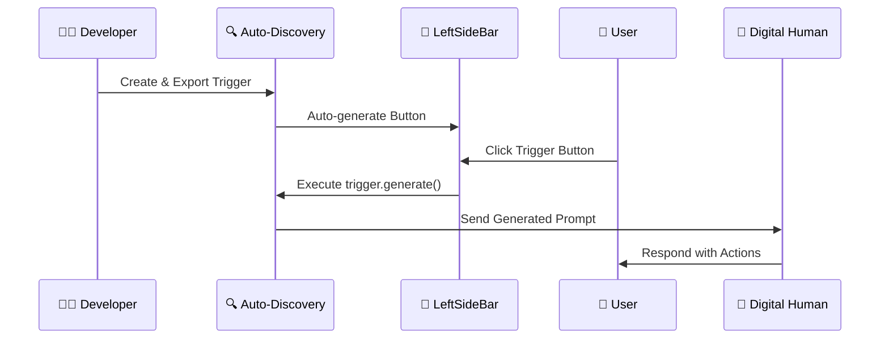
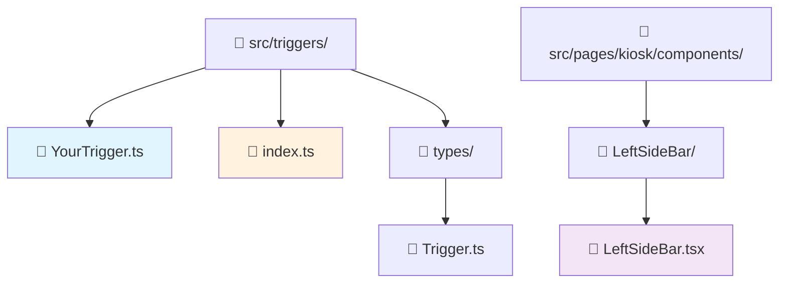
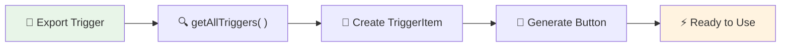

# How-to Guide: Creating Interactive Triggers

This guide explains how to create interactive triggers that automatically appear as buttons in the sidebar and generate dynamic prompts for your digital human conversations.

## 🎯 Quick Overview

**What are Triggers?**
Triggers are smart prompt generators that create dynamic, contextual instructions for your digital human. They automatically appear as clickable buttons in the sidebar and can generate everything from simple prompts to complex interactive scenarios.

**Example:** Click a "Random Story" button → Generates: *"Using the tags related to 'Show media content' you need to generate story naturally with 1 sentence, includes the tag `<uneeq:action_media />` at the exact moment where the action happens..."*

## 🚀 Why Use Triggers?

### **1. Dynamic Content Generation**
- Generate contextual prompts based on current state
- Include random elements for varied experiences  
- Create complex instruction sets programmatically

### **2. Automatic UI Integration**
- Zero configuration - triggers appear automatically in sidebar
- Consistent visual design with icons
- No manual button creation needed

### **3. Scalable Interaction Design**
- Easy to add new interaction patterns
- Self-contained, reusable components
- Type-safe implementation with TypeScript

### **4. Enhanced User Experience**
- Quick access to common actions
- Visual feedback and loading states
- Seamless integration with digital human workflow

## 🔄 The Complete Flow

Here's how triggers work from creation to execution:



## 📁 File Structure



## 🛠️ Step-by-Step Implementation

### Step 1: Understand the Trigger Interface

All triggers must implement this simple interface:

```typescript
interface Trigger {
    /** Optional icon name for UI representation */
    icon?: string;
    
    /**
     * Generate an instruction string (prompt)
     * @param args - Optional generation parameters
     */
    generate: (args: any) => string;
}
```

### Step 2: Create Your Trigger Class

The system supports **two types of triggers**:
- **🎨 UI Triggers**: With icons - appear as buttons in the sidebar
- **⚙️ Programmatic Triggers**: Without icons - available for code use only

#### UI Trigger Example (Appears in Sidebar)

**File: `src/triggers/ProductDemoTrigger.ts`**

```typescript
import type { Trigger } from "./types/Trigger";

export class ProductDemoTrigger implements Trigger {
    icon: string = "MdShoppingCart";  // ← Has icon = Shows in sidebar
    
    /**
     * Generate a product demonstration prompt
     */
    generate(args: any): string {
        const products = ['laptop', 'smartphone', 'tablet', 'smartwatch'];
        const randomProduct = products[Math.floor(Math.random() * products.length)];
        
        return `Please demonstrate the features of our ${randomProduct} in an engaging way. 
                Include specific details about performance, design, and key benefits. 
                When you mention showing the product image, use 
                <uneeq custom event name="product" data="${randomProduct}" /> 
                to display it visually.`;
    }
}
```

#### Programmatic Trigger Example (Code-Only Use)

**File: `src/triggers/ApiRequestTrigger.ts`**

```typescript
import type { Trigger } from "./types/Trigger";

export class ApiRequestTrigger implements Trigger {
    // No icon = Available via factory but not in sidebar UI
    
    /**
     * Generate API documentation request prompt
     */
    generate(args: any): string {
        const endpoint = args.endpoint || '/api/default';
        const method = args.method || 'GET';
        
        return `Please explain the ${method} ${endpoint} API endpoint, 
                including required parameters, response format, and example usage.`;
    }
}
```

### Step 3: Export Your Trigger (Auto-Discovery)

Add your trigger to `src/triggers/index.ts`:

```typescript
// Export all trigger classes for auto-discovery
export * from './RandomStoryTrigger';
export * from './ProductDemoTrigger';     // ← UI trigger (has icon)
export * from './ApiRequestTrigger';     // ← Programmatic trigger (no icon)

// Export types for usage in components
export type { Trigger } from './types/Trigger';
```

### Step 4: Using Your Triggers

#### UI Triggers (With Icons)
Your UI triggers automatically appear in the sidebar:

1. **Build/Restart** your development server
2. **Look for your icon** in the left sidebar  
3. **Click the button** to test prompt generation
4. **Check console** for generated prompt output

#### Programmatic Triggers (Without Icons)
Use programmatic triggers anywhere in your code:

```typescript
import { getTrigger, getAllTriggers } from '@/factories/TriggerFactory';

// Get a specific trigger by key
const apiTrigger = getTrigger('apiRequest');
if (apiTrigger) {
    const prompt = apiTrigger.generate({ endpoint: '/users', method: 'POST' });
    console.log(prompt);
}

// Or get all triggers (including both UI and programmatic)
const allTriggers = getAllTriggers();
const programmaticTriggers = allTriggers.filter(t => !t.instance.icon);
```

## 🔍 How Auto-Discovery Works

The system automatically finds and integrates your triggers:



**Behind the Scenes:**

#### 1. TriggerFactory Auto-Discovery
```typescript
// TriggerFactory.ts - Registers ALL triggers (with and without icons)
Object.entries(triggers).forEach(([className, TriggerClass]) => {
  if (typeof TriggerClass === 'function' && className.endsWith('Trigger')) {
    registerTrigger(TriggerClass, className);  // All triggers registered
  }
});

export const getAllTriggers = (): TriggerItem[] => {
  // Returns both UI and programmatic triggers
  return Array.from(triggerRegistry.entries()).map(([key, instance]) => ({
    key,
    instance
  }));
};
```

#### 2. LeftSideBar UI Filtering
```typescript
const LeftSideBar: React.FC = () => {
  // Get ALL registered triggers from factory
  const triggerInstances = useMemo(() => getAllTriggers(), []);
  
  // Filter for UI triggers only (those with icons)
  const iconNames = triggerInstances
    .map(trigger => trigger.instance.icon)
    .filter(Boolean);  // ← Filters out undefined/null icons
  
  const { getIconComponent } = useIconFactory(iconNames);

  return (
    <div className="left-side-bar-buttons-container">
      {triggerInstances
        .map(trigger => {
          const iconComponent = trigger.instance.icon ? 
            getIconComponent(trigger.instance.icon) : null;
          
          return iconComponent ? (  // ← Only render if has icon
            <CircleButton 
              key={trigger.key}
              icon={iconComponent}
              onClick={() => handleTriggerClick(trigger)}
              title={`Execute ${trigger.key} trigger`}
            />
          ) : null;
        })
        .filter(Boolean)  // ← Remove null entries
      }
    </div>
  );
};
```

## 🎯 When to Use Each Type

### **🎨 UI Triggers (With Icons)**
**Use when you want users to directly interact:**
- Quick action buttons (stories, demos, quizzes)
- Common user-requested features
- Visual shortcuts for complex prompts
- Interactive elements in the sidebar

**Example Use Cases:**
- "Random Story" button for entertainment
- "Product Demo" for showcasing features  
- "Help" button for assistance prompts
- "Quiz" button for educational content

### **⚙️ Programmatic Triggers (Without Icons)**
**Use for code-level automation:**
- Background processes and workflows
- API integration helpers
- Conditional prompt generation
- Complex business logic triggers

**Example Use Cases:**
- Error handling prompt generation
- API documentation generation
- Context-aware help responses
- Automated workflow prompts

## 🎨 Advanced Trigger Examples

### Example 1: UI Trigger - Contextual Conversation Starter

```typescript
export class ConversationStarterTrigger implements Trigger {
    icon: string = "MdChat";
    
    generate(args: any): string {
        const topics = [
            'the latest technology trends',
            'sustainable living practices', 
            'creative problem-solving techniques',
            'future of work and automation'
        ];
        
        const randomTopic = topics[Math.floor(Math.random() * topics.length)];
        const timeOfDay = new Date().getHours() < 12 ? 'morning' : 
                         new Date().getHours() < 18 ? 'afternoon' : 'evening';
        
        return `Good ${timeOfDay}! Let's have an engaging conversation about ${randomTopic}. 
                Start with an interesting question or fun fact that will spark curiosity 
                and encourage the user to share their thoughts.`;
    }
}
```

### Example 2: Interactive Quiz Generator

```typescript
export class QuizTrigger implements Trigger {
    icon: string = "MdQuiz";
    
    generate(args: any): string {
        const subjects = ['science', 'history', 'technology', 'geography'];
        const difficulties = ['easy', 'medium', 'challenging'];
        
        const subject = subjects[Math.floor(Math.random() * subjects.length)];
        const difficulty = difficulties[Math.floor(Math.random() * difficulties.length)];
        
        return `Create a ${difficulty} ${subject} quiz question with 4 multiple choice answers. 
                Present the question in an engaging way, then wait for the user's answer. 
                After they respond, provide the correct answer with a brief, interesting explanation.`;
    }
}
```

### Example 3: Media Showcase Trigger

```typescript
export class MediaShowcaseTrigger implements Trigger {
    icon: string = "MdPlayCircle";
    
    generate(args: any): string {
        const mediaTypes = ['video', 'image', 'presentation'];
        const mediaType = mediaTypes[Math.floor(Math.random() * mediaTypes.length)];
        
        const mediaUrls = {
            video: ['demo.mp4', 'tutorial.mp4', 'showcase.mp4'],
            image: ['product1.jpg', 'infographic.png', 'chart.svg'],
            presentation: ['slides1.pdf', 'overview.pptx', 'demo.slides']
        };
        
        const randomMedia = mediaUrls[mediaType][
            Math.floor(Math.random() * mediaUrls[mediaType].length)
        ];
        
        return `I'm going to show you something interesting! 
                <uneeq custom event name="${mediaType}" data="${randomMedia}" />
                This ${mediaType} demonstrates key concepts we've been discussing. 
                What questions do you have about what you're seeing?`;
    }
}
```

### Example 4: Programmatic Trigger - Error Handler

```typescript
export class ErrorHandlerTrigger implements Trigger {
    // No icon = Available via factory only, not in UI
    
    generate(args: any): string {
        const errorType = args.errorType || 'unknown';
        const errorMessage = args.message || 'Something went wrong';
        const userAction = args.userAction || 'an action';
        
        const errorPrompts = {
            connection: `I'm experiencing a connection issue while trying to ${userAction}. 
                        Let me try to reconnect and assist you in a different way.`,
            validation: `There seems to be an issue with the information provided for ${userAction}. 
                        Let me help you correct this and try again.`,
            timeout: `The request for ${userAction} is taking longer than expected. 
                     Let me try a different approach to help you.`,
            unknown: `I encountered an unexpected issue with ${userAction}. 
                     Let me help you resolve this problem step by step.`
        };
        
        return errorPrompts[errorType] || errorPrompts.unknown;
    }
}
```

### Example 5: Programmatic Trigger - Workflow Generator

```typescript
export class WorkflowGeneratorTrigger implements Trigger {
    // No icon = Code-only usage for complex workflows
    
    generate(args: any): string {
        const workflowType = args.workflow || 'general';
        const steps = args.steps || [];
        const context = args.context || {};
        
        switch (workflowType) {
            case 'onboarding':
                return this.generateOnboardingPrompt(steps, context);
            case 'troubleshooting':
                return this.generateTroubleshootingPrompt(steps, context);
            case 'documentation':
                return this.generateDocumentationPrompt(steps, context);
            default:
                return `Let me walk you through this process step by step...`;
        }
    }
    
    private generateOnboardingPrompt(steps: string[], context: any): string {
        return `Welcome! I'll guide you through ${steps.length} key steps to get started. 
                Let's begin with step 1: ${steps[0] || 'Getting oriented'}.`;
    }
    
    private generateTroubleshootingPrompt(steps: string[], context: any): string {
        const issue = context.issue || 'the problem';
        return `Let's diagnose ${issue} systematically. 
                I'll help you through ${steps.length} troubleshooting steps.`;
    }
    
    private generateDocumentationPrompt(steps: string[], context: any): string {
        const topic = context.topic || 'this topic';
        return `I'll create comprehensive documentation for ${topic}. 
                This will cover ${steps.length} main sections.`;
    }
}
```

### Example 6: Hybrid Usage - Background + UI Trigger

```typescript
// Programmatic trigger for background processing
export class DataProcessorTrigger implements Trigger {
    // No icon = Background processing only
    
    generate(args: any): string {
        const dataType = args.dataType;
        const processingType = args.processingType;
        
        return `Processing ${dataType} data using ${processingType} analysis. 
                Please wait while I prepare the results for you.`;
    }
}

// UI trigger that uses the programmatic trigger
import { getTrigger } from '@/factories/TriggerFactory';

export class AnalyticsButtonTrigger implements Trigger {
    icon: string = "MdAnalytics";  // Shows in sidebar
    
    async generate(args: any): string {
        // Use the programmatic trigger for processing
        const processor = getTrigger('dataProcessor');
        if (processor) {
            const processingPrompt = processor.generate({
                dataType: 'user analytics',
                processingType: 'behavioral'
            });
            
            // Add UI-specific context
            return `${processingPrompt} 
                    I'll display the analytics dashboard once processing is complete.
                    <uneeq custom event name="analytics" data="dashboard.html" />`;
        }
        
        return `Let me analyze your data and show you the insights.`;
    }
}
```

## 🎯 Trigger Integration with Custom Events

Triggers work beautifully with custom events. Here's how to combine them:

```typescript
export class InteractiveDemoTrigger implements Trigger {
    icon: string = "MdInteractive";
    
    generate(args: any): string {
        return `Let me show you our interactive features! 
                
                First, here's a welcome image: 
                <uneeq custom event name="image" data="welcome-banner.jpg" />
                
                Now let me play a demo video: 
                <uneeq custom event name="media" data="interactive-demo.mp4" />
                
                As you can see, I can display images and videos seamlessly 
                during our conversation. What would you like to explore next?`;
    }
}
```

## 🛡️ Best Practices

### **1. Clear Purpose & Naming**
```typescript
// ✅ Good - Clear purpose
export class ProductDemoTrigger implements Trigger { }
export class ConversationStarterTrigger implements Trigger { }

// ❌ Avoid - Vague naming
export class HelperTrigger implements Trigger { }
export class MainTrigger implements Trigger { }
```

### **2. Meaningful Icons**
```typescript
// ✅ Good - Icons match functionality
icon: string = "MdShoppingCart";  // For product demos
icon: string = "MdChat";          // For conversation starters
icon: string = "MdQuiz";          // For quizzes

// ❌ Avoid - Generic or confusing icons
icon: string = "MdHelp";          // Too generic
```

### **3. Dynamic & Contextual Content**
```typescript
// ✅ Good - Dynamic content
generate(args: any): string {
    const randomElement = this.getRandomOption();
    const contextualInfo = this.getContextualData(args);
    return `Generated prompt with ${randomElement} and ${contextualInfo}`;
}

// ❌ Avoid - Static content
generate(args: any): string {
    return "Always the same prompt";
}
```

### **4. Error Handling**
```typescript
generate(args: any): string {
    try {
        // Your generation logic
        return this.generatePrompt(args);
    } catch (error) {
        console.error('Trigger generation failed:', error);
        return 'Sorry, I had trouble generating that prompt. Please try again.';
    }
}
```

## 🔧 Debugging Triggers

### Common Issues & Solutions

**Issue: "My trigger doesn't appear in the sidebar"**

✅ **Solutions:**
1. **Verify it's a UI trigger** - Does your trigger have an `icon` property?
2. Check that your class is exported in `triggers/index.ts`
3. Verify the class implements the `Trigger` interface
4. Ensure you've restarted the development server
5. Check browser console for auto-discovery errors

**Issue: "I can't find my programmatic trigger"**

✅ **Solutions:**
1. **Verify it's registered** - Check `getAllTriggers()` includes your trigger
2. **Use correct key** - Key is className without "Trigger" suffix, camelCase
3. **Import factory** - Use `import { getTrigger } from '@/factories/TriggerFactory'`
4. **Check console** - Look for registration logs in browser console

**Issue: "Button appears but doesn't work when clicked"**

✅ **Solutions:**
1. Add console.log in your `generate` method to verify it's called
2. Check that `generate` returns a string (not undefined)
3. Look for JavaScript errors in browser console
4. Verify your prompt is being added to message history

**Issue: "Icon doesn't show up"**

✅ **Solutions:**
1. Verify the icon name exists in your icon library (React Icons)
2. Check that `useIconFactory` can load the icon
3. Use a common icon like `"MdHelp"` for testing
4. Check browser console for icon loading errors

### Debugging Checklist

#### For All Triggers:
- [ ] Trigger class exported in `triggers/index.ts`
- [ ] Class implements `Trigger` interface properly
- [ ] `generate` method returns a string
- [ ] Development server restarted after changes
- [ ] Browser console shows no errors
- [ ] Registration log appears in console: `"TriggerFactory: Registered trigger..."`

#### For UI Triggers (Sidebar Buttons):
- [ ] `icon` property is defined with valid React Icons name
- [ ] Button appears in left sidebar
- [ ] Button click triggers `generate` method
- [ ] Message history updates when button clicked
- [ ] Icon loads properly (no broken icon display)

#### For Programmatic Triggers:
- [ ] `icon` property is undefined/omitted (intentionally)
- [ ] Trigger appears in `getAllTriggers()` result  
- [ ] `getTrigger(key)` returns trigger instance
- [ ] Key follows camelCase naming (className without "Trigger" suffix)
- [ ] Trigger works when called programmatically

## 🎉 Real-World Use Cases

### **Customer Service Kiosk**
```typescript
export class CustomerServiceTrigger implements Trigger {
    icon: string = "MdSupportAgent";
    
    generate(): string {
        return `I'm here to help! I can assist with:
                • Product information and recommendations
                • Order status and tracking
                • Technical support questions
                • Store policies and procedures
                
                What can I help you with today?`;
    }
}
```

### **Educational Content**
```typescript
export class LearningPathTrigger implements Trigger {
    icon: string = "MdSchool";
    
    generate(): string {
        const subjects = ['programming', 'design', 'business', 'science'];
        const subject = subjects[Math.floor(Math.random() * subjects.length)];
        
        return `Let's explore ${subject}! I can create a personalized learning path
                based on your current knowledge and goals. 
                What specific areas of ${subject} interest you most?`;
    }
}
```

### **Entertainment & Engagement**
```typescript
export class StorytellingTrigger implements Trigger {
    icon: string = "MdAutoStories";
    
    generate(): string {
        const genres = ['sci-fi', 'mystery', 'adventure', 'comedy'];
        const settings = ['futuristic city', 'ancient castle', 'space station', 'magical forest'];
        
        const genre = genres[Math.floor(Math.random() * genres.length)];
        const setting = settings[Math.floor(Math.random() * settings.length)];
        
        return `Let me tell you a ${genre} story set in a ${setting}! 
                This will be interactive - you can influence the plot by making
                choices as we go along. Ready to begin the adventure?`;
    }
}
```

## 📈 Performance Considerations

### **Efficient Trigger Loading**
The auto-discovery system is optimized:
- Triggers are instantiated once using `useMemo`
- Icons are loaded dynamically only for registered triggers
- Button rendering is optimized with React keys

### **Memory Management**  
- Triggers are lightweight - just class instances
- No persistent state stored in triggers themselves
- Generated prompts are handled by session state

## 🚀 Summary

The trigger system provides flexible prompt generation for both UI interactions and programmatic use:

### **Creating Triggers:**
1. **Create** a class implementing `Trigger` interface
2. **Add icon** for UI triggers OR **omit icon** for programmatic use
3. **Export** it from `triggers/index.ts` 
4. **Use** auto-discovery for instant integration

### **Two Trigger Types:**
- **🎨 UI Triggers** (with icons): Automatic sidebar buttons for user interactions
- **⚙️ Programmatic Triggers** (no icons): Available via factory for code-level automation

### **Key Benefits:**
- 🔄 **Flexible Integration** - UI and programmatic usage in one system
- 🎯 **Smart Filtering** - UI shows only relevant triggers automatically
- 🛡️ **Type Safety** - Full TypeScript support with interfaces
- 📦 **Zero Configuration** - Auto-discovery handles registration
- 🎨 **Consistent Design** - Uniform sidebar styling for UI triggers
- ⚙️ **Code Reusability** - Programmatic triggers for complex workflows
- 📈 **Scalable Architecture** - Easy to add new interaction patterns

### **Best of Both Worlds:**
- **Users** get intuitive one-click interactions via sidebar buttons
- **Developers** get powerful programmatic tools for automation
- **System** automatically handles discovery, registration, and UI filtering

The trigger system makes it incredibly simple to create both user-facing interactive capabilities and behind-the-scenes automation tools. UI triggers automatically become sidebar buttons, while programmatic triggers remain available for code-level integration - giving you maximum flexibility with minimal configuration!
