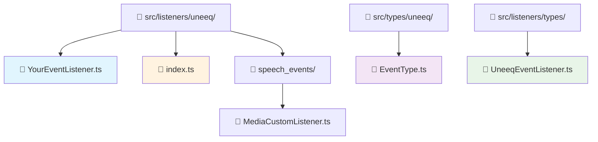

# How-to Guide: Creating UneeQ Event Listeners

This guide explains how to create event listeners for standard UneeQ SDK events. These are different from custom speech events - they handle core digital human lifecycle events like session status, speaking states, and system notifications.

## 🎯 Quick Overview

**What are UneeQ Event Listeners?**
UneeQ Event Listeners respond to standard events fired by the UneeQ SDK during digital human interactions. These events cover session management, avatar states, user interactions, and system status updates.

**Example:** `AvatarStoppedSpeaking` event → Your listener automatically updates UI state to show the avatar is ready for user input.

## 🔄 UneeQ Events vs Custom Speech Events

### **🤖 UneeQ Event Listeners** (This Guide)
- **Purpose**: Handle standard SDK events (session, avatar, user states)
- **Interface**: `UneeqEventListener` with `EventType` enum
- **Trigger**: Automatic SDK lifecycle events
- **Examples**: `SessionLive`, `PromptRequest`, `AvatarStoppedSpeaking`

### **🗣️ Custom Speech Event Listeners** ([See Other Guide](pages/howto/custom-events.md))
- **Purpose**: Handle custom tags embedded in avatar speech
- **Interface**: `CustomEventListener` with custom `type` string  
- **Trigger**: `<uneeq:custom_event name="custom_event_name" data="custom_event_data" />` tags in speech
- **Examples**: Media display, image showing, interactive actions

## 📁 File Structure



## 🛠️ Step-by-Step Implementation

### Step 1: Understand the UneeqEventListener Interface

All UneeQ event listeners must implement this interface:

```typescript
interface UneeqEventListener {
  /** Event type handled by this listener */
  eventType: EventType;
  
  /**
   * Execute the listener logic for the given event payload
   * @param data - UneeQ event payload
   * @param session - Current session context with actions and state
   */
  execute: (data: any, session: SessionContextType) => void;
}
```

### Step 2: Choose Your Event Type

## Essential Events (Start Here)

| Event | Purpose | When to Use |
|-------|---------|-------------|
| `SessionLive` | Session ready | Initialize UI, show welcome |
| `SessionEnded` | Session finished | Cleanup, show goodbye |
| `AvatarStartedSpeaking` | Avatar talking | Disable user input |
| `AvatarStoppedSpeaking` | Avatar finished | Enable user input |
| `UserStartedSpeaking` | User talking | Show speaking indicator |
| `UserStoppedSpeaking` | User finished | Process input |
| `DeviceError` | Hardware issue | Show troubleshooting |
| `MicPermissionDenied` | No mic access | Guide permission setup |

## Additional Events

<details>
<summary style="cursor: pointer; font-weight: bold; color:rgb(95, 95, 95); padding: 10px;border-radius: 5px;border: 1px solid rgba(210, 25, 127, 0.25); width: 50%;">🗂️ Full UneeQ Event List  <span style="margin-left: 15px;color:rgb(43, 38, 30);">(click to expand)</span></summary>

### Session Events
- `SessionDisconnected` - Connection lost
- `SessionReconnecting` - Reconnecting
- `SessionReconnectingFinished` - Reconnected
- `SessionError` - Session error

### Speech Events  
- `SpeechTranscription` - Live transcription
- `PromptRequest` - System requesting input
- `PromptResult` - Input processed
- `RecordingStarted` - Recording began
- `RecordingStopped` - Recording ended

### System Events
- `ServiceUnavailable` - Service down
- `DigitalHumanUnmuted` - Audio enabled
- `CustomMetadataUpdated` - Metadata changed
- `WebRtcStats` - Connection stats
- `WaitingInQueue` - In queue

### UI Events
- `Notification` - System message
- `Instructions` - Help text
- `FrameReady` - Video ready
- `CallToActionDismissed` - CTA dismissed

</details>

## Quick Examples

### Basic Session Management
```typescript
export class SessionLiveListener implements UneeqEventListener {
  eventType = EventType.SessionLive;
  
  execute(data: any, session: SessionContextType): void {
    session.actions.setSessionStatus(SessionStatus.LIVE);
    // Initialize UI
  }
}
```

### Avatar Speaking Control
```typescript
export class AvatarStoppedSpeakingListener implements UneeqEventListener {
  eventType = EventType.AvatarStoppedSpeaking;
  
  execute(data: any, session: SessionContextType): void {
    session.actions.setAwaitingPromptResponse(false);
    // Enable user input
  }
}
```

### Error Handling
```typescript
export class DeviceErrorListener implements UneeqEventListener {
  eventType = EventType.DeviceError;
  
  execute(data: any, session: SessionContextType): void {
    const error = data?.error?.message || 'Device error occurred';
    session.actions.addMessageToHistory({
      id: crypto.randomUUID(),
      content: `Error: ${error}. Please check your device.`,
      sender: MessageSender.System,
      timestamp: new Date()
    });
  }
}
```

### Step 3: Create Your Event Listener

```typescript
// src/listeners/uneeq/UserStartedSpeakingListener.ts
import { EventType } from '@/types';
import type { UneeqEventListener } from '../types/UneeqEventListener';
import type { SessionContextType } from '@/contexts/SessionContext';

export class UserStartedSpeakingListener implements UneeqEventListener {
  eventType = EventType.UserStartedSpeaking;
  
  execute(data: any, session: SessionContextType): void {
    session.actions.setUserSpeaking(true);
  }
}
```

### Step 4: Export Your Listener

Add to `src/listeners/uneeq/index.ts`:

```typescript
export * from './UserStartedSpeakingListener';
```

Done! Your listener auto-registers and responds to events.

## Troubleshooting

**Listener not working?**
1. Check export in `uneeq/index.ts`
2. Verify `eventType` matches `EventType` enum
3. Restart dev server

**Need event data?**
Add `console.log(data)` in your `execute` method to inspect.

## Summary

1. Create class implementing `UneeqEventListener`
2. Set `eventType` from `EventType` enum  
3. Export from `uneeq/index.ts`
4. Handle events in `execute` method

Auto-registered, type-safe event handling for UneeQ SDK events.
