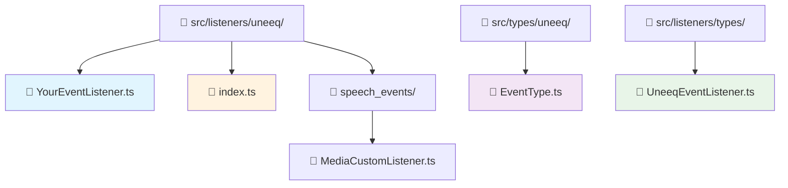
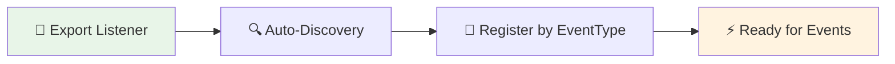

# How-to Guide: Creating UneeQ Event Listeners

This guide explains how to create event listeners for standard UneeQ SDK events. These are different from custom speech events - they handle core digital human lifecycle events like session status, speaking states, and system notifications.

## 🎯 Quick Overview

**What are UneeQ Event Listeners?**
UneeQ Event Listeners respond to standard events fired by the UneeQ SDK during digital human interactions. These events cover session management, avatar states, user interactions, and system status updates.

**Example:** `AvatarStoppedSpeaking` event → Your listener automatically updates UI state to show the avatar is ready for user input.

## 🔄 UneeQ Events vs Custom Speech Events

### **🤖 UneeQ Event Listeners** (This Guide)
- **Purpose**: Handle standard SDK events (session, avatar, user states)
- **Interface**: `UneeqEventListener` with `EventType` enum
- **Trigger**: Automatic SDK lifecycle events
- **Examples**: `SessionLive`, `PromptRequest`, `AvatarStoppedSpeaking`

### **🗣️ Custom Speech Event Listeners** ([See Other Guide](howto/custom-events.md))
- **Purpose**: Handle custom tags embedded in avatar speech
- **Interface**: `CustomEventListener` with custom `type` string  
- **Trigger**: `<uneeq custom event />` tags in speech
- **Examples**: Media display, image showing, interactive actions

## 📁 File Structure



## 🛠️ Step-by-Step Implementation

### Step 1: Understand the UneeqEventListener Interface

All UneeQ event listeners must implement this interface:

```typescript
interface UneeqEventListener {
  /** Event type handled by this listener */
  eventType: EventType;
  
  /**
   * Execute the listener logic for the given event payload
   * @param data - UneeQ event payload
   * @param session - Current session context with actions and state
   */
  execute: (data: any, session: SessionContextType) => void;
}
```

### Step 2: Choose Your Event Type

Available events from `EventType` enum:

```typescript
// Session & Connection Events
SessionLive, SessionEnded, SessionDisconnected
SessionReconnecting, SessionReconnectingFinished

// Avatar Events  
AvatarStoppedSpeaking, AvatarStartedSpeaking
AvatarUnavailable, AvatarAnswerContent

// User Interaction Events
UserStartedSpeaking, UserStoppedSpeaking
PromptRequest, PromptResult

// System Events
DeviceError, ServiceUnavailable, SessionError
MicPermissionDenied, DigitalHumanUnmuted
RecordingStarted, RecordingStopped

// Advanced Events
SpeechTranscription, CustomMetadataUpdated
WebRtcStats, WaitingInQueue
```

### Step 3: Create Your Event Listener

**File: `src/listeners/uneeq/UserStartedSpeakingListener.ts`**

```typescript
import { EventType } from '@/types';
import type { UneeqEventListener } from '../types/UneeqEventListener';
import type { SessionContextType } from '@/contexts/SessionContext';

export class UserStartedSpeakingListener implements UneeqEventListener {
  eventType = EventType.UserStartedSpeaking;
  
  execute(data: any, session: SessionContextType): void {
    console.log('[UserStartedSpeaking] User began speaking', data);
    
    // Update session state to show user is speaking
    session.actions.setUserSpeaking(true);
    
    // Optional: Add visual feedback
    session.actions.setAwaitingPromptResponse(false);
  }
}
```

### Step 4: Export Your Listener (Auto-Discovery)

Add your listener to `src/listeners/uneeq/index.ts`:

```typescript
export * from './SessionLiveListener';
export * from './DigitalHumanUnmutedListener';
export * from './PromptRequestListener';
export * from './UserStartedSpeakingListener';  // ← Add this line

// ... other exports
```

### Step 5: Test Your Listener

That's it! Your listener will automatically be registered and will respond to the specified UneeQ events during digital human sessions.

## 🎨 Key Examples

### Example 1: Session Status Management

```typescript
export class SessionEndedListener implements UneeqEventListener {
  eventType = EventType.SessionEnded;
  
  execute(data: any, session: SessionContextType): void {
    console.log('Session ended:', data);
    
    // Clean up session state
    session.actions.setSessionStatus(SessionStatus.ENDED);
    session.actions.setAwaitingPromptResponse(false);
    session.actions.setUserSpeaking(false);
    
    // Optional: Show end session message
    session.actions.addMessageToHistory({
      id: crypto.randomUUID(),
      content: 'Session has ended. Thank you for using our service!',
      sender: MessageSender.System,
      timestamp: new Date()
    });
  }
}
```

### Example 2: Error Handling

```typescript
export class DeviceErrorListener implements UneeqEventListener {
  eventType = EventType.DeviceError;
  
  execute(data: any, session: SessionContextType): void {
    console.error('Device error occurred:', data);
    
    const errorMessage = data.error?.message || 'A device error occurred';
    const errorType = data.error?.type || 'unknown';
    
    // Add error message to chat
    session.actions.addMessageToHistory({
      id: crypto.randomUUID(),
      content: `Device Error (${errorType}): ${errorMessage}. Please check your device settings.`,
      sender: MessageSender.System,
      timestamp: new Date()
    });
    
    // Update session state
    session.actions.setAwaitingPromptResponse(false);
  }
}
```

## 🎯 Common Use Cases

### **Session Management**
- **SessionLive**: Initialize UI components and welcome messages
- **SessionEnded**: Cleanup, show goodbye messages, reset state
- **SessionReconnecting**: Show reconnection indicators

### **Avatar Interaction**
- **AvatarStartedSpeaking**: Hide user input, show listening state
- **AvatarStoppedSpeaking**: Enable user input, show ready state  
- **PromptRequest**: Show loading indicators, prepare for response

### **User Interaction**
- **UserStartedSpeaking**: Visual feedback, pause background processes
- **UserStoppedSpeaking**: Process speech, update UI state
- **SpeechTranscription**: Show real-time speech-to-text

### **System Status**
- **DeviceError**: Handle microphone/camera issues
- **ServiceUnavailable**: Show fallback options
- **MicPermissionDenied**: Guide user through permission setup

## 🔍 How Auto-Discovery Works

The system automatically finds and registers your UneeQ event listeners:



**Behind the Scenes:**
```typescript
// System automatically discovers all UneeqEventListener implementations
Object.values(uneeqListeners).forEach(ListenerClass => {
  const listener = new ListenerClass();
  if (listener.eventType && typeof listener.execute === 'function') {
    eventRegistry.set(listener.eventType, listener);
  }
});

// When UneeQ events fire, system routes to appropriate listener
uneeqSDK.on('event', (eventType, data, session) => {
  const listener = eventRegistry.get(eventType);
  if (listener) {
    listener.execute(data, session);
  }
});
```

## 🔧 Debugging Event Listeners

### Common Issues & Solutions

**Issue: "My listener doesn't execute"**

✅ **Solutions:**
1. Check that your class is exported in `uneeq/index.ts`
2. Verify `eventType` matches an `EventType` enum value exactly
3. Ensure `execute` method signature matches interface
4. Check browser console for registration/error logs

**Issue: "Event data is undefined or unexpected"**

✅ **Solutions:**
1. Add console.log in your `execute` method to inspect data structure
2. Check UneeQ SDK documentation for event payload format  
3. Handle undefined/null data gracefully with optional chaining
4. Use TypeScript interfaces for better data structure validation

### Debugging Checklist

- [ ] Listener class exported in `uneeq/index.ts`
- [ ] `eventType` property matches `EventType` enum value
- [ ] `execute` method has correct signature
- [ ] Development server restarted after changes
- [ ] Browser console shows no registration errors
- [ ] Event actually fires (check UneeQ SDK documentation)

## 🚀 Advanced Patterns

### Conditional Event Handling

```typescript
export class PromptResultListener implements UneeqEventListener {
  eventType = EventType.PromptResult;
  
  execute(data: any, session: SessionContextType): void {
    const response = data?.promptResult?.response?.text;
    
    if (!response) {
      console.warn('PromptResult missing response text');
      return;
    }
    
    // Only add to history if response is meaningful
    if (response.trim() && response !== 'undefined') {
      session.actions.addMessageToHistory({
        id: crypto.randomUUID(),
        content: response,
        sender: MessageSender.Assistant,
        timestamp: new Date()
      });
    }
    
    session.actions.setAwaitingPromptResponse(false);
  }
}
```

### State-Aware Event Handling

```typescript
export class AvatarStartedSpeakingListener implements UneeqEventListener {
  eventType = EventType.AvatarStartedSpeaking;
  
  execute(data: any, session: SessionContextType): void {
    // Only update UI if session is actually live
    if (session.state.sessionStatus === SessionStatus.LIVE) {
      session.actions.setAwaitingPromptResponse(true);
      
      // Pause any background activities
      session.actions.pauseBackgroundProcesses?.(true);
    }
  }
}
```

## 📈 Performance Considerations

### **Efficient Event Processing**
- Keep `execute` methods lightweight and fast
- Use async operations sparingly to avoid blocking
- Avoid heavy computations in event handlers
- Delegate complex processing to separate services

### **Memory Management**
- Event listeners are singleton instances
- No persistent state should be stored in listeners
- Use session context for state management
- Clean up any resources in appropriate lifecycle events

## 🚀 Summary

Creating UneeQ event listeners is straightforward:

1. **Create** a class implementing `UneeqEventListener`
2. **Choose** an `EventType` from the enum
3. **Export** it from `uneeq/index.ts`
4. **Handle** events with session state updates

### Key Benefits:
- 🔄 **Automatic Registration** - Zero configuration event handling
- 🎯 **Type Safety** - Full TypeScript support with EventType enum
- 🛡️ **Error Isolation** - Failed listeners don't break other events
- 📈 **Scalable** - Easy to add new event handling capabilities
- 🧩 **Modular** - Each event type handled by dedicated class

The UneeQ event system provides a clean, modular way to respond to digital human SDK events and keep your application state synchronized with the avatar's lifecycle!
