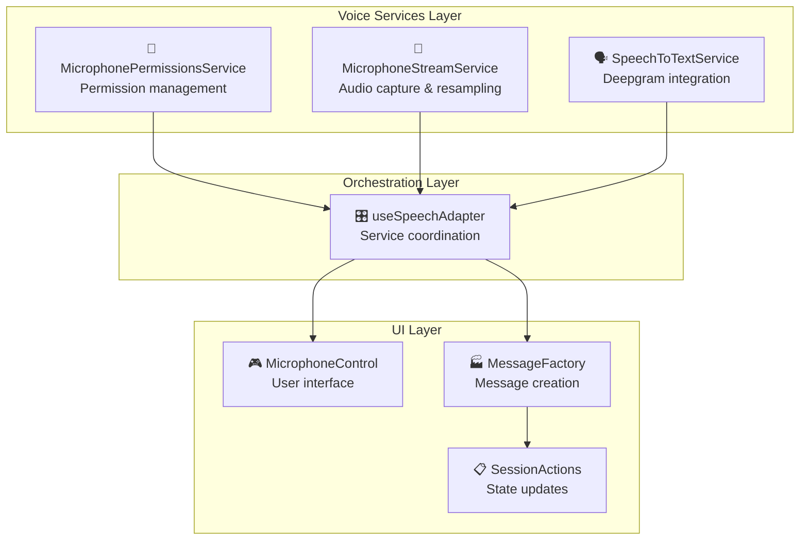

# How-to Guide: Voice Services Integration

This guide explains how to integrate and use the comprehensive voice interaction system introduced in version 1.5.0. The system provides microphone management, speech-to-text transcription, and seamless UI integration for voice-enabled interactions.

## 🎯 Quick Overview

**What are Voice Services?**
A complete service-based architecture for voice interaction that handles microphone permissions, audio streaming, speech recognition, and UI integration through a unified hook system.

**Key Components:**
- **MicrophonePermissionsService** - Permission management
- **MicrophoneStreamService** - Audio capture and processing  
- **SpeechToTextService** - Speech recognition with Deepgram
- **useSpeechAdapter Hook** - Service orchestration
- **MicrophoneControl Component** - UI integration

## 🏗️ Service Architecture



## 🚀 Basic Integration

### Step 1: Service Orchestration Hook

The `useSpeechAdapter` hook manages all voice services automatically:

```typescript
import { useSpeechAdapter } from '@/hooks';

function VoiceEnabledComponent() {
    const { 
        isProcessing,      // Is speech being processed?
        status,           // Current microphone status display info
        toggleMicrophone  // Function to toggle mic on/off
    } = useSpeechAdapter();
    
    return (
        <div>
            <button 
                onClick={toggleMicrophone}
                className={`mic-button ${status.className}`}
                disabled={isProcessing}
            >
                {status.icon} {status.label}
            </button>
            {isProcessing && <span>Processing speech...</span>}
        </div>
    );
}
```

### Step 2: Pre-built Microphone Control

Use the ready-made component for instant integration:

```typescript
import { MicrophoneControl } from '@/pages/remote/components';

function ChatInterface() {
    return (
        <div className="chat-input">
            <input type="text" placeholder="Type message..." />
            <MicrophoneControl disabled={false} />
            <button>Send</button>
        </div>
    );
}
```

### Step 3: Message Integration

Voice messages automatically integrate with your message system:

```typescript
import { useSession } from '@/contexts';
import { MessageFactory } from '@/factories';

function MessageHandler() {
    const { state, actions } = useSession();
    
    // Voice messages are automatically added to state.history
    // when speech recognition completes via useSpeechAdapter
    
    return (
        <div>
            {state.history.map(message => (
                <div key={message.id}>
                    {message.sender}: {message.content}
                </div>
            ))}
        </div>
    );
}
```

## 🔧 Advanced Configuration

### Custom Service Configuration

If you need to customize the speech services:

```typescript
import { 
    MicrophonePermissionsService,
    MicrophoneStreamService, 
    SpeechToTextService 
} from '@/services';

// Custom permissions service
const permissionsService = new MicrophonePermissionsService({
    autoRequest: true,
    onPermissionGranted: () => console.log('Microphone access granted'),
    onPermissionDenied: (error) => console.error('Access denied:', error)
});

// Custom stream service  
const streamService = new MicrophoneStreamService({
    targetSampleRate: 16000,
    echoCancellation: true,
    noiseSuppression: true,
    onStreamStart: () => console.log('Recording started'),
    onAudioChunk: (audioChunk) => {
        // Handle audio data
        sttService.sendAudio(audioChunk);
    }
});

// Custom STT service
const sttService = new SpeechToTextService({
    apiBaseUrl: 'https://your-backend.com',
    apiKey: 'your-api-key',
    model: 'nova-3',
    language: 'en-US',
    onFinal: (text) => {
        console.log('Transcription:', text);
        // Create and add message
        const message = MessageFactory.createUserMessage(text);
        actions.addMessageToHistory(message);
    }
});
```

### Service Lifecycle Management

The services handle their own lifecycle, but you can control them manually:

```typescript
import { useEffect, useRef } from 'react';

function CustomVoiceComponent() {
    const servicesRef = useRef(null);
    
    useEffect(() => {
        // Services are initialized automatically by useSpeechAdapter
        // Manual control is rarely needed
        
        return () => {
            // Cleanup happens automatically
        };
    }, []);
    
    // Use the hook for automatic management
    const { isProcessing, status, toggleMicrophone } = useSpeechServices();
    
    return <MicrophoneControl />;
}
```

## 🎨 UI Integration Patterns

### Status-Aware Microphone Button

```typescript
function StatusAwareMicButton() {
    const { status, toggleMicrophone, isProcessing } = useSpeechServices();
    
    return (
        <button
            onClick={toggleMicrophone}
            className={`microphone-btn ${status.className} ${isProcessing ? 'processing' : ''}`}
            title={status.title}
        >
            <span className="mic-icon">
                {status.icon}
            </span>
            {isProcessing && (
                <span className="processing-indicator">
                    <div className="pulse-animation" />
                </span>
            )}
        </button>
    );
}
```

### Voice Activity Visualization

```typescript
import { FeedbackLine } from '@/components';
import { MicrophoneStatus } from '@/types/microphone';

function VoiceVisualization() {
    const { state } = useSession();
    const isListening = state.microphoneStatus === MicrophoneStatus.LISTENING;
    
    return (
        <div className="voice-feedback">
            <FeedbackLine 
                listening={isListening}
                thickness={4}
            />
        </div>
    );
}
```

### Processing Indicators

```typescript
import { ThinkingIndicator } from '@/components';

function ProcessingFeedback() {
    const { state } = useSession();
    
    return (
        <div className="message-area">
            {state.awaitingPromptResponse && (
                <div className="processing-container">
                    <ThinkingIndicator />
                    <span>AI is thinking...</span>
                </div>
            )}
        </div>
    );
}
```

## 🔍 Microphone Status Management

### Understanding MicrophoneStatus

```typescript
import { MicrophoneStatus } from '@/types/microphone';

// Available status values:
// - MicrophoneStatus.UNKNOWN      // Initial state
// - MicrophoneStatus.REQUESTING   // Asking for permission  
// - MicrophoneStatus.GRANTED      // Permission granted, ready
// - MicrophoneStatus.DENIED       // Permission denied
// - MicrophoneStatus.MUTED        // Microphone available but not active
// - MicrophoneStatus.LISTENING    // Currently recording

function MicrophoneStatusDisplay() {
    const { state } = useSession();
    
    const statusText = {
        [MicrophoneStatus.UNKNOWN]: 'Microphone status unknown',
        [MicrophoneStatus.REQUESTING]: 'Requesting microphone access...',
        [MicrophoneStatus.GRANTED]: 'Microphone ready',
        [MicrophoneStatus.DENIED]: 'Microphone access denied',
        [MicrophoneStatus.MUTED]: 'Microphone muted',
        [MicrophoneStatus.LISTENING]: 'Listening...'
    };
    
    return (
        <div className="status-display">
            Status: {statusText[state.microphoneStatus]}
        </div>
    );
}
```

### Reacting to Status Changes

```typescript
function VoiceEnabledChat() {
    const { state, actions } = useSession();
    const { status, toggleMicrophone } = useSpeechServices();
    
    // React to microphone status changes
    useEffect(() => {
        switch (state.microphoneStatus) {
            case MicrophoneStatus.DENIED:
                // Show permission help UI
                break;
            case MicrophoneStatus.LISTENING:
                // Show recording UI
                break;
            case MicrophoneStatus.MUTED:
                // Show ready-to-talk UI
                break;
        }
    }, [state.microphoneStatus]);
    
    return (
        <div className="chat-interface">
            <MicrophoneControl />
        </div>
    );
}
```

## 🛠️ Troubleshooting

### Common Issues

**Issue: "Microphone permission denied"**
```typescript
// Check permissions and provide user guidance
const { state } = useSession();
if (state.microphoneStatus === MicrophoneStatus.DENIED) {
    // Show instructions to enable microphone in browser settings
}
```

**Issue: "No audio being processed"**
```typescript
// Verify service initialization
const { status } = useSpeechServices();
console.log('Current status:', status);

// Check if services are ready
if (status.className === 'permission-needed') {
    // User needs to grant permission
    // toggleMicrophone() will trigger permission request
}
```

**Issue: "STT service not working"**
```typescript
// Check backend configuration
const { config } = useConfiguration();
console.log('Backend config:', config?.backend);

// Verify ephemeral token service
// This is handled automatically but can be debugged in browser dev tools
```

### Performance Optimization

```typescript
// Disable voice services when not needed
function ConditionalVoiceServices() {
    const [voiceEnabled, setVoiceEnabled] = useState(false);
    
    return (
        <div>
            <button onClick={() => setVoiceEnabled(!voiceEnabled)}>
                Toggle Voice: {voiceEnabled ? 'ON' : 'OFF'}
            </button>
            
            {voiceEnabled && <MicrophoneControl />}
        </div>
    );
}
```

## 🎯 Best Practices

### 1. Always Provide Fallbacks
```typescript
function AccessibleChatInput() {
    return (
        <div className="chat-input">
            {/* Always provide text input as fallback */}
            <input 
                type="text" 
                placeholder="Type your message or use voice..."
            />
            <MicrophoneControl />
            <button>Send</button>
        </div>
    );
}
```

### 2. Handle Permission States Gracefully
```typescript
function PermissionAwareVoiceUI() {
    const { state } = useSession();
    
    if (state.microphoneStatus === MicrophoneStatus.DENIED) {
        return (
            <div className="permission-help">
                <p>Enable microphone access in browser settings for voice input</p>
                <button onClick={() => window.location.reload()}>
                    Retry Permission
                </button>
            </div>
        );
    }
    
    return <MicrophoneControl />;
}
```

### 3. Provide Visual Feedback
```typescript
function FeedbackRichVoiceUI() {
    const { isProcessing, status } = useSpeechServices();
    const { state } = useSession();
    
    return (
        <div className="voice-ui">
            <FeedbackLine listening={state.microphoneStatus === MicrophoneStatus.LISTENING} />
            <MicrophoneControl />
            {isProcessing && <ThinkingIndicator />}
            <div className="status-text">{status.title}</div>
        </div>
    );
}
```

### 4. Optimize for Mobile
```typescript
import { useViewport } from '@/hooks';

function MobileOptimizedVoiceUI() {
    const { isMobile } = useViewport();
    
    return (
        <div className={`voice-controls ${isMobile ? 'mobile' : 'desktop'}`}>
            <MicrophoneControl />
            {/* Larger touch targets on mobile */}
            <style>{`
                .voice-controls.mobile .microphone-control {
                    min-width: 44px;
                    min-height: 44px;
                }
            `}</style>
        </div>
    );
}
```

## 🚀 Summary

The voice services system provides:

### **Key Benefits:**
- 🎤 **Complete Voice Solution**: Permissions, capture, and recognition in one system
- 🔧 **Service Architecture**: Clean, maintainable, and testable code structure  
- ⚡ **Automatic Management**: Hook-based orchestration handles complexity
- 🎨 **UI Integration**: Ready-made components with status awareness
- 🔄 **Message Integration**: Seamless integration with MessageFactory and session state

### **Simple Integration:**
1. **Import Hook**: `const { toggleMicrophone } = useSpeechAdapter()`
2. **Add Component**: `<MicrophoneControl />`  
3. **Handle Messages**: Messages automatically appear in `state.history`
4. **Style UI**: Use status-aware styling for visual feedback

### **Advanced Features:**
- Automatic permission management
- Real-time audio processing and resampling
- Ephemeral token management for security
- Service lifecycle management
- Mobile-optimized performance
- Accessibility support

The voice services system transforms any React component into a voice-enabled interface with just a few lines of code, while providing the flexibility to customize every aspect of the voice interaction experience.
