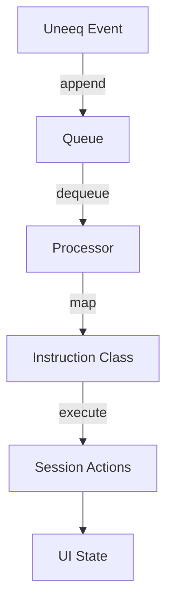

# Instructions

Instructions are explicit domain intents that connect natural-language interactions to UI/UX effects.

## Outgoing (to Uneeq)
- `UserInstruction`: wraps user/remote text and produces the final prompt.
- `OutRandomActionStoryInstruction`: constructs a playful one‑sentence story prompt, embedding action tags like `<uneeq:action_*>` that the Digital Human can act upon.

Why: Encapsulate prompt shaping and keep Kiosk/Remote views ignorant of prompt text generation.

## Incoming (from Uneeq)
Triggered by `SpeechEvent` or other events and resolved via dynamic lookup:
- `InMediaInstruction`: sets `videoUrl` to play a clip.
- `InWeegoInstruction`: sets `imageUrl` to a themed image.

Why: Decouple how Uneeq encodes actions from how the UI responds; adding a new instruction is a new class, not a cross-cutting change.

## Event processing lifecycle
1. Uneeq emits events → `useUneeq` pushes to queue
2. `useUneeqEvents` pops and processes
3. If instruction-type speech tags exist, the matching instruction class is instantiated and executed
4. UI updates (media, status) are driven via `SessionContext` actions

