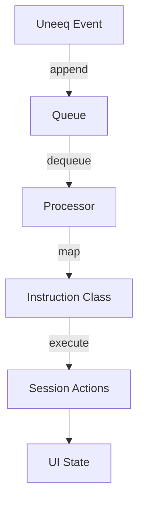

## Instructions

Instructions encode domain intent at the integration seam.

### Outgoing (to Uneeq)
- `UserInstruction`: wraps user/remote text and produces the final prompt.
- `OutRandomActionStoryInstruction`: creates a playful one‑sentence story prompt that embeds `<uneeq:action_*>` tags (e.g., waving) at the moment the action happens.

Why: encapsulate prompt shaping so views remain agnostic of LLM prompt text.

### Incoming (from Uneeq)
Resolved by `useUneeqEvents` upon `SpeechEvent` (and others) through a dynamic lookup:
- `InMediaInstruction`: sets `videoUrl` to play a clip.
- `InWeegoInstruction`: sets `imageUrl` to a themed image.

Why: decouple how Uneeq encodes actions from how the UI responds; adding a new behavior is a new class, not a cross‑cutting change.

### Event processing lifecycle
1. Uneeq emits events → `useUneeq` appends to queue
2. `useUneeqEvents` pops and processes
3. On instruction‑type speech tags, the matching instruction class is instantiated and executed
4. UI updates (media, status) are driven via `SessionContext` actions

