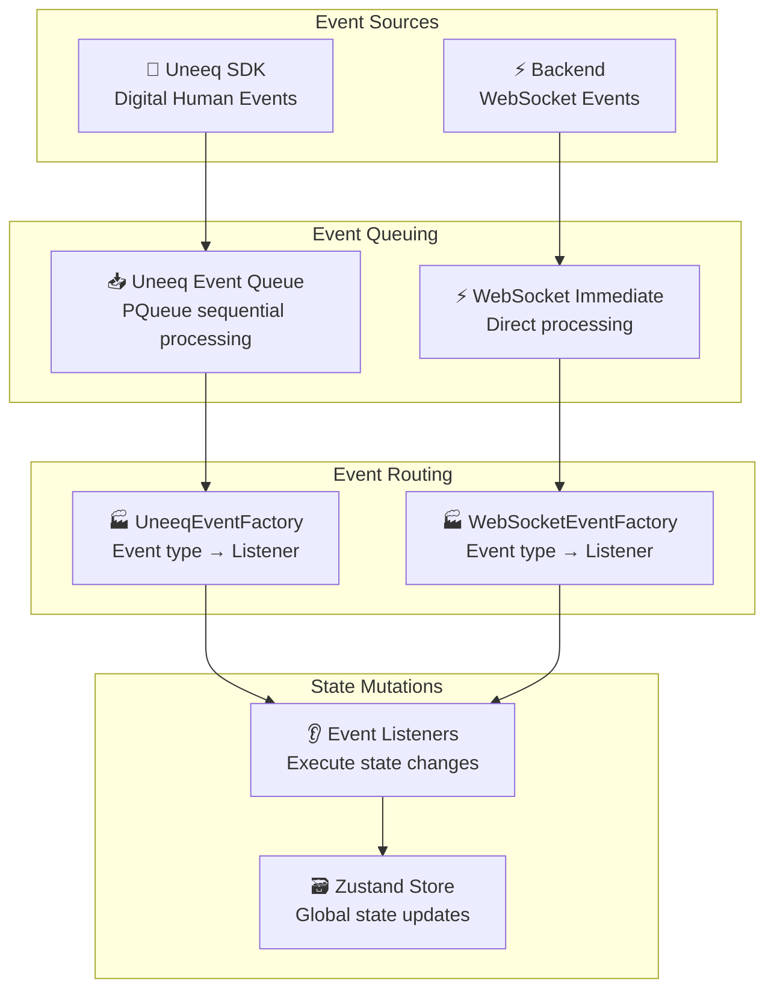
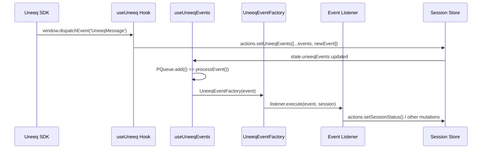
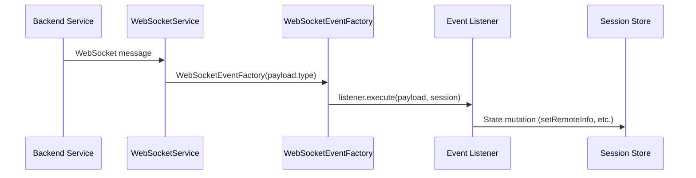

## Kiosk — Event System Architecture

The kiosk handles two primary event streams: Uneeq SDK events (from the digital human service) and WebSocket events (from the backend). Both use a listener pattern with factory-based routing for clean separation of concerns.

### Event Processing Overview



### Uneeq Event Pipeline

The Uneeq SDK communicates through browser events that are queued and processed sequentially:



#### Key Uneeq Event Listeners

| Event Type | Listener Class | Purpose |
|------------|---------------|---------|
| `DigitalHumanUnmuted` | `DigitalHumanUnmutedListener` | Transitions to LIVE state when avatar is ready |
| `PromptRequest` | `PromptRequestListener` | Sets `awaitingPromptResponse = true` |
| `PromptResult` | `PromptResultListener` | Clears prompt waiting state |
| `AvatarStoppedSpeaking` | `AvatarStoppedSpeakingListener` | Clears outgoing instructions |
| `SpeechEvent` | `SpeechEventListener` | Auto-discovers and executes custom speech events (media, weego, etc.) |
| `SessionLive` | `SessionLiveListener` | Logs session activation |
| `SessionReconnectingFinished` | `SessionReconnectingFinishedListener` | Handles reconnection completion |

### WebSocket Event Pipeline

WebSocket events are processed immediately as they arrive:



#### Key WebSocket Event Listeners

| Event Type | Listener Class | Purpose |
|------------|---------------|---------|
| `CONNECTION_ID` | `ConnectionIdListener` | Stores WebSocket session ID |
| `REGISTER_REMOTE` | `RegisterRemoteListener` | Connects remote device |
| `PEER_MESSAGE` | `PeerMessageListener` | Receives messages from remote |
| `PEER_CHECKED` | `PeerCheckedListener` | Logs connection health checks |
| `PEER_DISCONNECTED` | `PeerDisconnectedListener` | Clears remote connection |

### Event Listener Architecture

Each event listener follows a consistent interface:

```typescript
interface UneeqEventListener {
    eventType: EventType;
    execute: (data: any, session: SessionContextType) => void;
}

interface WebSocketEventListener {
    eventType: WebSocketEventType;
    execute: (data: any, session: SessionContextType) => void;
}
```

#### Example Listener Implementation

```typescript
export class DigitalHumanUnmutedListener implements UneeqEventListener {
    eventType = EventType.DigitalHumanUnmuted;
    
    execute(_: any, session: SessionContextType): void {
        session.actions.setSessionStatus(SessionStatus.LIVE);
        session.actions.setAwaitingPromptResponse(false);
    }
}
```

### Factory Registration

Listeners are automatically registered using reflection:

```typescript
// UneeqEventFactory.ts
const eventRegistry = new Map<EventType, UneeqEventListener>();

Object.values(listeners).forEach(listener => {
    registerEventListener(listener);
});

export const UneeqEventFactory = (event: Event): UneeqEventListener | null => {
    return eventRegistry.get(event.uneeqMessageType) || null;
};
```

### Custom Speech Events Auto-Discovery

The `SpeechEventListener` uses dynamic imports to automatically discover and execute custom event handlers:

```typescript
// SpeechEventListener.ts - Auto-discovery pattern
import * as customEvents from './custom_events';

export class SpeechEventListener implements UneeqEventListener {
    private customEvents: Map<string, CustomEvent>;

    constructor() {
        this.customEvents = new Map();
        
        // Auto-discover all custom event classes
        Object.values(customEvents).forEach(EventClass => {
            if (typeof EventClass === 'function') {
                const instance = new EventClass() as CustomEvent;
                this.customEvents.set(instance.type, instance);
            }
        });
    }

    async execute(data: any, actions: SessionActions): Promise<void> {
        const eventType = data.name || data.type;
        const customEvent = this.customEvents.get(eventType);
        
        if (customEvent) {
            await customEvent.execute(data, actions);
        } else {
            console.warn(`No handler found for custom event: ${eventType}`);
        }
    }
}
```

#### Adding New Custom Events

To add a new custom event handler:

1. Create a new class in `listeners/uneeq/custom_events/`
2. Implement the `CustomEvent` interface
3. Export it from `custom_events/index.ts`
4. The `SpeechEventListener` will automatically discover and register it

**Example Custom Event**:
```typescript
export class InMediaInstruction implements CustomEvent {
    type = "media";

    async execute(data: any, actions: SessionActions): Promise<void> {
        console.log("In Media Instruction", data);
        actions.setVideoUrl(data.url);
    }
}
```

### Error Handling and Debugging

- **Sequential Processing**: Uneeq events use PQueue to prevent race conditions
- **Error Isolation**: Failed listeners don't break the entire event chain
- **Logging**: All events are logged with color-coded console output
- **Missing Handlers**: Warnings logged for unregistered event types

### Event Flow Examples

#### Starting a Session
1. User clicks "Start Experience"
2. `KioskStartForm` calls `actions.setSessionStatus(LOADING)`
3. Uneeq SDK initializes and eventually fires `DigitalHumanUnmuted`
4. `DigitalHumanUnmutedListener` sets status to `LIVE`
5. UI updates to show main kiosk interface

#### Remote Connection
1. Remote device scans QR code and connects to backend
2. Backend sends `REGISTER_REMOTE` WebSocket event
3. `RegisterRemoteListener` stores remote info in state
4. UI hides QR code and shows `RemoteConnectionInfo` panel

#### Message Flow
1. Remote user types message and sends
2. Backend forwards as `PEER_MESSAGE` WebSocket event  
3. `PeerMessageListener` stores message in `peerMessage` state
4. `KioskPage` useEffect detects change and creates outgoing command
5. Command sent to Uneeq SDK via `chatPrompt()`

