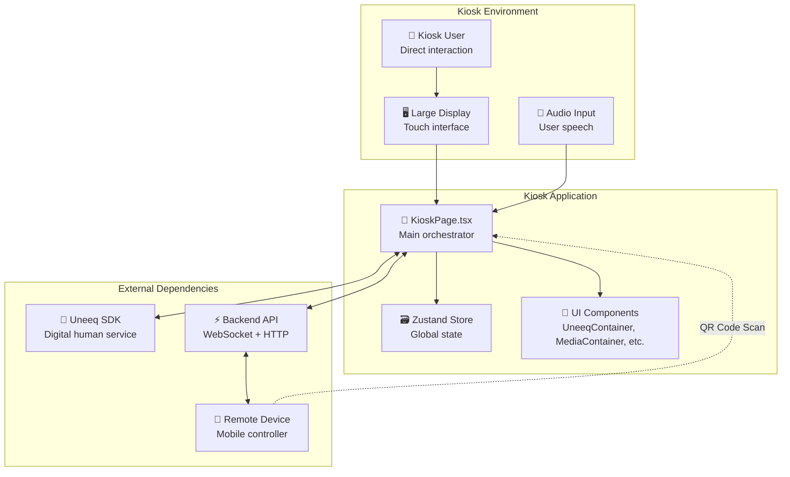

## Kiosk — System Overview

The Kiosk is the primary user interface for the digital human experience. It runs on large displays and provides an interactive interface where users can speak with an AI-powered avatar.

### Core Responsibilities

- **Avatar Rendering**: Displays the Uneeq digital human avatar with real-time speech and animation
- **Session Management**: Handles user session lifecycle from startup to completion
- **Remote Connectivity**: Generates QR codes and manages connections with mobile remote controllers
- **Media Display**: Shows images and videos as instructed by the digital human or remote users
- **Voice Interaction**: Processes user speech through the Uneeq SDK's built-in speech recognition

### System Context



### Key Integrations

#### Uneeq Digital Human SDK
- **Purpose**: Provides the AI avatar with speech, animation, and conversation capabilities
- **Integration**: Loaded dynamically via CDN script, initialized in `useUneeq` hook
- **Communication**: Bidirectional event system using `window.addEventListener('UneeqMessage')`
- **Configuration**: Persona settings loaded from `config.yaml`

#### Backend WebSocket Connection
- **Purpose**: Real-time communication for remote control and session management
- **Integration**: Managed by `WebSocketService` class with automatic reconnection
- **Events**: Connection ID assignment, remote registration, peer messaging
- **Actions**: Heartbeat checks, session management commands

#### State Management (Zustand)
- **Store Location**: `src/contexts/SessionContext.tsx`
- **State Shape**: Defined in `src/contexts/types/State.ts`
- **Key Properties**: Session status, WebSocket state, remote info, media URLs
- **Actions**: Simple setters that update store slices

### File Structure

```
src/pages/kiosk/
├── KioskPage.tsx              # Main orchestrator component
├── components/
│   ├── KioskStartForm/        # Initial landing screen
│   ├── UneeqContainer/        # Avatar display wrapper
│   ├── LeftSideBar/           # Control panel with instructions
│   ├── MediaContainer/        # Image/video display
│   └── RemoteConnectionInfo/  # Remote session details
```

The KioskPage component serves as the composition root, wiring together hooks, services, and UI components to implement the complete kiosk experience.


