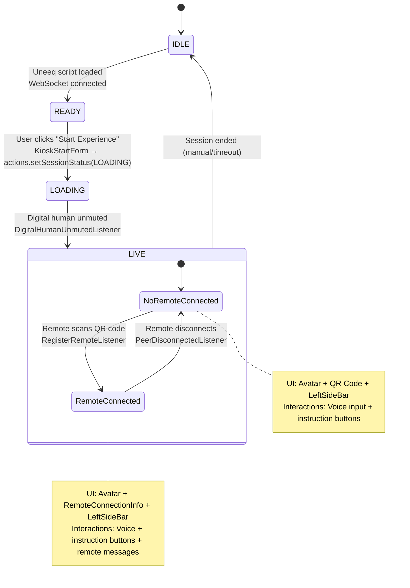

## Kiosk — State Management

The kiosk uses a centralized state management approach with Zustand to handle session lifecycle, WebSocket connections, and UI state. The primary state is managed through the `SessionStatus` enum which drives the entire user experience flow.

### Session Status Flow



### State Properties

The complete state shape is defined in `src/contexts/types/State.ts`:

```typescript
interface State {
    // Core session state
    status: SessionStatus;              // Primary state machine
    webSocketState: WebsocketStatus;    // Connection health
    
    // Uneeq integration
    uneeq: Uneeq | null;               // SDK instance
    uneeqEvents: Event[];              // Event queue
    
    // Connection management  
    connectionId: string | null;       // WebSocket session ID
    remoteInfo: RemoteSessionInfo | null; // Connected remote device
    
    // Media display
    imageUrl: string;                  // Current image to display
    videoUrl: string;                  // Current video to display
    
    // Interaction state
    awaitingPromptResponse: boolean;   // Waiting for AI response
    history: Message[];                // Message history
    uneeqEvents: Event[];              // Event queue
    
    // Speech and interaction states
    isTyping: boolean;                // User/remote is typing/speaking
    micActive: boolean;               // Microphone is active on remote
    sttReady: boolean;               // Speech-to-text service is ready
    showSuggestions: boolean;        // Show suggestion cards in remote
    
    // Configuration
    language: string;                  // UI language
    renderMode: string;               // 'cloud' or 'miniprem'
}
```

### State Transitions in Detail

#### IDLE → READY
- **Trigger**: Application startup sequence completes
- **Conditions**: 
  - Uneeq SDK script loaded from CDN
  - WebSocket connection established
  - Configuration loaded successfully
- **UI State**: Shows `KioskStartForm` with language selection and start button

#### READY → LOADING  
- **Trigger**: User clicks "Start Experience" button
- **Action**: `KioskStartForm.startExperience()` calls `actions.setSessionStatus(LOADING)`
- **Side Effects**: 
  - Calls `state.uneeq?.init()` and `state.uneeq?.startSession()`
  - Shows loading spinner in `UneeqContainer`

#### LOADING → LIVE
- **Trigger**: Uneeq SDK fires `EventType.DigitalHumanUnmuted` event
- **Handler**: `DigitalHumanUnmutedListener.execute()`
- **Actions**: 
  - Sets `status = SessionStatus.LIVE`
  - Sets `awaitingPromptResponse = false`
- **UI Changes**: 
  - Hides loading spinner
  - Shows main kiosk interface with avatar
  - Displays QR code for remote connection
  - Shows left sidebar with instruction controls

### Conditional UI Rendering

The UI components are conditionally rendered based on state:

```typescript
// In KioskPage.tsx
if (state.status === SessionStatus.IDLE || state.status === SessionStatus.READY) {
    return <KioskStartForm />;
}

// LOADING and LIVE states show main interface
return (
    <div>
        <UneeqContainer /> {/* Shows loading spinner if LOADING */}
        {state.status === SessionStatus.LIVE && (
            <>
                <LeftSideBar />
                {!state.remoteInfo && <QRCode />}
                {state.remoteInfo && <RemoteConnectionInfo />}
                {state.imageUrl && <MediaContainer type="image" />}
                {state.videoUrl && <MediaContainer type="video" />}
            </>
        )}
    </div>
);
```

### LIVE State Behavior

The LIVE state is the main operational mode where the digital human avatar is active and ready for interaction. It has two modes based on remote connectivity:

#### No Remote Connected
- **UI**: Avatar display + QR code + trigger buttons (LeftSideBar)
- **Interactions**: Users can speak to avatar or click trigger buttons
- **Media**: Avatar can display images/videos when instructed

#### Remote Connected  
- **UI**: Avatar display + remote device info + trigger buttons
- **Interactions**: All previous interactions + remote user can send text messages
- **Connection**: QR code hidden, shows connected device details instead

#### Key Behaviors

**Remote Connection Flow:**
1. Remote device scans QR code → connects to backend
2. `RegisterRemoteListener` receives connection info → sets `remoteInfo` state
3. UI switches from QR code to `RemoteConnectionInfo` panel
4. Remote messages flow: Mobile text → backend → `PeerMessageListener` → avatar

**Media Display:**
- Images and videos can overlay the avatar when triggered by instructions
- Controlled by `imageUrl` and `videoUrl` state properties
- Works in both remote and standalone modes

**Trigger System:**
- `LeftSideBar` buttons use auto-discovered triggers to generate prompts
- Generated prompts added to message history and sent to avatar
- Extensible: new triggers automatically discovered when exported
- Works alongside voice input and remote messages

### Error Handling

The state machine includes error states (currently unused but reserved):
- `SessionStatus.ERROR`: For unrecoverable errors
- `SessionStatus.ENDED`: For graceful session termination

State mutations are handled through Zustand actions, ensuring predictable updates and easy debugging.


