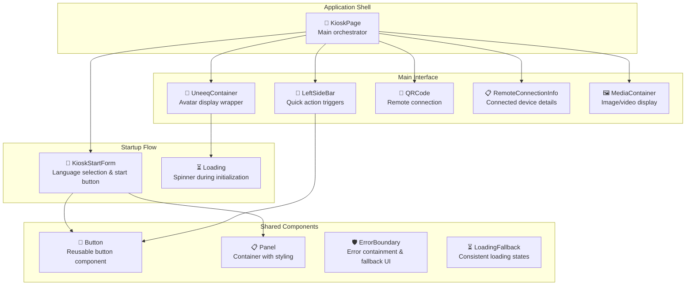
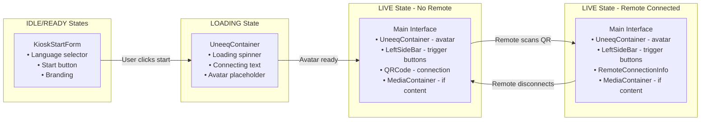

## Kiosk — UI Architecture

The kiosk interface uses conditional rendering based on session state to provide a seamless user experience from startup through active conversation. Components are composed hierarchically with clear separation of concerns.

### Component Hierarchy



### State-Driven Rendering

The UI composition changes dynamically based on session state:



### Component Details

#### KioskPage (Main Orchestrator)
**Location**: `src/pages/kiosk/KioskPage.tsx`

**Responsibilities**:
- Initializes Uneeq SDK and WebSocket connections
- Manages global hooks (`useUneeq`, `useUneeqEvents`, `useWebSocket`)
- Handles peer message processing
- Conditional rendering based on session state

**Key Logic**:
```typescript
// State-based rendering
if (state.status === SessionStatus.IDLE || state.status === SessionStatus.READY) {
    return <KioskStartForm />;
}

// Main interface for LOADING and LIVE states
return (
    <div>
        <UneeqContainer uneeqContainerId={defaultUneeqOptions.containedElementIdName} />
        {state.status === SessionStatus.LIVE && (
            <>
                <LeftSideBar />
                {!state.remoteInfo && <QRCode value={qrCodeUrl} size={160} />}
                {state.remoteInfo && <RemoteConnectionInfo info={state.remoteInfo} />}
                {state.media && <MediaContainer {...state.media} />}
            </>
        )}
    </div>
);
```

#### KioskStartForm (Landing Screen)
**Location**: `src/pages/kiosk/components/KioskStartForm/`

**Features**:
- Language selection dropdown
- Branding and welcome message
- "Start Experience" button
- Responsive design for large displays

**State Integration**:
- Calls `actions.setSessionStatus(LOADING)` on start
- Triggers Uneeq SDK initialization
- Uses `useConfig` for supported languages

#### UneeqContainer (Avatar Display)
**Location**: `src/pages/kiosk/components/UneeqContainer/`

**Responsibilities**:
- Provides DOM container for Uneeq SDK rendering
- Shows loading spinner during LOADING state
- Handles avatar display area styling
- Includes protection overlay to prevent user interaction with avatar controls

**Conditional Rendering**:
```typescript
return (
    <div className="uneeq-container">
        <div className="uneeq-container-content">
            {state.status === SessionStatus.LOADING && <Loading />}
            <div id={uneeqContainerId} />
        </div>
        <div className="uneeq-container-protection"></div>
    </div>
);
```

#### LeftSideBar (Control Panel)
**Location**: `src/pages/kiosk/components/LeftSideBar/`

**Features**:
- Auto-discovered trigger buttons with dynamic icons
- Quick action prompts for engaging the avatar
- Visual feedback for button interactions
- Organized trigger system with extensible architecture

**Integration**:
- Uses `TriggerFactory.getAllTriggers()` for auto-discovery
- Uses `IconFactory` for dynamic icon loading
- Calls `actions.addMessageToHistory()` with generated prompts using `MessageSender.System`
- Generated prompts added to message history for processing

**Auto-Discovery Pattern**:
```typescript
// Trigger buttons are automatically discovered
const triggerInstances = useMemo(() => getAllTriggers(), []);

const handleTriggerClick = async (trigger: TriggerItem) => {
    const result = trigger.instance.execute(sessionContext);
    if (result) {
        actions.addMessageToHistory(result);
    }
};
```

#### MediaContainer (Content Display)
**Location**: `src/pages/kiosk/components/MediaContainer/`

**Capabilities**:
- Image display with responsive sizing and proper aspect ratios (4:3)
- Video playback with configurable controls, autoplay, and loop options (16:9)
- Enhanced visual frame with frosted glass backdrop filter effect
- Loading spinner with smooth fade transitions
- Hover animations for interactive feedback
- Automatic fade in/out transitions between media changes
- Device-specific optimizations (desktop, tablet, holobox)
- Centered positioning with consistent margins

**Enhanced Features**:
- **Loading States**: Shows animated spinner while media loads
- **Smooth Transitions**: Fade in/out animations when switching between media
- **Visual Polish**: Semi-transparent borders, depth shadows, and blur effects
- **Responsive Design**: Adapts to different screen sizes and device types
- **Interactive Feedback**: Subtle hover animations for better user engagement

**Props Interface**:
```typescript
interface Media {
  type: 'image' | 'video';
  url: string;
  autoPlay?: boolean; // Default: true
  controls?: boolean; // Default: true
  loop?: boolean;     // Default: false
  muted?: boolean;    // Default: true
}
```

**Usage**:
```typescript
// Actual usage in KioskPage - spreads media object from state
{state.media && <MediaContainer {...state.media} />}

// Legacy examples for reference (deprecated):
// {state.imageUrl && <MediaContainer type="image" url={state.imageUrl} />}
// {state.videoUrl && <MediaContainer type="video" url={state.videoUrl} loop={true} />}
```

**Styling Architecture**:
- Positioned as fixed overlay with vertical centering
- Backdrop filter for glass-like transparency effect
- Device-specific positioning and sizing rules
- Smooth CSS transitions for all state changes

#### Connection Components

**QRCode**: Generates QR code for remote device connection
- URL format: `${window.location.protocol}//${window.location.host}/remote/${state.connectionId}`
- Hidden when remote device is connected
- Customizable size and styling

**RemoteConnectionInfo**: Shows connected remote device details
- Displays device information from `state.remoteInfo`
- Connection status and timestamp
- Replaces QR code when remote is active

### Styling Architecture

**CSS Organization**:
- Each component has its own `.scss` file
- Global styles in `src/styles/`
- Responsive breakpoints defined
- CSS custom properties for theming

**Design Principles**:
- Large touch targets for kiosk interaction
- High contrast for visibility
- Minimal cognitive load
- Consistent spacing and typography

### Performance Considerations

**Component Optimization**:
- Lazy loading reduces initial bundle size by ~60%
- Conditional rendering prevents unnecessary DOM nodes
- Media components only render when content exists
- Uneeq SDK container persists across state changes
- Event listeners properly cleaned up on unmount

**State Updates**:
- Zustand provides efficient re-renders
- Components only re-render when relevant state changes
- Media URLs cleared when not needed to free memory

**Error Handling & Loading**:
- `ErrorBoundary` components prevent crashes from propagating
- `LoadingFallback` provides consistent loading states across the app
- Performance monitoring tracks page load times in development

### Accessibility Features

- Keyboard navigation support
- Screen reader compatible structure
- High contrast color schemes
- Large text and buttons for visibility
- ARIA labels on interactive elements

This architecture provides a maintainable, performant, and accessible kiosk interface that scales well across different display sizes and use cases.


