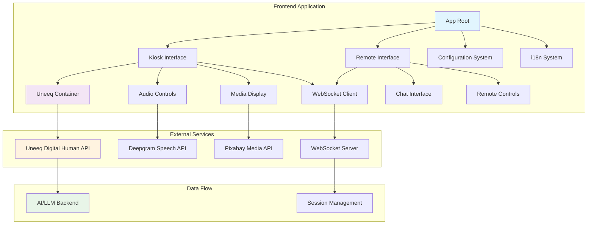

 
# Uneeq Demo App - Frontend

  

## Overview

The **Uneeq Demo App Frontend** is a sophisticated **React + TypeScript** application designed to showcase the full capabilities of the **Uneeq digital human platform**. It provides both kiosk and remote control interfaces for creating immersive, interactive experiences with AI-powered digital humans.

This application serves as a demonstration platform for businesses, developers, and organizations looking to integrate digital human technology into their customer-facing applications, training systems, or interactive displays.

## Architecture Overview

The application follows a modern React architecture with clear separation of concerns:

