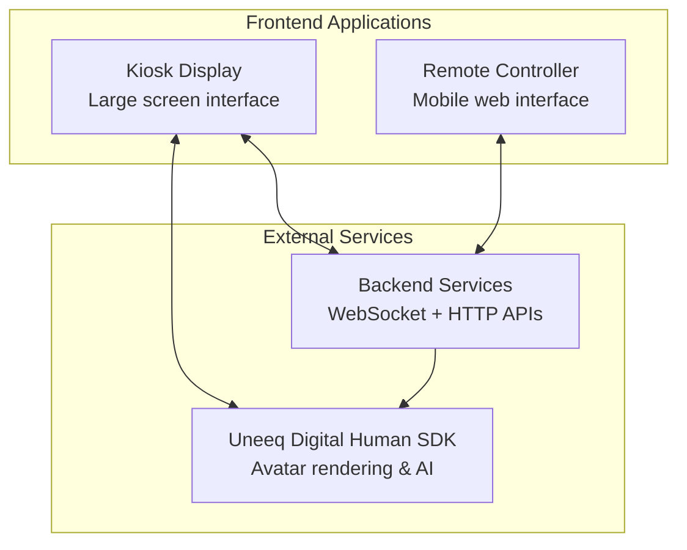

## Generic Kiosk — Frontend Documentation

This application provides a digital human kiosk experience with remote mobile control capabilities. Users interact with an AI-powered avatar (Uneeq) on the main kiosk display, while remote users can connect via mobile devices to send messages and control the conversation.

### System Architecture

The system consists of:

- **Kiosk**: Main display showing the digital human avatar and UI controls
- **Remote**: Mobile interface for remote users to interact with the kiosk
- **Backend**: Manages WebSocket connections, peer-to-peer messaging, and service tokens
- **Uneeq SDK**: Third-party service providing the digital human avatar and AI capabilities

### Documentation Sections

#### Core
- **[Overview](pages/core/overview.md)** - System context and relationships
- **[Performance & Monitoring](pages/core/performance-monitoring.md)** - Development-time metrics tracking for optimization
- **[Configuration System](pages/core/configuration.md)** - Application configuration management
- **[Error Boundary](pages/core/error-boundary.md)** - Error handling and recovery

#### Kiosk (Digital Human)
- **[Overview](pages/kiosk/overview.md)** - Digital human avatar and UI controls
- **[State Management](pages/kiosk/states.md)** - Session lifecycle and state transitions  
- **[Event System](pages/kiosk/events.md)** - How Uneeq and WebSocket events are processed
- **[UI Architecture](pages/kiosk/ui.md)** - Component composition and rendering logic for the digital human avatar

#### Remote (Mobile Controller)
- **[Overview](pages/remote/overview.md)** - Mobile interface architecture and design
- **[Connection Flow](pages/remote/connection.md)** - Device pairing and WebSocket setup
- **[Message System](pages/remote/messaging.md)** - Text and voice communication handling for the mobile controller
- **[UI Architecture](pages/remote/ui.md)** - Mobile-first responsive design patterns for the mobile controller

### Key Technologies
- **React + TypeScript** - UI framework and type safety with lazy loading
- **Zustand** - Centralized state management with shared interaction states
- **WebSocket** - Real-time communication with backend
- **Uneeq SDK** - Digital human avatar integration
- **Vite** - Build tool and development server
- **Performance Monitoring** - Development-time metrics tracking for optimization

