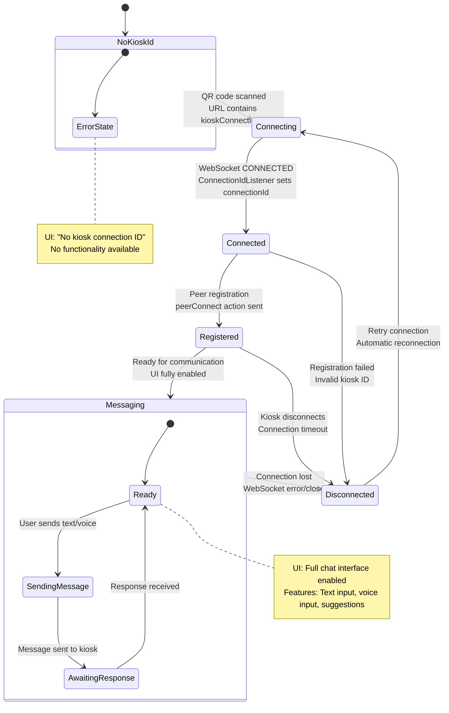
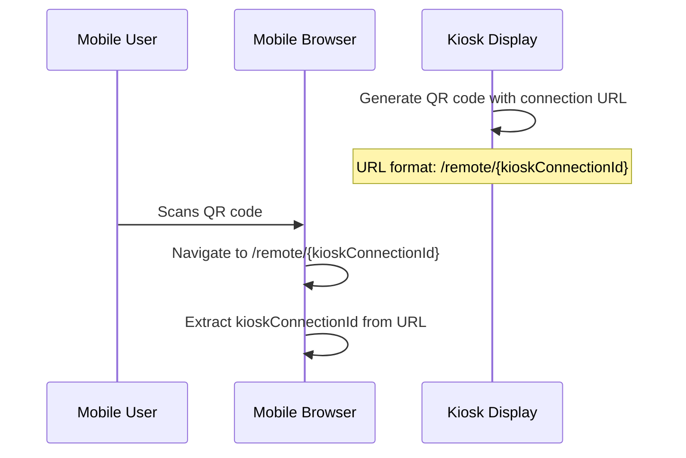
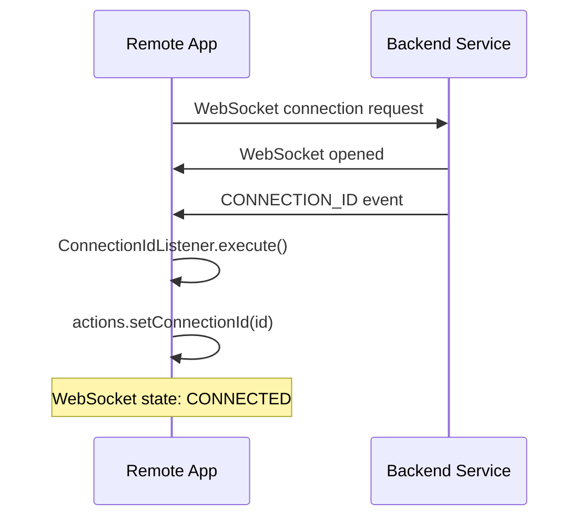
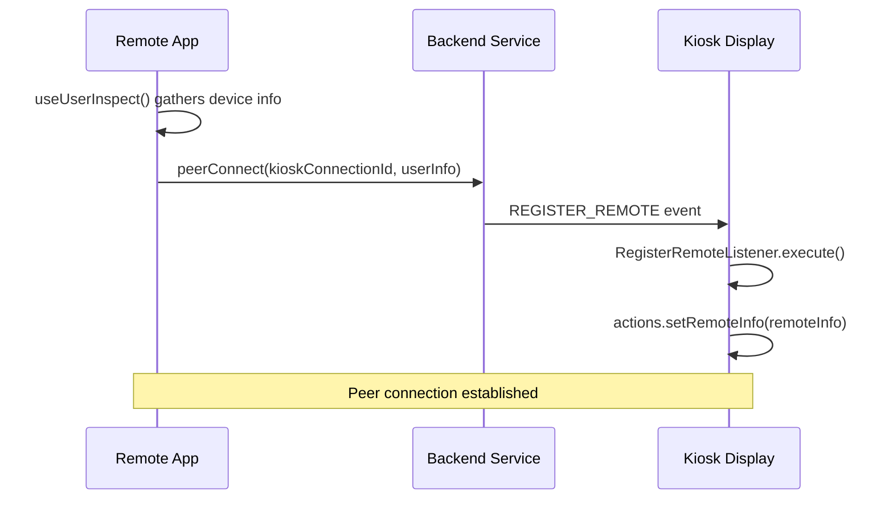

## Remote — Connection Flow

The Remote application establishes and manages connections to Kiosk displays through a multi-step process involving QR code scanning, WebSocket connection establishment, and peer registration. The connection state drives the entire user experience flow.

### Connection Lifecycle



### Connection State Properties

The connection state is managed through multiple layers:

```typescript
// URL Parameter (React Router)
const { kioskConnectionId } = useParams(); // From QR code scan

// Shared Session State (Zustand)
interface State {
    webSocketState: WebsocketStatus;     // CONNECTING | CONNECTED | DISCONNECTED
    connectionId: string | null;        // This remote's WebSocket ID
    history: Message[];                 // Complete message history
    isTyping: boolean;                  // Typing indicator state
    micActive: boolean;                 // Microphone active status
    sttReady: boolean;                  // Speech-to-text readiness
    showSuggestions: boolean;           // Show suggestion cards
}

// Local Component State (React) - UI only
const [inputText, setInputText] = useState('');  // Input field content
```

### Connection Establishment Process

#### Step 1: QR Code Scan


#### Step 2: WebSocket Connection


#### Step 3: Peer Registration


### Connection Validation and Health Checks

The system includes multiple validation layers to ensure reliable connections:

#### URL Validation
```typescript
// In RemotePage.tsx
const { kioskConnectionId } = useParams();
const hasKioskId = Boolean(kioskConnectionId);

// Conditional rendering based on kiosk ID presence
if (!hasKioskId) {
    return (
        <div className="chat-content">
            <div style={{ padding: '1rem' }}>No kiosk connection ID</div>
        </div>
    );
}
```

#### Connection State Monitoring
```typescript
// Connection-dependent service initialization
useEffect(() => {
    if (state.webSocketState !== WebsocketStatus.CONNECTED) return;
    
    // Initialize speech-to-text service only when connected
    // Setup peer connection only when WebSocket is ready
}, [state.webSocketState]);
```

#### Automatic Peer Connection
```typescript
// Automatic peer registration when conditions are met
useEffect(() => {
    if (state.webSocketState === WebsocketStatus.CONNECTED && 
        kioskConnectionId && 
        state.connectionId) {
        
        console.log(`connecting from ${state.connectionId} to ${kioskConnectionId}`);
        websocket?.send(createActionFactory().peerConnect(kioskConnectionId, userInspect));
    }
}, [state.webSocketState, kioskConnectionId, state.connectionId, websocket, userInspect]);
```

### Error Handling and Recovery

#### Connection Failure Scenarios

**No Kiosk ID**: 
- **Cause**: Invalid QR code or direct URL access without ID
- **Handling**: Display error message, disable all functionality
- **Recovery**: User must scan valid QR code

**WebSocket Connection Failed**:
- **Cause**: Network issues, backend unavailable
- **Handling**: `useWebSocket` hook handles automatic reconnection
- **UI State**: Connection status shown in `RemoteHeader`

**Peer Registration Failed**:
- **Cause**: Invalid kiosk ID, kiosk not available
- **Handling**: Connection established but messaging disabled
- **Recovery**: Automatic retry on next connection cycle

**Speech-to-Text Service Failed**:
- **Cause**: Deepgram token issues, network problems
- **Handling**: Microphone disabled, text input still available
- **Recovery**: Service reinitialized on next WebSocket connection

### Connection Status UI Indicators

The `RemoteHeader` component provides real-time connection status:

```typescript
interface RemoteHeaderProps {
    webSocketState: WebsocketStatus;    // Visual connection indicator
    kioskConnectionId?: string | null;  // Target kiosk identifier
    connectionId?: string | null;       // This remote's identifier
}
```

**Status Indicators**:
- 🔴 **DISCONNECTED**: Red indicator, functionality disabled
- 🟡 **CONNECTING**: Yellow indicator, services initializing  
- 🟢 **CONNECTED**: Green indicator, full functionality available

### Connection-Dependent Features

Different features become available based on connection state:

| Connection State | Available Features |
|-----------------|-------------------|
| **No Kiosk ID** | Error message only |
| **DISCONNECTED** | Static UI, no interaction |
| **CONNECTING** | UI visible, inputs disabled |
| **CONNECTED** | Text input enabled |
| **STT Ready** | Voice input enabled |
| **Peer Registered** | Full messaging capability |

This layered approach ensures graceful degradation and clear user feedback throughout the connection process.
