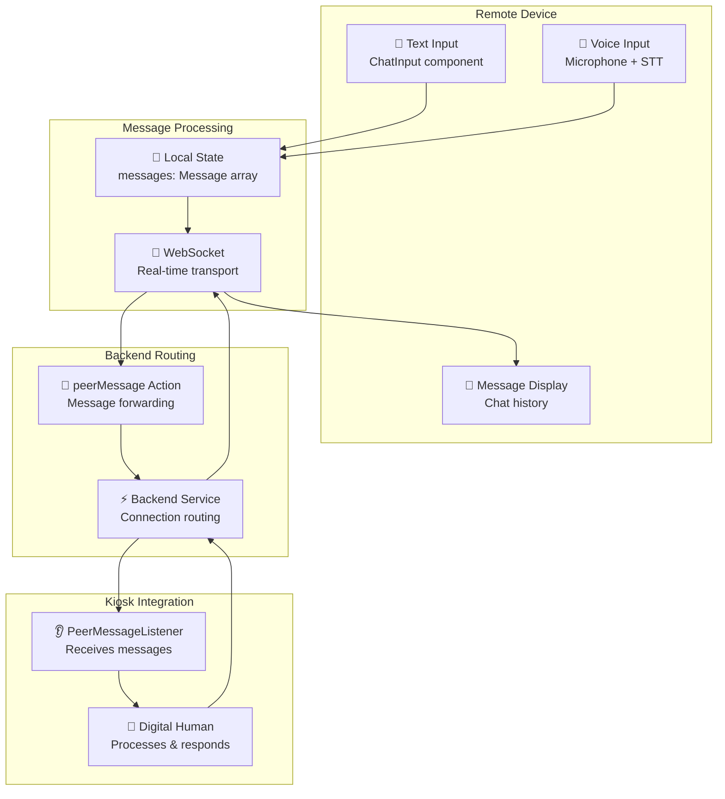
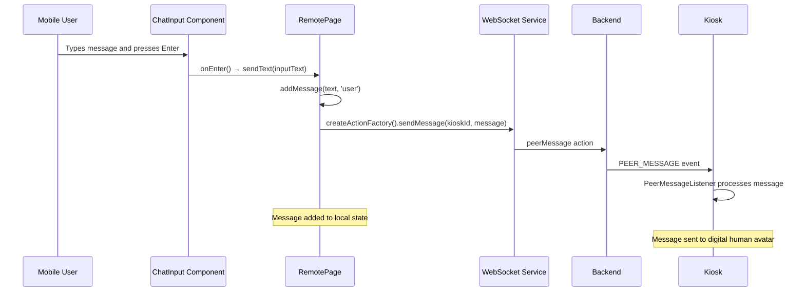
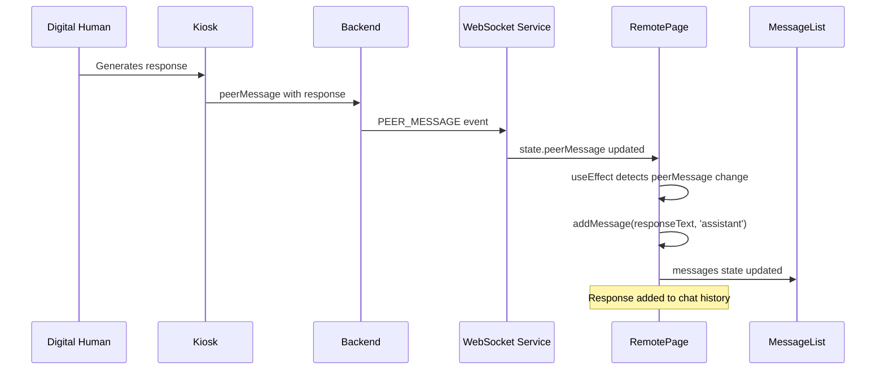
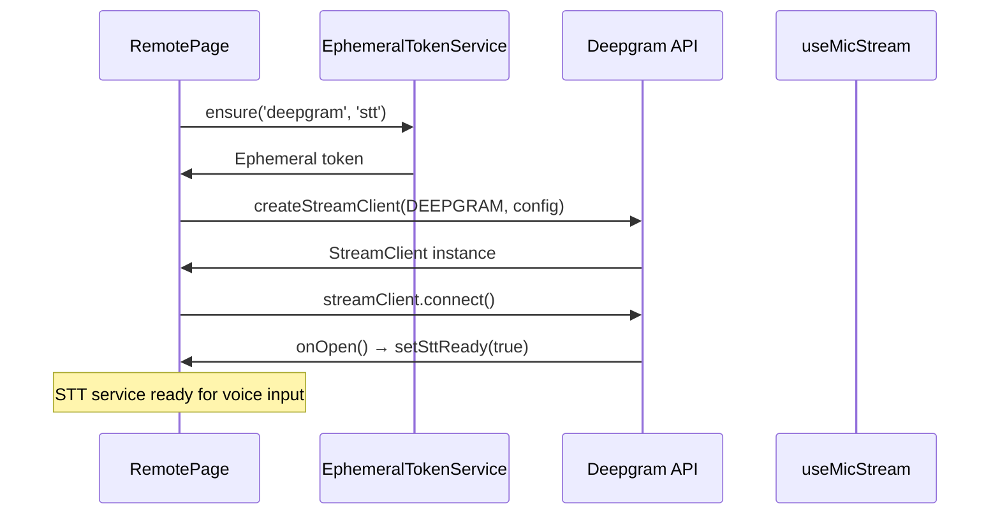
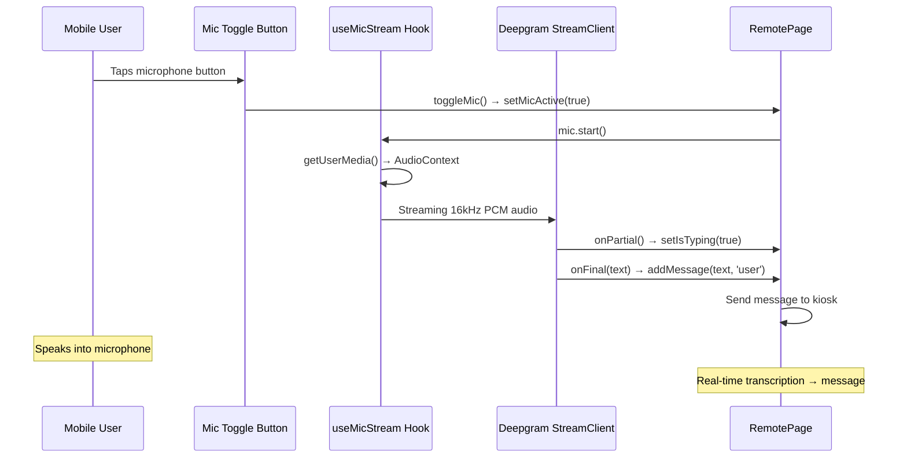
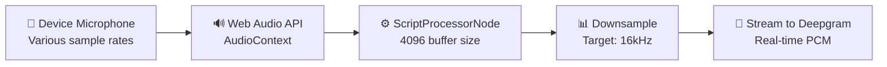

## Remote — Message System

The Remote messaging system enables real-time communication between mobile users and the Kiosk's digital human avatar. It supports both text input and voice transcription, with messages flowing through the backend to reach the avatar and responses returning to the mobile interface.

### Message Flow Architecture



### Message Data Structure

Messages use a standardized interface defined in `src/types/transport/Message.ts`:

```typescript
import { MessageSender } from '@/types/transport/MessageSender';

interface Message {
    id: string;                    // Unique identifier (timestamp-based)
    content: string;               // Message content
    timestamp: Date | string;      // Creation time
    sender: MessageSender;         // Message origin (User, Assistant, System)
    prompt?: boolean;              // Optional flag indicating if message is a prompt
}
```

### Text Message Flow

#### Sending Messages


#### Receiving Responses


### Voice Message Flow with Speech-to-Text

The Remote app integrates Deepgram's real-time speech-to-text for hands-free messaging:

#### STT Service Initialization


#### Voice Input Processing


### Message State Management

The Remote app uses a hybrid state approach combining local and shared state:

#### Local Message State
```typescript
// In RemotePage.tsx - Local UI state only
const [inputText, setInputText] = useState(''); // Keep local - UI specific input

// Message creation and shared state storage
const addMessage = (content: string, sender: MessageSender) => {
    const newMessage: Message = {
        id: crypto.randomUUID(),
        content,
        sender,
        timestamp: new Date(),
    };
    
    // Send to kiosk if user message
    if (sender === MessageSender.User && kioskConnectionId) {
        websocket?.send(createActionFactory().sendMessage(kioskConnectionId, newMessage));
    }
    
    // Add to shared message history
    actions.addMessageToHistory(newMessage);
};
```

#### Shared State Integration
```typescript
// All interaction states are now centralized in SessionContext
const { state, actions } = useSession();

// Key shared states used:
// - state.history: Message[]           // Complete message history
// - state.isTyping: boolean           // Typing/speaking indicator  
// - state.micActive: boolean          // Microphone status
// - state.sttReady: boolean           // Speech-to-text readiness
// - state.showSuggestions: boolean    // Show suggestion cards
// - state.webSocketState              // Connection status

// Messages are displayed directly from shared history
<MessageList messages={state.history} isTyping={state.isTyping} />

// All state updates go through shared actions
actions.setIsTyping(true);
actions.setMicActive(false);
actions.addMessageToHistory(newMessage);
```

### Speech-to-Text Configuration

The STT service is configured for optimal mobile voice input:

```typescript
const streamClient = createStreamClient(SpeechToTextProviders.DEEPGRAM, {
    token,                    // Ephemeral token from backend
    model: 'nova-3',         // Latest Deepgram model
    language: 'en-US',       // English US
    encoding: 'linear16',    // PCM format
    sampleRate: 16000,       // 16kHz audio
    channels: 1,             // Mono audio
    smartFormat: true,       // Auto punctuation/capitalization
    
    // Real-time callbacks
    onOpen: () => setSttReady(true),
    onPartial: () => setIsTyping(true),           // Interim results
    onFinal: (text: string) => {                  // Final transcription
        setIsTyping(false);
        addMessage(text, MessageSender.User);
    },
    onError: (err: any) => console.error('[STT] error:', err),
    onClose: () => console.info('[STT] closed')
});
```

### Audio Processing Pipeline

The microphone audio undergoes several processing steps:



#### Audio Resampling Process
```typescript
// From useMicStream.ts - Audio processing
processor.onaudioprocess = (event: AudioProcessingEvent) => {
    try {
        const input = event.inputBuffer.getChannelData(0);
        const resampled = downsampleToTarget(input, audioContext.sampleRate, targetSampleRate);
        if (resampled.length > 0) onAudio(resampled);
    } catch (e) {
        // Ignore transient errors during processing
    }
};
```

### Message UI Components

#### Typing Indicators
The system provides visual feedback during message processing:

```typescript
// In MessageList.tsx - Typing indicator
{isTyping && (
    <div className="message assistant-message">
        <div className="message-bubble typing-indicator">
            <div className="typing-dot"></div>
            <div className="typing-dot"></div>
            <div className="typing-dot"></div>
        </div>
    </div>
)}
```

#### Suggestion System
Quick action buttons help users start conversations:

```typescript
const suggestions = [
    { label: 'Unique and Fun Birthday Surprise Ideas', text: 'Unique and Fun Birthday Surprise Ideas', Icon: FiFeather },
    { label: 'Create an image', text: 'Please create an image of a sunny beach at golden hour', Icon: FiImage },
    { label: 'How can you help me?', text: 'How can you help me?', Icon: FiHelpCircle },
    { label: 'End session', text: 'End session', Icon: FiPower },
];
```

### Error Handling and Recovery

#### Message Delivery Failures
- **Network Issues**: Messages queued locally until connection restored
- **Invalid Kiosk ID**: Error logged, message not sent
- **Backend Errors**: Automatic retry with exponential backoff

#### Voice Input Failures  
- **Microphone Access Denied**: Fallback to text input only
- **STT Service Unavailable**: Microphone disabled, text input available
- **Audio Processing Errors**: Silent failure, user can retry

#### Connection Recovery
- **WebSocket Reconnection**: Automatic reconnection preserves chat history
- **STT Service Recovery**: Service reinitialized on successful connection
- **State Persistence**: Local messages preserved during connection issues

This comprehensive messaging system ensures reliable communication between Remote users and the Kiosk avatar while providing multiple input methods and robust error handling.
