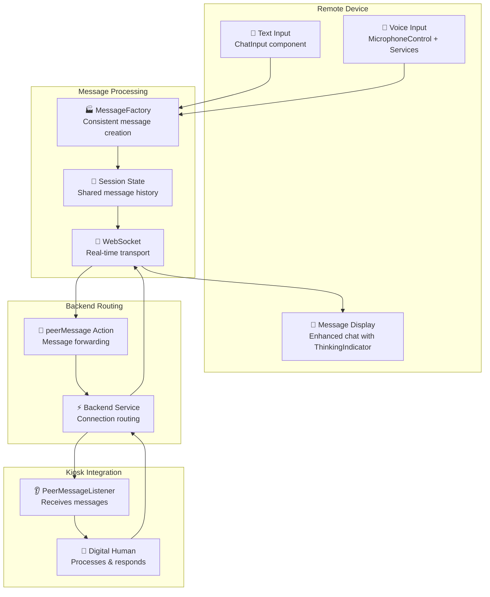
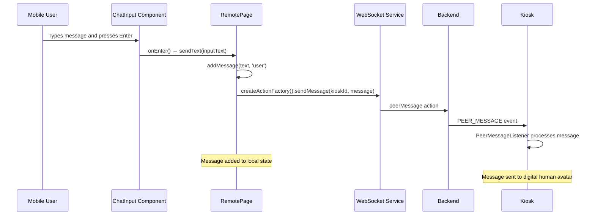
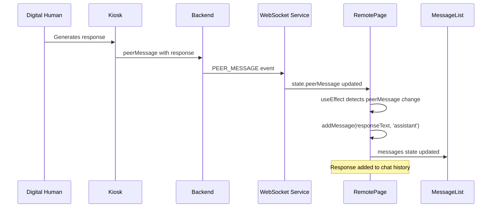
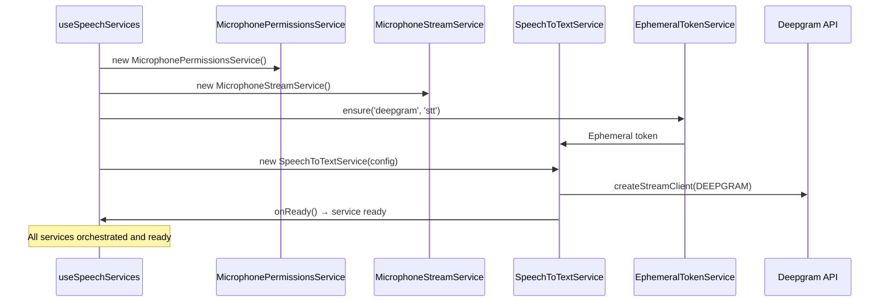
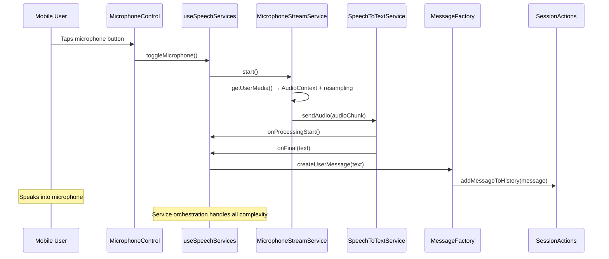
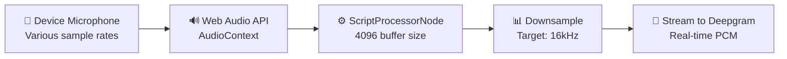

## Remote — Message System

The Remote messaging system enables real-time communication between mobile users and the Kiosk's digital human avatar. It supports both text input and voice transcription, with messages flowing through the backend to reach the avatar and responses returning to the mobile interface.

### Message Flow Architecture



### Message Data Structure

Messages use a standardized interface defined in `src/types/transport/Message.ts`:

```typescript
import { MessageSender } from '@/types/transport/MessageSender';

interface Message {
    id: string;                    // Unique identifier (timestamp-based)
    content: string;               // Message content
    timestamp: Date | string;      // Creation time
    sender: MessageSender;         // Message origin (User, Assistant, System)
    prompt?: boolean;              // Optional flag indicating if message is a prompt
}
```

### Text Message Flow

#### Sending Messages


#### Receiving Responses


### Voice Message Flow with Speech-to-Text

The Remote app integrates Deepgram's real-time speech-to-text for hands-free messaging:

#### STT Service Architecture & Initialization


#### Voice Input Processing with Service Architecture


### Message State Management

The Remote app uses a hybrid state approach combining local and shared state:

#### Enhanced Message State with MessageFactory
```typescript
// In RemotePage.tsx - Simplified with MessageFactory
const [inputText, setInputText] = useState(''); // Local UI input only

// Message creation using MessageFactory
const sendText = useCallback((text: string) => {
    const message = MessageFactory.createUserMessage(text);
    
    // Send to kiosk via WebSocket
    if (kioskConnectionId) {
        websocket?.send(createActionFactory().sendMessage(kioskConnectionId, message));
    }
    
    // Add to shared session state
    actions.addMessageToHistory(message);
}, [kioskConnectionId, websocket, actions]);

// Voice messages handled automatically by useSpeechServices
const { isProcessing, status, toggleMicrophone } = useSpeechServices();
```

#### Shared State Integration with Enhanced Voice Support
```typescript
// Centralized session state with voice capabilities
const { state, actions } = useSession();

// Key shared states for voice interaction:
// - state.history: Message[]                   // Complete message history
// - state.awaitingPromptResponse: boolean      // AI processing indicator
// - state.microphoneStatus: MicrophoneStatus   // Microphone permission & status
// - state.showSuggestions: boolean            // Show suggestion cards
// - state.webSocketState                       // Connection status

// Enhanced message display with thinking indicators
<MessageList messages={state.history} />

// Voice service integration provides complete microphone management
const { isProcessing, status, toggleMicrophone } = useSpeechServices();

// Simplified state management through centralized actions
actions.setMicrophoneStatus(MicrophoneStatus.LISTENING);
actions.setAwaitingPromptResponse(true);
actions.addMessageToHistory(MessageFactory.createUserMessage(text));
```

### Enhanced Speech-to-Text Service Architecture

The new service-based architecture provides comprehensive voice capabilities:

```typescript
// SpeechToTextService configuration
const sttService = new SpeechToTextService({
    apiBaseUrl: BackendHostUrlFactory.getHttpBaseUrl(state.config),
    apiKey: BackendHostUrlFactory.getApiKey(state.config),
    provider: 'deepgram',      // Service provider
    model: 'nova-3',          // Latest Deepgram model
    language: 'en-US',        // English US
    encoding: 'linear16',     // PCM format
    sampleRate: 16000,        // 16kHz audio
    channels: 1,              // Mono audio
    smartFormat: true,        // Auto punctuation/capitalization
    tokenTtl: 60,             // Token refresh interval
    
    // Service lifecycle callbacks
    onReady: () => console.log('STT service ready'),
    onProcessingStart: () => setIsProcessing(true),
    onProcessingEnd: () => setIsProcessing(false),
    onFinal: (text: string) => {
        console.log('STT final text:', text);
        actions.addMessageToHistory(MessageFactory.createUserMessage(text));
    },
    onError: (error: any) => console.error('STT service error:', error)
});

// Automatic service management
await sttService.start();
```

### Service Integration Benefits

**MicrophonePermissionsService**:
- Automatic permission requests and state tracking
- Graceful error handling for denied permissions
- User-friendly permission management UI

**MicrophoneStreamService**:
- Real-time audio capture with Web Audio API
- Automatic resampling to target sample rates
- Echo cancellation and noise suppression
- Proper resource cleanup and memory management

**SpeechToTextService**:
- Ephemeral token management with automatic refresh
- Streaming connection with Deepgram
- Error recovery and reconnection capabilities
- State management integration

### Audio Processing Pipeline

The microphone audio undergoes several processing steps:



#### Audio Resampling Process
```typescript
// From useMicStream.ts - Audio processing
processor.onaudioprocess = (event: AudioProcessingEvent) => {
    try {
        const input = event.inputBuffer.getChannelData(0);
        const resampled = downsampleToTarget(input, audioContext.sampleRate, targetSampleRate);
        if (resampled.length > 0) onAudio(resampled);
    } catch (e) {
        // Ignore transient errors during processing
    }
};
```

### Message UI Components

#### Typing Indicators
The system provides visual feedback during message processing:

```typescript
// In MessageList.tsx - Typing indicator
{isTyping && (
    <div className="message assistant-message">
        <div className="message-bubble typing-indicator">
            <div className="typing-dot"></div>
            <div className="typing-dot"></div>
            <div className="typing-dot"></div>
        </div>
    </div>
)}
```

#### Suggestion System
Quick action buttons help users start conversations:

```typescript
const suggestions = [
    { label: 'Unique and Fun Birthday Surprise Ideas', text: 'Unique and Fun Birthday Surprise Ideas', Icon: FiFeather },
    { label: 'Create an image', text: 'Please create an image of a sunny beach at golden hour', Icon: FiImage },
    { label: 'How can you help me?', text: 'How can you help me?', Icon: FiHelpCircle },
    { label: 'End session', text: 'End session', Icon: FiPower },
];
```

### Error Handling and Recovery

#### Message Delivery Failures
- **Network Issues**: Messages queued locally until connection restored
- **Invalid Kiosk ID**: Error logged, message not sent
- **Backend Errors**: Automatic retry with exponential backoff

#### Voice Input Failures  
- **Microphone Access Denied**: Fallback to text input only
- **STT Service Unavailable**: Microphone disabled, text input available
- **Audio Processing Errors**: Silent failure, user can retry

#### Connection Recovery
- **WebSocket Reconnection**: Automatic reconnection preserves chat history
- **STT Service Recovery**: Service reinitialized on successful connection
- **State Persistence**: Local messages preserved during connection issues

This comprehensive messaging system ensures reliable communication between Remote users and the Kiosk avatar while providing multiple input methods and robust error handling.
