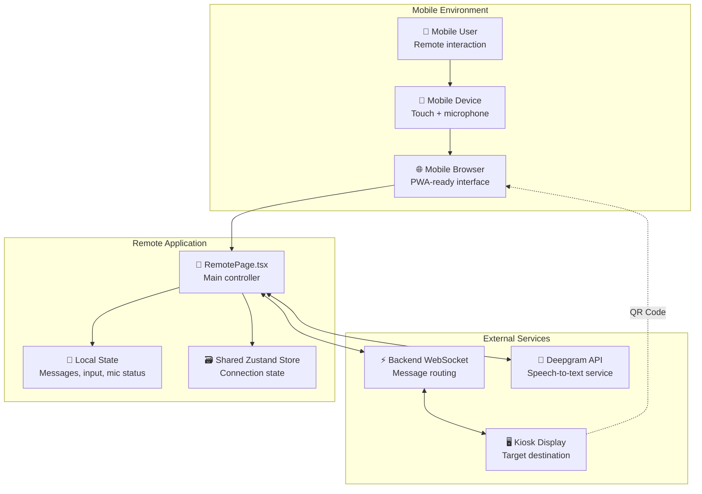
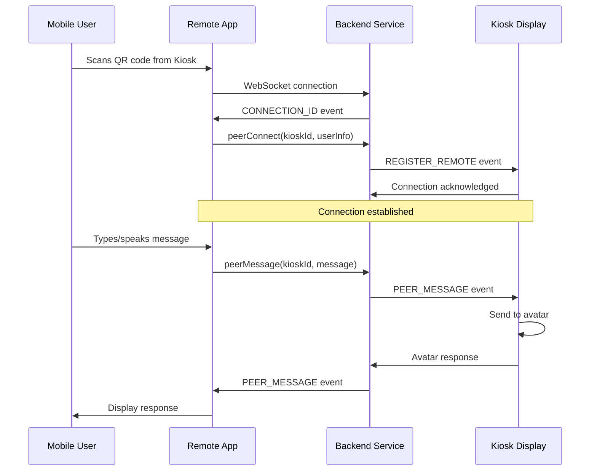

## Remote — System Overview

The Remote interface is a mobile-first web application that allows users to control and interact with the Kiosk's digital human avatar from their smartphones or tablets. Users scan a QR code displayed on the Kiosk to establish a connection and can then send text messages or use voice input to communicate with the AI avatar.

### Core Responsibilities

- **Mobile Controller**: Provides remote control capabilities for the Kiosk experience
- **Message Relay**: Sends user messages to the Kiosk's digital human avatar
- **Voice Input**: Captures and transcribes speech using real-time speech-to-text
- **Real-time Communication**: Maintains WebSocket connection for instant message delivery
- **Chat Interface**: Displays conversation history with typing indicators and suggestions

### System Context



### Key Integrations

#### Backend WebSocket Connection
- **Purpose**: Real-time bidirectional communication with Kiosk and message routing
- **Integration**: Managed by shared `useWebSocket` hook with automatic reconnection
- **Events**: Peer connection registration, message forwarding, connection health checks
- **Actions**: `peerConnect`, `peerMessage`, `getConnectionId`

#### Deepgram Speech-to-Text Service
- **Purpose**: Real-time voice transcription for hands-free messaging
- **Integration**: `DeepgramStreamService` with streaming WebSocket connection
- **Configuration**: 16kHz PCM audio, Nova-3 model, smart formatting enabled
- **Token Management**: Ephemeral tokens via `EphemeralTokenService`

#### Shared Session State (Zustand)
- **Store Location**: `src/contexts/SessionContext.tsx` (shared with Kiosk)
- **Remote-specific Usage**: WebSocket connection state, peer messages
- **Local State**: Chat messages, input text, microphone status, UI flags

#### Comprehensive Voice Interaction Services
- **MicrophonePermissionsService**: Automatic permission management with state tracking
- **MicrophoneStreamService**: Real-time audio capture with resampling and noise cancellation  
- **SpeechToTextService**: Deepgram integration with automatic token management
- **Service Orchestration**: Coordinated through `useSpeechServices` hook
- **UI Integration**: `MicrophoneControl` component with status-aware visual feedback

### Connection Flow Overview



### File Structure

```
src/pages/remote/
├── RemotePage.tsx              # Main orchestrator component
├── RemotePage.scss             # Page-level styles and animations
├── components/
│   ├── RemoteHeader/           # Connection status and info display
│   ├── MessageList/            # Chat history with thinking indicators
│   ├── ChatInput/              # Text input with integrated voice controls
│   ├── MicrophoneControl/      # Advanced microphone control with status awareness
│   └── Suggestions/            # Quick action suggestion cards

src/components/
├── thinkingIndicator/          # AI processing visual feedback
│   ├── ThinkingIndicator.tsx   # Animated gradient waves and dots
│   └── ThinkingIndicator.scss  # Processing animation styles
└── messageBubble/              # Enhanced message display
    ├── MessageBubble.tsx       # Improved text animations with gradients
    └── MessageBubble.scss      # Enhanced typing effects
```

### Technology Stack

- **Frontend Framework**: React with TypeScript
- **State Management**: Zustand (shared) + Local React state
- **Real-time Communication**: WebSocket with automatic reconnection
- **Speech Recognition**: Deepgram streaming API with service architecture
- **Audio Processing**: Web Audio API with custom resampling and service orchestration
- **Message Management**: MessageFactory for consistent message creation
- **Viewport Management**: useViewport hook for responsive layout utilities
- **Styling**: SCSS with mobile-first responsive design
- **Icons**: Feather icons via `react-icons/fi`

The RemotePage component serves as the composition root, orchestrating WebSocket connections, speech-to-text services, and chat interface components to deliver a seamless mobile control experience for the Kiosk.

