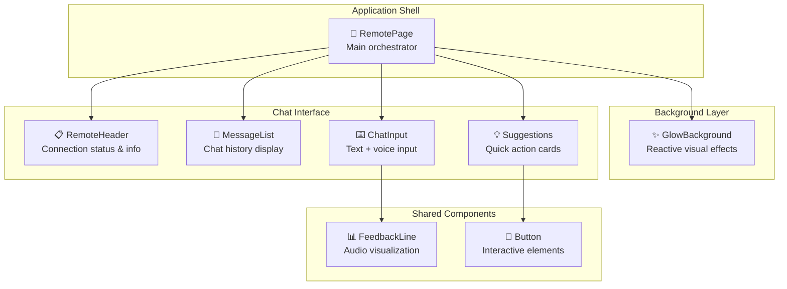
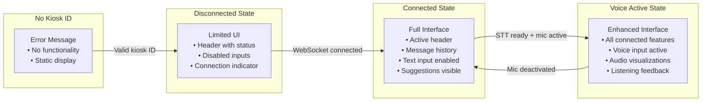

## Remote — UI Architecture

The Remote interface is designed as a mobile-first chat application that adapts to different screen sizes and connection states. It uses a layered component architecture with responsive design principles and real-time visual feedback for an optimal mobile user experience.

### Component Hierarchy



### Connection-Driven UI States

The interface adapts based on connection status and kiosk availability:



### Layout Architecture

#### Mobile-First Responsive Design
```scss
// From RemotePage.scss - Mobile-optimized container
.chat-container {
    display: flex;
    flex-direction: column;
    height: 100vh;              // Full viewport height
    width: 100%;
    position: relative;
    overflow: hidden;
    background: #0d0d0d;        // Dark theme
    color: #e4e4e4;
}

.chat-content {
    position: relative;
    z-index: 1;                 // Above background effects
    display: flex;
    flex-direction: column;
    height: 100vh;
    min-height: 100vh;          // Prevent content shrinking
}
```

#### Layered Z-Index System
- **Background Layer** (z-index: 0): `GlowBackground` with reactive animations
- **Content Layer** (z-index: 1): Main chat interface components
- **Overlay Layer** (z-index: 5): Listening feedback and modal states

### Component Implementation Details

#### RemotePage (Main Orchestrator)
**Location**: `src/pages/remote/RemotePage.tsx`

**Responsibilities**:
- Manages WebSocket connection and STT service lifecycle
- Handles local state for messages, input, and microphone status
- Orchestrates component rendering based on connection state
- Processes peer messages from shared session state

**Key State Management**:
```typescript
// Local UI-specific state only
const [inputText, setInputText] = useState(''); // Input field content

// Shared session state for all interaction state
const { state, actions } = useSession();
const { websocket } = useWebSocket({ webSocketUrl: BackendHostUrlFactory.getWebSocketUrl(config) });

// Shared states accessed:
// - state.history: Message[]        // Complete message history
// - state.isTyping: boolean         // Typing indicator
// - state.micActive: boolean        // Microphone status  
// - state.sttReady: boolean         // STT service readiness
// - state.showSuggestions: boolean  // Show suggestion cards
// - state.webSocketState            // Connection status
```

**Conditional Rendering Logic**:
```typescript
return (
    <div className="chat-container">
        {!hasKioskId ? (
            <div className="chat-content">
                <div style={{ padding: '1rem' }}>No kiosk connection ID</div>
            </div>
        ) : (
            <>
                <GlowBackground 
                    isLargeScreen={isLargeScreen}
                    reactiveActive={state.micActive}
                    dimOpacity={0.65}
                />
                <div className="chat-content">
                    <RemoteHeader 
                        title="Thoughts Bridge" 
                        webSocketState={state.webSocketState}
                        kioskConnectionId={kioskConnectionId}
                        connectionId={state.connectionId}
                    />
                    <MessageList messages={state.history} isTyping={state.isTyping} messagesEndRef={messagesEndRef} />
                    {state.webSocketState === WebsocketStatus.CONNECTED && state.showSuggestions && (
                        <Suggestions 
                            items={suggestions} 
                            onSelect={(text) => sendText(text)}
                            disabled={state.isTyping}
                            onClose={() => actions.setShowSuggestions(false)}
                        />
                    )}
                    <ChatInput
                        inputRef={inputRef}
                        value={inputText}
                        onChange={setInputText}
                        onEnter={handleEnter}
                        disabled={state.webSocketState !== WebsocketStatus.CONNECTED}
                        micActive={state.micActive}
                        onToggleMic={toggleMic}
                        speaking={false}
                    />
                </div>
            </>
        )}
    </div>
);
```

#### RemoteHeader (Connection Status)
**Location**: `src/pages/remote/components/RemoteHeader/`

**Features**:
- Displays application title with animated text effect
- Connection status indicator with color-coded states
- Tooltip showing detailed connection information
- Responsive design for different screen sizes

**Connection Status Display**:
```typescript
interface RemoteHeaderProps {
    title: string;                      // Application title
    webSocketState: WebsocketStatus;    // Connection state indicator
    kioskConnectionId?: string | null;  // Target kiosk identifier
    connectionId?: string | null;       // This remote's identifier
}

// Status indicator with dynamic styling
<span className={`value ${webSocketState.toLowerCase()}`}>
    {webSocketState}
</span>
```

#### MessageList (Chat History)
**Location**: `src/pages/remote/components/MessageList/`

**Features**:
- Scrollable message history with auto-scroll to latest
- Distinct styling for user vs assistant messages
- Typing indicator with animated dots
- Timestamp display for each message

**Message Rendering**:
```typescript
{messages.map((message) => (
    <div key={message.id} className={`message ${message.sender}-message`}>
        <div className="message-bubble">
            <p>{message.content}</p>
            <span className="message-time">
                {(typeof message.timestamp === 'string' 
                    ? new Date(message.timestamp) 
                    : message.timestamp
                ).toLocaleTimeString()}
            </span>
        </div>
    </div>
))}
```

**Typing Indicator**:
```typescript
{isTyping && (
    <div className="message assistant-message">
        <div className="message-bubble typing-indicator">
            <div className="typing-dot"></div>
            <div className="typing-dot"></div>
            <div className="typing-dot"></div>
        </div>
    </div>
)}
```

#### ChatInput (Text + Voice Input)
**Location**: `src/pages/remote/components/ChatInput/`

**Features**:
- Text input with Enter key submission
- Microphone toggle button with active state styling
- Send button with disabled state handling
- Visual feedback line for audio input

**Input Controls**:
```typescript
interface ChatInputProps {
    inputRef: RefObject<HTMLInputElement>;
    value: string;
    onChange: (value: string) => void;
    onEnter: () => void;
    disabled?: boolean;
    micActive?: boolean;
    onToggleMic?: () => void;
    speaking?: boolean;
}
```

**Audio Feedback Integration**:
```typescript
<FeedbackLine 
    listening={!!micActive} 
    speaking={!!speaking} 
    thickness={4} 
/>
```

#### Suggestions (Quick Actions)
**Location**: `src/pages/remote/components/Suggestions/`

**Features**:
- Grid layout of suggestion cards with icons
- Fade-out animation when selected
- Close button to hide suggestions
- Disabled state during typing/processing

**Suggestion Card Structure**:
```typescript
interface SuggestionItem {
    label: string;                              // Display text
    text: string;                              // Message to send
    Icon: React.ComponentType<{ size?: number }>; // Feather icon
}

// Predefined suggestions
const suggestions = [
    { label: 'Unique and Fun Birthday Surprise Ideas', text: 'Unique and Fun Birthday Surprise Ideas', Icon: FiFeather },
    { label: 'Create an image', text: 'Please create an image of a sunny beach at golden hour', Icon: FiImage },
    { label: 'How can you help me?', text: 'How can you help me?', Icon: FiHelpCircle },
    { label: 'End session', text: 'End session', Icon: FiPower },
];
```

### Visual Effects and Animations

#### GlowBackground (Reactive Background)
**Purpose**: Provides ambient visual effects that react to user interaction
**Features**:
- Particle system with reduced complexity on large screens
- Reactive intensity based on microphone activity
- Smooth opacity transitions
- Performance-optimized rendering

**Responsive Behavior**:
```typescript
// Viewport size detection for performance optimization
const [viewportWidth, setViewportWidth] = useState<number>(
    typeof window !== 'undefined' ? window.innerWidth : 0
);
const isLargeScreen = viewportWidth >= 1280; // Reduce complexity for large screens

<GlowBackground 
    isLargeScreen={isLargeScreen}
    reactiveActive={micActive}
    dimOpacity={0.65}
/>
```

#### Audio Visualization
**FeedbackLine Component**: Provides real-time visual feedback during voice input
- Animated waveform during listening
- Speaking state visualization
- Smooth transitions between states
- Configurable thickness and colors

#### Listening Overlay
**Purpose**: Full-screen feedback during voice input
**Features**:
```scss
.listening-overlay {
    position: absolute;
    inset: 0;
    display: grid;
    place-items: center;
    z-index: 5;
    pointer-events: none;       // Allows interaction with underlying UI
}

.listening-bubble {
    background: rgba(255, 255, 255, 0.06);
    border: 1px solid rgba(255, 255, 255, 0.12);
    backdrop-filter: blur(8px) saturate(120%);
    animation: listeningPulse 1.8s ease-in-out infinite;
}
```

### Performance Optimizations

#### Efficient Re-rendering
- **Memoized Services**: Token service and stream clients cached to prevent recreation
- **Conditional Rendering**: Components only render when needed based on state
- **Event Cleanup**: Proper cleanup of WebSocket, STT, and microphone resources

#### Memory Management
- **Message History**: Local state prevents memory leaks from global state
- **Audio Resources**: Proper disposal of AudioContext and MediaStream objects
- **Service Cleanup**: STT clients and WebSocket connections cleaned up on unmount

#### Mobile Performance
- **Reduced Animations**: Simplified effects on smaller screens
- **Touch Optimization**: Large touch targets for mobile interaction
- **Battery Efficiency**: Microphone and STT services only active when needed

### Accessibility Features

- **Keyboard Navigation**: Full keyboard support for all interactive elements
- **Screen Reader Support**: ARIA labels and semantic HTML structure
- **High Contrast**: Dark theme with sufficient color contrast ratios
- **Touch Accessibility**: Minimum 44px touch targets for mobile devices
- **Voice Alternative**: Text input always available as fallback to voice

### Error State Handling

- **Connection Errors**: Clear status indicators and retry mechanisms
- **Input Validation**: Real-time feedback for invalid states
- **Graceful Degradation**: Features disable gracefully when services unavailable
- **User Feedback**: Toast notifications and status messages for important events

This architecture provides a robust, accessible, and performant mobile interface that scales across different devices and connection states while maintaining a smooth user experience.
